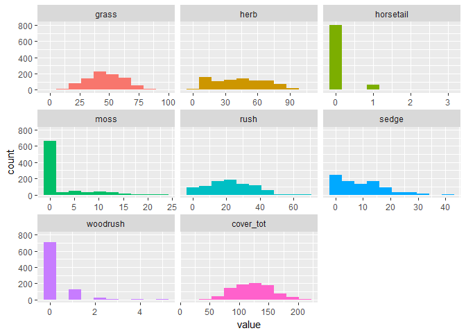
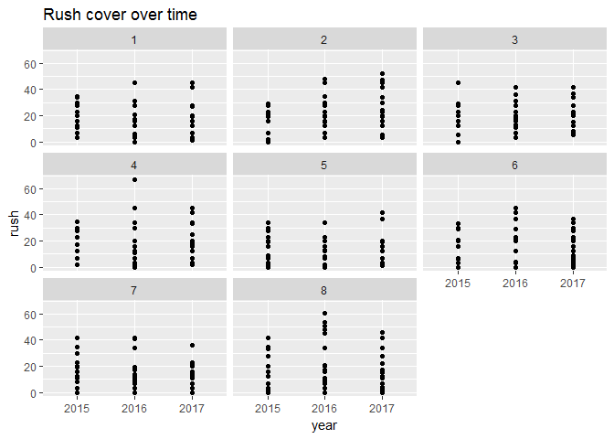
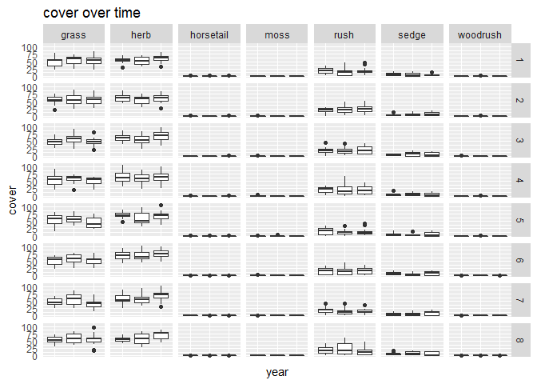
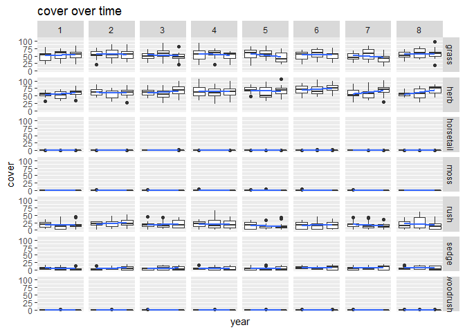
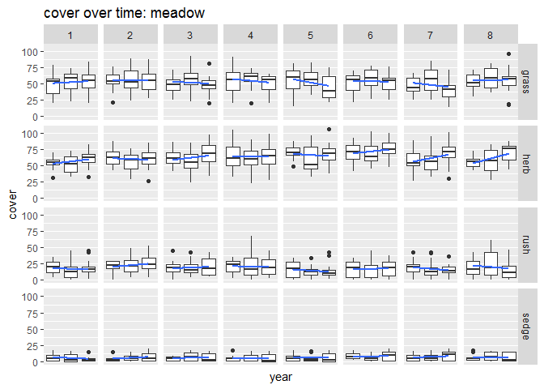
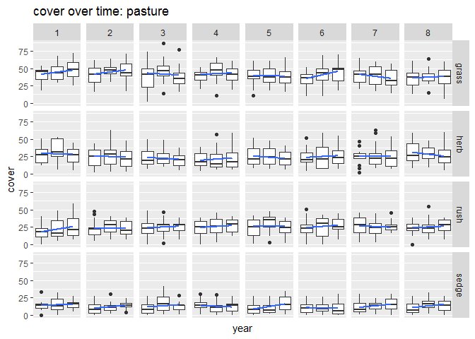
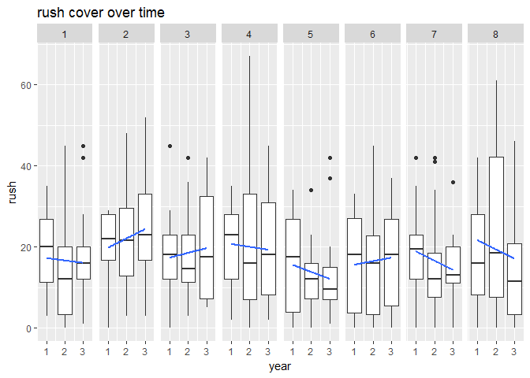

# Rush Trial: data exploration: taxa

Packages

```r
library(tidyverse)
```

```
## Warning: package 'tidyverse' was built under R version 3.3.3
```

```
## -- Attaching packages ---------------------------------- tidyverse 1.2.1 --
```

```
## v ggplot2 2.2.1     v purrr   0.2.4
## v tibble  1.4.1     v dplyr   0.7.4
## v tidyr   0.7.2     v stringr 1.2.0
## v readr   1.1.1     v forcats 0.2.0
```

```
## Warning: package 'tibble' was built under R version 3.3.3
```

```
## Warning: package 'tidyr' was built under R version 3.3.3
```

```
## Warning: package 'readr' was built under R version 3.3.3
```

```
## Warning: package 'purrr' was built under R version 3.3.3
```

```
## Warning: package 'dplyr' was built under R version 3.3.3
```

```
## Warning: package 'stringr' was built under R version 3.3.3
```

```
## Warning: package 'forcats' was built under R version 3.3.3
```

```
## -- Conflicts ------------------------------------- tidyverse_conflicts() --
## x dplyr::filter() masks stats::filter()
## x dplyr::lag()    masks stats::lag()
```

```r
library(skimr)
```

```
## Warning: package 'skimr' was built under R version 3.3.3
```

```
## 
## Attaching package: 'skimr'
```

```
## The following objects are masked from 'package:dplyr':
## 
##     contains, ends_with, everything, matches, num_range, one_of,
##     starts_with
```

```r
library(funModeling)
```

```
## Warning: package 'funModeling' was built under R version 3.3.3
```

```
## Loading required package: Hmisc
```

```
## Warning: package 'Hmisc' was built under R version 3.3.3
```

```
## Loading required package: lattice
```

```
## Warning: package 'lattice' was built under R version 3.3.3
```

```
## Loading required package: survival
```

```
## Warning: package 'survival' was built under R version 3.3.3
```

```
## Loading required package: Formula
```

```
## Warning: package 'Formula' was built under R version 3.3.3
```

```
## 
## Attaching package: 'Hmisc'
```

```
## The following objects are masked from 'package:dplyr':
## 
##     combine, src, summarize
```

```
## The following objects are masked from 'package:base':
## 
##     format.pval, round.POSIXt, trunc.POSIXt, units
```

```
## funModeling v.1.6.7 :)
## Examples and tutorials at livebook.datascienceheroes.com
```


Import data

```r
grp_calc_w <- read.csv("../data/prepped/taxon_grp_calc_w.csv", header = TRUE)
```


```r
#drop unwanted columns
data_taxa <- grp_calc_w %>% 
  select(-c(X, uid)) 

#make categories factors
data_taxa <- data_taxa %>% 
  mutate_at(c("year", "treat_plot"), as.factor)
```

```
## Warning: package 'bindrcpp' was built under R version 3.3.3
```

```r
skim(data_taxa)  
```

```
## Skim summary statistics
##  n obs: 864 
##  n variables: 14 
## 
## Variable type: factor 
##    variable missing complete   n n_unique
##    location       0      864 864        4
##        quad       1      863 864       69
##   replicate       0      864 864        3
##  treat_plot       0      864 864        8
##        type       0      864 864        2
##        year       0      864 864        3
##                           top_counts ordered
##   HM: 216, HP: 216, LM: 216, VP: 216   FALSE
##       24: 33, 47: 33, 10: 24, 29: 24   FALSE
##        A: 288, B: 288, C: 288, NA: 0   FALSE
##       1: 108, 2: 108, 3: 108, 4: 108   FALSE
##            mea: 432, pas: 432, NA: 0   FALSE
##  201: 288, 201: 288, 201: 288, NA: 0   FALSE
## 
## Variable type: integer 
##   variable missing complete   n    mean    sd p0    p25 median p75 p100
##  cover_tot       0      864 864 123.4   31.64 31 100       123 145  222
##      grass       0      864 864  47.04  16     2  35.75     47  59   97
##       herb       0      864 864  43.63  24.1   2  24        43  62  106
##  horsetail       0      864 864   0.084  0.32  0   0         0   0    3
##       moss       0      864 864   1.94   4.17  0   0         0   1   23
##       rush       0      864 864  21.31  12.67  0  12        20  30   67
##      sedge       0      864 864   9.15   7.75  0   2         7  14   41
##   woodrush       0      864 864   0.24   0.61  0   0         0   0    5
##      hist
##  <U+2581><U+2582><U+2586><U+2587><U+2587><U+2583><U+2582><U+2581>
##  <U+2581><U+2582><U+2585><U+2587><U+2587><U+2583><U+2581><U+2581>
##  <U+2587><U+2587><U+2587><U+2587><U+2587><U+2586><U+2582><U+2581>
##  <U+2587><U+2581><U+2581><U+2581><U+2581><U+2581><U+2581><U+2581>
##  <U+2587><U+2581><U+2581><U+2581><U+2581><U+2581><U+2581><U+2581>
##  <U+2587><U+2587><U+2587><U+2586><U+2585><U+2582><U+2581><U+2581>
##  <U+2587><U+2583><U+2585><U+2582><U+2581><U+2581><U+2581><U+2581>
##  <U+2587><U+2582><U+2581><U+2581><U+2581><U+2581><U+2581><U+2581>
```

```r
funModeling::plot_num(data_taxa) #plot numeric variables
```

<!-- -->

```r
funModeling::profiling_num(data_taxa) %>% pander() #instead of pander use kable()
```

```
##    variable    mean std_dev variation_coef p_01 p_05 p_25 p_50 p_75 p_95
## 1     grass  47.043   16.00           0.34 14.0   21   36   47   59   73
## 2      herb  43.634   24.10           0.55  5.6    8   24   43   62   83
## 3 horsetail   0.084    0.32           3.75  0.0    0    0    0    0    1
## 4      moss   1.938    4.17           2.15  0.0    0    0    0    1   12
## 5      rush  21.307   12.67           0.59  0.0    2   12   20   30   42
## 6     sedge   9.153    7.75           0.85  0.0    0    2    7   14   24
## 7  woodrush   0.243    0.61           2.50  0.0    0    0    0    0    1
## 8 cover_tot 123.402   31.64           0.26 58.0   75  100  123  145  177
##   p_99 skewness kurtosis iqr      range_98  range_80
## 1   84     0.11      2.7  23   [14, 84.37]  [26, 68]
## 2   96     0.20      2.1  38 [5.63, 96.37]  [12, 77]
## 3    1     4.45     27.5   0        [0, 1]    [0, 0]
## 4   17     2.36      8.2   1       [0, 17]    [0, 8]
## 5   49     0.27      2.5  18       [0, 49] [3.3, 38]
## 6   30     0.83      3.2  12       [0, 30]   [1, 19]
## 7    3     3.50     19.3   0        [0, 3]    [0, 1]
## 8  199     0.17      2.7  45  [58, 198.74] [83, 164]
```


-----------------------------------------------------------------------------
 variable     mean     std_dev   variation_coef   p_01   p_05   p_25    p_50 
----------- --------- --------- ---------------- ------ ------ ------- ------
   grass      47.04      16          0.3402        14     21    35.75    47  

   herb       43.63     24.1         0.5522       5.63    8      24      43  

 horsetail   0.08449   0.3172        3.754         0      0       0      0   

   moss       1.938     4.166         2.15         0      0       0      0   

   rush       21.31     12.67        0.5945        0      2      12      20  

   sedge      9.153     7.753        0.847         0      0       2      7   

 woodrush    0.2431    0.6079        2.501         0      0       0      0   

 cover_tot    123.4     31.64        0.2564        58     75     100    123  
-----------------------------------------------------------------------------

Table: Table continues below

 
--------------------------------------------------------------------------------
 p_75   p_95    p_99    skewness   kurtosis    iqr      range_98      range_80  
------ ------- ------- ---------- ---------- ------- --------------- -----------
  59    72.85   84.37    0.1106     2.669     23.25    [14, 84.37]    [26, 68]  

  62     83     96.37    0.1993     2.065      38     [5.63, 96.37]   [12, 77]  

  0       1       1      4.449      27.48       0        [0, 1]        [0, 0]   

  1      12      17       2.36      8.217       1        [0, 17]       [0, 8]   

  30     42      49      0.2697     2.485      18        [0, 49]      [3.3, 38] 

  14     24      30      0.8258     3.221      12        [0, 30]       [1, 19]  

  0       1       3      3.504      19.28       0        [0, 3]        [0, 1]   

 145    176.8   198.7    0.1733     2.712      45     [58, 198.74]    [83, 164] 
--------------------------------------------------------------------------------

```r
funModeling::correlation_table(data = data_taxa, target = "year") #correlation coefficient (pearsons R)
```

```
##    Variable  year
## 1      year  1.00
## 2     sedge  0.09
## 3      herb  0.03
## 4 cover_tot  0.03
## 5      rush  0.02
## 6  woodrush  0.01
## 7 horsetail  0.00
## 8     grass -0.01
## 9      moss -0.19
```


  


```r
plotdata <- filter(data_taxa, type == "meadow")
ggplot(plotdata, 
       aes(x = year, y = rush)) +
#  geom_boxplot() +
  geom_point() +
  facet_wrap(~ treat_plot) +
  labs(title = "Rush cover over time")
```

<!-- -->


```r
plotdata <- data_taxa %>% 
  select(-cover_tot) %>% 
  gather(key = "taxon", value = "cover", grass:woodrush) %>% 
  filter(type == "meadow")

  ggplot(plotdata, 
       aes(x = year, y = cover)) +
  geom_boxplot() +
  facet_grid(treat_plot ~ taxon) +
  labs(title = "cover over time") +
  theme(axis.ticks = element_blank(), axis.text.x = element_blank(), legend.position = "none")
```

<!-- -->

with linear model

```r
plotdata <- data_taxa %>% 
  filter(type == "meadow") %>% 
  mutate_at(.$year, as.numeric) %>% 
  select(-cover_tot) %>% 
  gather(key = "taxon", value = "cover", grass:woodrush) 

ggplot(plotdata, 
       aes(x = year, y = cover)) +
 geom_boxplot(aes(group = year)) +
  #geom_point()
   geom_smooth(method = "lm", se = FALSE)   +
  facet_grid(taxon ~ treat_plot) +
  scale_x_continuous(breaks=c(2015, 2016, 2017))+
  labs(title = "cover over time") 
```

<!-- -->

with linear model: remove smaller spp

```r
plotdata <- data_taxa %>% 
  filter(type == "meadow") %>% 
  mutate_at(.$year, as.numeric) %>% 
  select(-one_of(c("woodrush", "moss", "horsetail", "cover_tot"))) %>% 
  gather(key = "taxon", value = "cover", grass:sedge) 

meadow.sm <- ggplot(plotdata, 
       aes(x = year, y = cover)) +
 geom_boxplot(aes(group = year)) +
  #geom_point()
   geom_smooth(method = "lm", se = FALSE)   +
  scale_x_continuous(breaks=c(2015, 2016, 2017)) +
  facet_grid(taxon ~ treat_plot) +
  labs(title = "cover over time: meadow")
meadow.sm
```

<!-- -->

```r
ggsave(meadow.sm, filename = "../outputs/meadow.sm.png")
```

```
## Saving 7 x 5 in image
```

with linear model: remove smaller spp: pasture

```r
plotdata <- data_taxa %>% 
  filter(type == "pasture") %>% 
  mutate_at(.$year, as.numeric) %>% 
  select(-one_of(c("woodrush", "moss", "horsetail", "cover_tot"))) %>% 
  gather(key = "taxon", value = "cover", grass:sedge) 

pasture.sm <- ggplot(plotdata, 
       aes(x = year, y = cover)) +
 geom_boxplot(aes(group = year)) +
  #geom_point()
   geom_smooth(method = "lm", se = FALSE)   +
  scale_x_continuous(breaks=c(2015, 2016, 2017)) +
  facet_grid(taxon ~ treat_plot) +
  labs(title = "cover over time: pasture")
pasture.sm
```

<!-- -->

```r
ggsave(pasture.sm, filename = "../outputs/pasture.sm.png")
```

```
## Saving 7 x 5 in image
```


just rushes

```r
plotdata <- data_taxa %>% 
  filter(type == "meadow") %>% 
  mutate_at(.$year, as.numeric)

ggplot(plotdata, 
       aes(x = year, y = rush)) +
 geom_boxplot(aes(group = year)) +
  #geom_point()
   geom_smooth(method = "lm", se = FALSE)   +
  facet_grid(. ~ treat_plot) +
  labs(title = "rush cover over time") 
```

<!-- -->


