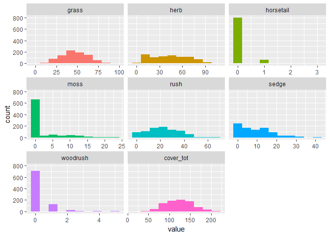

# Rush Trial: data exploration 2017

Packages

```r
library(tidyverse)
```

```
## Warning: package 'tidyverse' was built under R version 3.3.3
```

```
## -- Attaching packages ---------------------------------- tidyverse 1.2.1 --
```

```
## v ggplot2 2.2.1     v purrr   0.2.4
## v tibble  1.4.1     v dplyr   0.7.4
## v tidyr   0.7.2     v stringr 1.2.0
## v readr   1.1.1     v forcats 0.2.0
```

```
## Warning: package 'tibble' was built under R version 3.3.3
```

```
## Warning: package 'tidyr' was built under R version 3.3.3
```

```
## Warning: package 'readr' was built under R version 3.3.3
```

```
## Warning: package 'purrr' was built under R version 3.3.3
```

```
## Warning: package 'dplyr' was built under R version 3.3.3
```

```
## Warning: package 'stringr' was built under R version 3.3.3
```

```
## Warning: package 'forcats' was built under R version 3.3.3
```

```
## -- Conflicts ------------------------------------- tidyverse_conflicts() --
## x dplyr::filter() masks stats::filter()
## x dplyr::lag()    masks stats::lag()
```

```r
library(skimr)
```

```
## Warning: package 'skimr' was built under R version 3.3.3
```

```
## 
## Attaching package: 'skimr'
```

```
## The following objects are masked from 'package:dplyr':
## 
##     contains, ends_with, everything, matches, num_range, one_of,
##     starts_with
```

```r
library(funModeling)
```

```
## Warning: package 'funModeling' was built under R version 3.3.3
```

```
## Loading required package: Hmisc
```

```
## Warning: package 'Hmisc' was built under R version 3.3.3
```

```
## Loading required package: lattice
```

```
## Warning: package 'lattice' was built under R version 3.3.3
```

```
## Loading required package: survival
```

```
## Warning: package 'survival' was built under R version 3.3.3
```

```
## Loading required package: Formula
```

```
## Warning: package 'Formula' was built under R version 3.3.3
```

```
## 
## Attaching package: 'Hmisc'
```

```
## The following objects are masked from 'package:dplyr':
## 
##     combine, src, summarize
```

```
## The following objects are masked from 'package:base':
## 
##     format.pval, round.POSIXt, trunc.POSIXt, units
```

```
## funModeling v.1.6.7 :)
## Examples and tutorials at livebook.datascienceheroes.com
```

Import data

```r
grp_calc_w <- read.csv("../data/prepped/taxon_grp_calc_w.csv", header = TRUE)
```


```r
#drop unwanted columns
data_taxa <- grp_calc_w %>% 
  select(-c(X, uid)) 

#make categories factors
data_taxa <- data_taxa %>% 
  mutate_at(c("year", "treat_plot"), as.factor)
```

```
## Warning: package 'bindrcpp' was built under R version 3.3.3
```

```r
skim(data_taxa)  
```

```
## Skim summary statistics
##  n obs: 864 
##  n variables: 14 
## 
## Variable type: factor 
##    variable missing complete   n n_unique
##    location       0      864 864        4
##        quad       1      863 864       69
##   replicate       0      864 864        3
##  treat_plot       0      864 864        8
##        type       0      864 864        2
##        year       0      864 864        3
##                           top_counts ordered
##   HM: 216, HP: 216, LM: 216, VP: 216   FALSE
##       24: 33, 47: 33, 10: 24, 29: 24   FALSE
##        A: 288, B: 288, C: 288, NA: 0   FALSE
##       1: 108, 2: 108, 3: 108, 4: 108   FALSE
##            mea: 432, pas: 432, NA: 0   FALSE
##  201: 288, 201: 288, 201: 288, NA: 0   FALSE
## 
## Variable type: integer 
##   variable missing complete   n    mean    sd p0    p25 median p75 p100
##  cover_tot       0      864 864 123.4   31.64 31 100       123 145  222
##      grass       0      864 864  47.04  16     2  35.75     47  59   97
##       herb       0      864 864  43.63  24.1   2  24        43  62  106
##  horsetail       0      864 864   0.084  0.32  0   0         0   0    3
##       moss       0      864 864   1.94   4.17  0   0         0   1   23
##       rush       0      864 864  21.31  12.67  0  12        20  30   67
##      sedge       0      864 864   9.15   7.75  0   2         7  14   41
##   woodrush       0      864 864   0.24   0.61  0   0         0   0    5
##      hist
##  <U+2581><U+2582><U+2586><U+2587><U+2587><U+2583><U+2582><U+2581>
##  <U+2581><U+2582><U+2585><U+2587><U+2587><U+2583><U+2581><U+2581>
##  <U+2587><U+2587><U+2587><U+2587><U+2587><U+2586><U+2582><U+2581>
##  <U+2587><U+2581><U+2581><U+2581><U+2581><U+2581><U+2581><U+2581>
##  <U+2587><U+2581><U+2581><U+2581><U+2581><U+2581><U+2581><U+2581>
##  <U+2587><U+2587><U+2587><U+2586><U+2585><U+2582><U+2581><U+2581>
##  <U+2587><U+2583><U+2585><U+2582><U+2581><U+2581><U+2581><U+2581>
##  <U+2587><U+2582><U+2581><U+2581><U+2581><U+2581><U+2581><U+2581>
```

```r
funModeling::plot_num(data_taxa) #plot numeric variables
```

<!-- -->

```r
funModeling::profiling_num(data_taxa) %>% pander() #instead of pander use kable()
```

```
##    variable    mean std_dev variation_coef p_01 p_05 p_25 p_50 p_75 p_95
## 1     grass  47.043   16.00           0.34 14.0   21   36   47   59   73
## 2      herb  43.634   24.10           0.55  5.6    8   24   43   62   83
## 3 horsetail   0.084    0.32           3.75  0.0    0    0    0    0    1
## 4      moss   1.938    4.17           2.15  0.0    0    0    0    1   12
## 5      rush  21.307   12.67           0.59  0.0    2   12   20   30   42
## 6     sedge   9.153    7.75           0.85  0.0    0    2    7   14   24
## 7  woodrush   0.243    0.61           2.50  0.0    0    0    0    0    1
## 8 cover_tot 123.402   31.64           0.26 58.0   75  100  123  145  177
##   p_99 skewness kurtosis iqr      range_98  range_80
## 1   84     0.11      2.7  23   [14, 84.37]  [26, 68]
## 2   96     0.20      2.1  38 [5.63, 96.37]  [12, 77]
## 3    1     4.45     27.5   0        [0, 1]    [0, 0]
## 4   17     2.36      8.2   1       [0, 17]    [0, 8]
## 5   49     0.27      2.5  18       [0, 49] [3.3, 38]
## 6   30     0.83      3.2  12       [0, 30]   [1, 19]
## 7    3     3.50     19.3   0        [0, 3]    [0, 1]
## 8  199     0.17      2.7  45  [58, 198.74] [83, 164]
```


-----------------------------------------------------------------------------
 variable     mean     std_dev   variation_coef   p_01   p_05   p_25    p_50 
----------- --------- --------- ---------------- ------ ------ ------- ------
   grass      47.04      16          0.3402        14     21    35.75    47  

   herb       43.63     24.1         0.5522       5.63    8      24      43  

 horsetail   0.08449   0.3172        3.754         0      0       0      0   

   moss       1.938     4.166         2.15         0      0       0      0   

   rush       21.31     12.67        0.5945        0      2      12      20  

   sedge      9.153     7.753        0.847         0      0       2      7   

 woodrush    0.2431    0.6079        2.501         0      0       0      0   

 cover_tot    123.4     31.64        0.2564        58     75     100    123  
-----------------------------------------------------------------------------

Table: Table continues below

 
--------------------------------------------------------------------------------
 p_75   p_95    p_99    skewness   kurtosis    iqr      range_98      range_80  
------ ------- ------- ---------- ---------- ------- --------------- -----------
  59    72.85   84.37    0.1106     2.669     23.25    [14, 84.37]    [26, 68]  

  62     83     96.37    0.1993     2.065      38     [5.63, 96.37]   [12, 77]  

  0       1       1      4.449      27.48       0        [0, 1]        [0, 0]   

  1      12      17       2.36      8.217       1        [0, 17]       [0, 8]   

  30     42      49      0.2697     2.485      18        [0, 49]      [3.3, 38] 

  14     24      30      0.8258     3.221      12        [0, 30]       [1, 19]  

  0       1       3      3.504      19.28       0        [0, 3]        [0, 1]   

 145    176.8   198.7    0.1733     2.712      45     [58, 198.74]    [83, 164] 
--------------------------------------------------------------------------------

```r
funModeling::correlation_table(data = data_taxa, target = "treat_plot") #correlation coefficient (pearsons R)
```

```
##     Variable treat_plot
## 1 treat_plot       1.00
## 2       herb       0.05
## 3  horsetail       0.05
## 4       rush       0.02
## 5      sedge       0.02
## 6       moss       0.00
## 7  cover_tot       0.00
## 8   woodrush      -0.05
## 9      grass      -0.08
```


filter by year and type

```r
# data_taxa <- filter(data_taxa, year == "2015", type == "meadow")
# 
# #drop unused factors
# data_taxa <- droplevels(data_taxa)
# 
# skim(data_taxa)
```

# Analysis

##Three-way ANOVA with replication

### Baseline data (2015) 

```r
model_rush <- aov(data = filter(data_taxa, year == "2015"),#, type == "meadow"), 
                  formula = rush ~ type + location + replicate + treat_plot) 

model_rush_int <- aov(data = filter(data_taxa, year == "2015"),#, type == "meadow"), 
                      formula = rush ~ type * location * replicate * treat_plot) 

summary(model_rush)
```

```
##              Df Sum Sq Mean Sq F value Pr(>F)    
## type          1   2016    2016   15.53 0.0001 ***
## location      2     80      40    0.31 0.7351    
## replicate     2    602     301    2.32 0.1005    
## treat_plot    7    696      99    0.77 0.6165    
## Residuals   275  35698     130                   
## ---
## Signif. codes:  0 '***' 0.001 '**' 0.01 '*' 0.05 '.' 0.1 ' ' 1
```

```r
summary(model_rush_int)
```

```
##                                Df Sum Sq Mean Sq F value  Pr(>F)    
## type                            1   2016    2016   20.44 1.1e-05 ***
## location                        2     80      40    0.41 0.66713    
## replicate                       2    602     301    3.05 0.04966 *  
## treat_plot                      7    696      99    1.01 0.42690    
## type:replicate                  2    308     154    1.56 0.21216    
## location:replicate              4   1273     318    3.23 0.01365 *  
## type:treat_plot                 7    767     110    1.11 0.35742    
## location:treat_plot            14   4124     295    2.99 0.00037 ***
## replicate:treat_plot           14   3566     255    2.58 0.00196 ** 
## type:replicate:treat_plot      14   1468     105    1.06 0.39338    
## location:replicate:treat_plot  28   5257     188    1.90 0.00626 ** 
## Residuals                     192  18934      99                    
## ---
## Signif. codes:  0 '***' 0.001 '**' 0.01 '*' 0.05 '.' 0.1 ' ' 1
```
There is significant difference between types (meadow and pasture).  So lets look at meadow and pasture separately: 

Meadow:

```r
model_rush_int <- aov(data = filter(data_taxa, year == "2015", type == "meadow"), 
                      formula = rush ~ location * replicate * treat_plot) 

summary(model_rush_int)
```

```
##                               Df Sum Sq Mean Sq F value Pr(>F)   
## location                       1     64      64    0.61 0.4358   
## replicate                      2    230     115    1.10 0.3375   
## treat_plot                     7    443      63    0.61 0.7497   
## location:replicate             2    100      50    0.48 0.6207   
## location:treat_plot            7   2419     346    3.31 0.0034 **
## replicate:treat_plot          14   2858     204    1.95 0.0297 * 
## location:replicate:treat_plot 14   1432     102    0.98 0.4804   
## Residuals                     96  10030     104                  
## ---
## Signif. codes:  0 '***' 0.001 '**' 0.01 '*' 0.05 '.' 0.1 ' ' 1
```
There is no significant difference in the main effects, but there is  in the interaction between location and treatment, and replicate and treatment.  

post hoc

```r
mead_tuk <- TukeyHSD(model_rush_int, "location:treat_plot")
mead_tuk <- data.frame(mead_tuk$`location:treat_plot`)
mead_tuk %>% arrange(p.adj)
```

```
##       diff   lwr  upr p.adj
## 1    15.00  -2.0 32.0  0.15
## 2   -14.22 -31.2  2.7  0.21
## 3   -13.78 -30.7  3.2  0.26
## 4    13.33  -3.6 30.3  0.31
## 5    12.56  -4.4 29.5  0.41
## 6   -12.44 -29.4  4.5  0.42
## 7   -12.11 -29.1  4.8  0.47
## 8   -12.11 -29.1  4.8  0.47
## 9    11.89  -5.1 28.8  0.50
## 10   11.56  -5.4 28.5  0.55
## 11  -11.33 -28.3  5.6  0.59
## 12  -10.89 -27.8  6.1  0.65
## 13   10.78  -6.2 27.7  0.67
## 14   10.78  -6.2 27.7  0.67
## 15  -10.78 -27.7  6.2  0.67
## 16  -10.33 -27.3  6.6  0.73
## 17   10.22  -6.7 27.2  0.75
## 18  -10.11 -27.1  6.8  0.76
## 19    9.67  -7.3 26.6  0.82
## 20   -9.56 -26.5  7.4  0.83
## 21   -9.22 -26.2  7.7  0.86
## 22    9.11  -7.8 26.1  0.87
## 23   -9.00 -26.0  8.0  0.88
## 24   -9.00 -26.0  8.0  0.88
## 25    8.89  -8.1 25.8  0.89
## 26    8.78  -8.2 25.7  0.90
## 27    8.44  -8.5 25.4  0.93
## 28   -8.44 -25.4  8.5  0.93
## 29   -8.44 -25.4  8.5  0.93
## 30   -8.44 -25.4  8.5  0.93
## 31    7.89  -9.1 24.8  0.96
## 32    7.56  -9.4 24.5  0.97
## 33    7.56  -9.4 24.5  0.97
## 34   -7.44 -24.4  9.5  0.97
## 35    7.33  -9.6 24.3  0.98
## 36   -7.22 -24.2  9.7  0.98
## 37    7.11  -9.8 24.1  0.98
## 38    7.11  -9.8 24.1  0.98
## 39    6.78 -10.2 23.7  0.99
## 40   -6.67 -23.6 10.3  0.99
## 41   -6.67 -23.6 10.3  0.99
## 42    6.56 -10.4 23.5  0.99
## 43    6.56 -10.4 23.5  0.99
## 44   -6.33 -23.3 10.6  0.99
## 45   -6.22 -23.2 10.7  1.00
## 46   -6.22 -23.2 10.7  1.00
## 47    5.89 -11.1 22.8  1.00
## 48    5.89 -11.1 22.8  1.00
## 49    5.78 -11.2 22.7  1.00
## 50   -5.78 -22.7 11.2  1.00
## 51   -5.78 -22.7 11.2  1.00
## 52   -5.56 -22.5 11.4  1.00
## 53   -5.44 -22.4 11.5  1.00
## 54    5.44 -11.5 22.4  1.00
## 55    5.33 -11.6 22.3  1.00
## 56   -5.33 -22.3 11.6  1.00
## 57   -5.33 -22.3 11.6  1.00
## 58   -5.00 -22.0 12.0  1.00
## 59   -5.00 -22.0 12.0  1.00
## 60   -5.00 -22.0 12.0  1.00
## 61   -4.89 -21.8 12.1  1.00
## 62    4.89 -12.1 21.8  1.00
## 63   -4.78 -21.7 12.2  1.00
## 64    4.67 -12.3 21.6  1.00
## 65   -4.56 -21.5 12.4  1.00
## 66   -4.33 -21.3 12.6  1.00
## 67   -4.22 -21.2 12.7  1.00
## 68    4.11 -12.8 21.1  1.00
## 69    4.11 -12.8 21.1  1.00
## 70    4.00 -13.0 21.0  1.00
## 71    3.89 -13.1 20.8  1.00
## 72   -3.67 -20.6 13.3  1.00
## 73    3.67 -13.3 20.6  1.00
## 74   -3.67 -20.6 13.3  1.00
## 75    3.44 -13.5 20.4  1.00
## 76   -3.44 -20.4 13.5  1.00
## 77    3.44 -13.5 20.4  1.00
## 78    3.44 -13.5 20.4  1.00
## 79   -3.22 -20.2 13.7  1.00
## 80    3.22 -13.7 20.2  1.00
## 81   -3.11 -20.1 13.8  1.00
## 82    3.11 -13.8 20.1  1.00
## 83    3.11 -13.8 20.1  1.00
## 84   -3.00 -20.0 14.0  1.00
## 85    2.89 -14.1 19.8  1.00
## 86    2.67 -14.3 19.6  1.00
## 87   -2.56 -19.5 14.4  1.00
## 88    2.56 -14.4 19.5  1.00
## 89   -2.44 -19.4 14.5  1.00
## 90    2.33 -14.6 19.3  1.00
## 91   -2.33 -19.3 14.6  1.00
## 92    2.33 -14.6 19.3  1.00
## 93    2.22 -14.7 19.2  1.00
## 94   -2.00 -19.0 15.0  1.00
## 95   -1.89 -18.8 15.1  1.00
## 96   -1.89 -18.8 15.1  1.00
## 97    1.78 -15.2 18.7  1.00
## 98    1.78 -15.2 18.7  1.00
## 99   -1.78 -18.7 15.2  1.00
## 100  -1.67 -18.6 15.3  1.00
## 101  -1.67 -18.6 15.3  1.00
## 102  -1.67 -18.6 15.3  1.00
## 103  -1.67 -18.6 15.3  1.00
## 104   1.56 -15.4 18.5  1.00
## 105  -1.33 -18.3 15.6  1.00
## 106  -1.33 -18.3 15.6  1.00
## 107  -1.22 -18.2 15.7  1.00
## 108   1.22 -15.7 18.2  1.00
## 109   1.22 -15.7 18.2  1.00
## 110  -0.89 -17.8 16.1  1.00
## 111  -0.44 -17.4 16.5  1.00
## 112   0.33 -16.6 17.3  1.00
## 113  -1.11 -18.1 15.8  1.00
## 114   0.67 -16.3 17.6  1.00
## 115  -0.56 -17.5 16.4  1.00
## 116   0.78 -16.2 17.7  1.00
## 117  -0.56 -17.5 16.4  1.00
## 118   0.78 -16.2 17.7  1.00
## 119  -0.89 -17.8 16.1  1.00
## 120   0.44 -16.5 17.4  1.00
```
only between one combination of 

####Pasture:

```r
model_rush_int <- aov(data = filter(data_taxa, year == "2015", type == "pasture"), 
                      formula = rush ~ location * replicate * treat_plot) 

summary(model_rush_int)
```

```
##                               Df Sum Sq Mean Sq F value  Pr(>F)    
## location                       1     16      16    0.17 0.67882    
## replicate                      2    680     340    3.67 0.02919 *  
## treat_plot                     7   1020     146    1.57 0.15329    
## location:replicate             2   1173     586    6.32 0.00263 ** 
## location:treat_plot            7   1705     244    2.63 0.01589 *  
## replicate:treat_plot          14   2176     155    1.68 0.07341 .  
## location:replicate:treat_plot 14   3825     273    2.95 0.00092 ***
## Residuals                     96   8904      93                    
## ---
## Signif. codes:  0 '***' 0.001 '**' 0.01 '*' 0.05 '.' 0.1 ' ' 1
```
There is no significant difference in the main effects, but there is  in the interaction between location and treatment, and replicate and treatment.  

post hoc

```r
TukeyHSD(model_rush_int, "location:treat_plot")
```

```
##   Tukey multiple comparisons of means
##     95% family-wise confidence level
## 
## Fit: aov(formula = rush ~ location * replicate * treat_plot, data = filter(data_taxa, year == "2015", type == "pasture"))
## 
## $`location:treat_plot`
##               diff    lwr  upr p adj
## VP:1-HP:1  7.7e+00  -8.31 23.6  0.94
## HP:2-HP:1  9.1e+00  -6.86 25.1  0.82
## VP:2-HP:1  6.2e+00  -9.75 22.2  0.99
## HP:3-HP:1  1.4e+01  -2.42 29.5  0.20
## VP:3-HP:1  5.9e+00 -10.09 21.9  1.00
## HP:4-HP:1  9.2e+00  -6.75 25.2  0.80
## VP:4-HP:1  1.1e+01  -5.31 26.6  0.59
## HP:5-HP:1  4.1e+00 -11.86 20.1  1.00
## VP:5-HP:1  1.5e+01  -0.97 31.0  0.09
## HP:6-HP:1  6.2e+00  -9.75 22.2  0.99
## VP:6-HP:1  1.4e+01  -1.86 30.1  0.15
## HP:7-HP:1  1.7e+01   1.47 33.4  0.02
## VP:7-HP:1  1.1e+01  -5.42 26.5  0.61
## HP:8-HP:1  1.3e+01  -3.31 28.6  0.29
## VP:8-HP:1  7.6e+00  -8.42 23.5  0.95
## HP:2-VP:1  1.4e+00 -14.53 17.4  1.00
## VP:2-VP:1 -1.4e+00 -17.42 14.5  1.00
## HP:3-VP:1  5.9e+00 -10.09 21.9  1.00
## VP:3-VP:1 -1.8e+00 -17.75 14.2  1.00
## HP:4-VP:1  1.6e+00 -14.42 17.5  1.00
## VP:4-VP:1  3.0e+00 -12.97 19.0  1.00
## HP:5-VP:1 -3.6e+00 -19.53 12.4  1.00
## VP:5-VP:1  7.3e+00  -8.64 23.3  0.96
## HP:6-VP:1 -1.4e+00 -17.42 14.5  1.00
## VP:6-VP:1  6.4e+00  -9.53 22.4  0.99
## HP:7-VP:1  9.8e+00  -6.20 25.8  0.73
## VP:7-VP:1  2.9e+00 -13.09 18.9  1.00
## HP:8-VP:1  5.0e+00 -10.97 21.0  1.00
## VP:8-VP:1 -1.1e-01 -16.09 15.9  1.00
## VP:2-HP:2 -2.9e+00 -18.86 13.1  1.00
## HP:3-HP:2  4.4e+00 -11.53 20.4  1.00
## VP:3-HP:2 -3.2e+00 -19.20 12.8  1.00
## HP:4-HP:2  1.1e-01 -15.86 16.1  1.00
## VP:4-HP:2  1.6e+00 -14.42 17.5  1.00
## HP:5-HP:2 -5.0e+00 -20.97 11.0  1.00
## VP:5-HP:2  5.9e+00 -10.09 21.9  1.00
## HP:6-HP:2 -2.9e+00 -18.86 13.1  1.00
## VP:6-HP:2  5.0e+00 -10.97 21.0  1.00
## HP:7-HP:2  8.3e+00  -7.64 24.3  0.90
## VP:7-HP:2  1.4e+00 -14.53 17.4  1.00
## HP:8-HP:2  3.6e+00 -12.42 19.5  1.00
## VP:8-HP:2 -1.6e+00 -17.53 14.4  1.00
## HP:3-VP:2  7.3e+00  -8.64 23.3  0.96
## VP:3-VP:2 -3.3e-01 -16.31 15.6  1.00
## HP:4-VP:2  3.0e+00 -12.97 19.0  1.00
## VP:4-VP:2  4.4e+00 -11.53 20.4  1.00
## HP:5-VP:2 -2.1e+00 -18.09 13.9  1.00
## VP:5-VP:2  8.8e+00  -7.20 24.8  0.85
## HP:6-VP:2  7.1e-15 -15.97 16.0  1.00
## VP:6-VP:2  7.9e+00  -8.09 23.9  0.93
## HP:7-VP:2  1.1e+01  -4.75 27.2  0.50
## VP:7-VP:2  4.3e+00 -11.64 20.3  1.00
## HP:8-VP:2  6.4e+00  -9.53 22.4  0.99
## VP:8-VP:2  1.3e+00 -14.64 17.3  1.00
## VP:3-HP:3 -7.7e+00 -23.64  8.3  0.94
## HP:4-HP:3 -4.3e+00 -20.31 11.6  1.00
## VP:4-HP:3 -2.9e+00 -18.86 13.1  1.00
## HP:5-HP:3 -9.4e+00 -25.42  6.5  0.77
## VP:5-HP:3  1.4e+00 -14.53 17.4  1.00
## HP:6-HP:3 -7.3e+00 -23.31  8.6  0.96
## VP:6-HP:3  5.6e-01 -15.42 16.5  1.00
## HP:7-HP:3  3.9e+00 -12.09 19.9  1.00
## VP:7-HP:3 -3.0e+00 -18.97 13.0  1.00
## HP:8-HP:3 -8.9e-01 -16.86 15.1  1.00
## VP:8-HP:3 -6.0e+00 -21.97 10.0  0.99
## HP:4-VP:3  3.3e+00 -12.64 19.3  1.00
## VP:4-VP:3  4.8e+00 -11.20 20.8  1.00
## HP:5-VP:3 -1.8e+00 -17.75 14.2  1.00
## VP:5-VP:3  9.1e+00  -6.86 25.1  0.82
## HP:6-VP:3  3.3e-01 -15.64 16.3  1.00
## VP:6-VP:3  8.2e+00  -7.75 24.2  0.91
## HP:7-VP:3  1.2e+01  -4.42 27.5  0.45
## VP:7-VP:3  4.7e+00 -11.31 20.6  1.00
## HP:8-VP:3  6.8e+00  -9.20 22.8  0.98
## VP:8-VP:3  1.7e+00 -14.31 17.6  1.00
## VP:4-HP:4  1.4e+00 -14.53 17.4  1.00
## HP:5-HP:4 -5.1e+00 -21.09 10.9  1.00
## VP:5-HP:4  5.8e+00 -10.20 21.8  1.00
## HP:6-HP:4 -3.0e+00 -18.97 13.0  1.00
## VP:6-HP:4  4.9e+00 -11.09 20.9  1.00
## HP:7-HP:4  8.2e+00  -7.75 24.2  0.91
## VP:7-HP:4  1.3e+00 -14.64 17.3  1.00
## HP:8-HP:4  3.4e+00 -12.53 19.4  1.00
## VP:8-HP:4 -1.7e+00 -17.64 14.3  1.00
## HP:5-VP:4 -6.6e+00 -22.53  9.4  0.99
## VP:5-VP:4  4.3e+00 -11.64 20.3  1.00
## HP:6-VP:4 -4.4e+00 -20.42 11.5  1.00
## VP:6-VP:4  3.4e+00 -12.53 19.4  1.00
## HP:7-VP:4  6.8e+00  -9.20 22.8  0.98
## VP:7-VP:4 -1.1e-01 -16.09 15.9  1.00
## HP:8-VP:4  2.0e+00 -13.97 18.0  1.00
## VP:8-VP:4 -3.1e+00 -19.09 12.9  1.00
## VP:5-HP:5  1.1e+01  -5.09 26.9  0.55
## HP:6-HP:5  2.1e+00 -13.86 18.1  1.00
## VP:6-HP:5  1.0e+01  -5.97 26.0  0.69
## HP:7-HP:5  1.3e+01  -2.64 29.3  0.22
## VP:7-HP:5  6.4e+00  -9.53 22.4  0.99
## HP:8-HP:5  8.6e+00  -7.42 24.5  0.88
## VP:8-HP:5  3.4e+00 -12.53 19.4  1.00
## HP:6-VP:5 -8.8e+00 -24.75  7.2  0.85
## VP:6-VP:5 -8.9e-01 -16.86 15.1  1.00
## HP:7-VP:5  2.4e+00 -13.53 18.4  1.00
## VP:7-VP:5 -4.4e+00 -20.42 11.5  1.00
## HP:8-VP:5 -2.3e+00 -18.31 13.6  1.00
## VP:8-VP:5 -7.4e+00 -23.42  8.5  0.96
## VP:6-HP:6  7.9e+00  -8.09 23.9  0.93
## HP:7-HP:6  1.1e+01  -4.75 27.2  0.50
## VP:7-HP:6  4.3e+00 -11.64 20.3  1.00
## HP:8-HP:6  6.4e+00  -9.53 22.4  0.99
## VP:8-HP:6  1.3e+00 -14.64 17.3  1.00
## HP:7-VP:6  3.3e+00 -12.64 19.3  1.00
## VP:7-VP:6 -3.6e+00 -19.53 12.4  1.00
## HP:8-VP:6 -1.4e+00 -17.42 14.5  1.00
## VP:8-VP:6 -6.6e+00 -22.53  9.4  0.99
## VP:7-HP:7 -6.9e+00 -22.86  9.1  0.98
## HP:8-HP:7 -4.8e+00 -20.75 11.2  1.00
## VP:8-HP:7 -9.9e+00 -25.86  6.1  0.71
## HP:8-VP:7  2.1e+00 -13.86 18.1  1.00
## VP:8-VP:7 -3.0e+00 -18.97 13.0  1.00
## VP:8-HP:8 -5.1e+00 -21.09 10.9  1.00
```

###Looking at year as a factor

#meadow

```r
model_rush <- aov(data = filter(data_taxa, type == "meadow"), 
                  formula = rush ~ location + replicate + treat_plot + year) 

model_rush_int <- aov(data = filter(data_taxa, type == "meadow"), 
                      formula = rush ~ location * replicate * treat_plot * year) 

summary(model_rush)
```

```
##              Df Sum Sq Mean Sq F value Pr(>F)  
## location      1    795     795    4.93  0.027 *
## replicate     2     19      10    0.06  0.942  
## treat_plot    7   2520     360    2.23  0.031 *
## year          2     47      23    0.15  0.865  
## Residuals   419  67499     161                 
## ---
## Signif. codes:  0 '***' 0.001 '**' 0.01 '*' 0.05 '.' 0.1 ' ' 1
```

```r
summary(model_rush_int)
```

```
##                                     Df Sum Sq Mean Sq F value  Pr(>F)    
## location                             1    795     795    5.76 0.01702 *  
## replicate                            2     19      10    0.07 0.93231    
## treat_plot                           7   2520     360    2.61 0.01261 *  
## year                                 2     47      23    0.17 0.84433    
## location:replicate                   2    150      75    0.54 0.58167    
## location:treat_plot                  7   3246     464    3.36 0.00184 ** 
## replicate:treat_plot                14   1784     127    0.92 0.53350    
## location:year                        2    905     453    3.28 0.03903 *  
## replicate:year                       4    526     132    0.95 0.43348    
## treat_plot:year                     14   1663     119    0.86 0.60195    
## location:replicate:treat_plot       14   5209     372    2.70 0.00097 ***
## location:replicate:year              4    257      64    0.46 0.76158    
## location:treat_plot:year            14   2417     173    1.25 0.23787    
## replicate:treat_plot:year           28   5947     212    1.54 0.04388 *  
## location:replicate:treat_plot:year  28   5656     202    1.46 0.06583 .  
## Residuals                          288  39738     138                    
## ---
## Signif. codes:  0 '***' 0.001 '**' 0.01 '*' 0.05 '.' 0.1 ' ' 1
```


```r
model_rush <- aov(data = filter(data_taxa, type == "meadow"), 
                  formula = rush ~ treat_plot + year) 

model_rush_int <- aov(data = filter(data_taxa, type == "meadow"), 
                      formula = rush ~ treat_plot * year) 

summary(model_rush)
```

```
##              Df Sum Sq Mean Sq F value Pr(>F)  
## treat_plot    7   2520     360    2.22  0.031 *
## year          2     47      23    0.14  0.866  
## Residuals   422  68313     162                 
## ---
## Signif. codes:  0 '***' 0.001 '**' 0.01 '*' 0.05 '.' 0.1 ' ' 1
```

```r
summary(model_rush_int)
```

```
##                  Df Sum Sq Mean Sq F value Pr(>F)  
## treat_plot        7   2520     360    2.20  0.033 *
## year              2     47      23    0.14  0.867  
## treat_plot:year  14   1663     119    0.73  0.747  
## Residuals       408  66650     163                 
## ---
## Signif. codes:  0 '***' 0.001 '**' 0.01 '*' 0.05 '.' 0.1 ' ' 1
```


post hoc

```r
TukeyHSD(model_rush, "treat_plot")
```

```
##   Tukey multiple comparisons of means
##     95% family-wise confidence level
## 
## Fit: aov(formula = rush ~ treat_plot + year, data = filter(data_taxa, type == "meadow"))
## 
## $treat_plot
##       diff   lwr   upr p adj
## 2-1  5.481  -2.0 12.94  0.33
## 3-1  1.907  -5.6  9.37  0.99
## 4-1  3.370  -4.1 10.83  0.87
## 5-1 -2.815 -10.3  4.64  0.95
## 6-1 -0.148  -7.6  7.31  1.00
## 7-1 -0.037  -7.5  7.42  1.00
## 8-1  2.722  -4.7 10.18  0.95
## 3-2 -3.574 -11.0  3.88  0.83
## 4-2 -2.111  -9.6  5.35  0.99
## 5-2 -8.296 -15.8 -0.84  0.02
## 6-2 -5.630 -13.1  1.83  0.30
## 7-2 -5.519 -13.0  1.94  0.32
## 8-2 -2.759 -10.2  4.70  0.95
## 4-3  1.463  -6.0  8.92  1.00
## 5-3 -4.722 -12.2  2.74  0.53
## 6-3 -2.056  -9.5  5.40  0.99
## 7-3 -1.944  -9.4  5.51  0.99
## 8-3  0.815  -6.6  8.27  1.00
## 5-4 -6.185 -13.6  1.27  0.19
## 6-4 -3.519 -11.0  3.94  0.84
## 7-4 -3.407 -10.9  4.05  0.86
## 8-4 -0.648  -8.1  6.81  1.00
## 6-5  2.667  -4.8 10.13  0.96
## 7-5  2.778  -4.7 10.24  0.95
## 8-5  5.537  -1.9 13.00  0.32
## 7-6  0.111  -7.3  7.57  1.00
## 8-6  2.870  -4.6 10.33  0.94
## 8-7  2.759  -4.7 10.22  0.95
```

#pasture

```r
model_rush <- aov(data = filter(data_taxa, type == "pasture"), 
                  formula = rush ~ location + replicate + treat_plot + year) 

model_rush_int <- aov(data = filter(data_taxa, type == "pasture"), 
                      formula = rush ~ location * replicate * treat_plot * year) 

summary(model_rush)
```

```
##              Df Sum Sq Mean Sq F value Pr(>F)   
## location      1     60      60    0.46 0.4996   
## replicate     2   1292     646    4.92 0.0078 **
## treat_plot    7    873     125    0.95 0.4687   
## year          2    311     155    1.18 0.3078   
## Residuals   419  55056     131                  
## ---
## Signif. codes:  0 '***' 0.001 '**' 0.01 '*' 0.05 '.' 0.1 ' ' 1
```

```r
summary(model_rush_int)
```

```
##                                     Df Sum Sq Mean Sq F value  Pr(>F)    
## location                             1     60      60    0.57  0.4490    
## replicate                            2   1292     646    6.19  0.0023 ** 
## treat_plot                           7    873     125    1.19  0.3061    
## year                                 2    311     155    1.49  0.2277    
## location:replicate                   2   1009     504    4.83  0.0086 ** 
## location:treat_plot                  7    931     133    1.27  0.2631    
## replicate:treat_plot                14   1987     142    1.36  0.1723    
## location:year                        2    241     120    1.15  0.3175    
## replicate:year                       4   1161     290    2.78  0.0271 *  
## treat_plot:year                     14   1695     121    1.16  0.3058    
## location:replicate:treat_plot       14   4996     357    3.42 3.8e-05 ***
## location:replicate:year              4    746     187    1.79  0.1314    
## location:treat_plot:year            14   1889     135    1.29  0.2111    
## replicate:treat_plot:year           28   5442     194    1.86  0.0064 ** 
## location:replicate:treat_plot:year  28   4891     175    1.67  0.0204 *  
## Residuals                          288  30067     104                    
## ---
## Signif. codes:  0 '***' 0.001 '**' 0.01 '*' 0.05 '.' 0.1 ' ' 1
```


```r
model_rush <- aov(data = filter(data_taxa, type == "pasture"), 
                  formula = rush ~ treat_plot + year) 

model_rush_int <- aov(data = filter(data_taxa, type == "pasture"), 
                      formula = rush ~ treat_plot * year) 

summary(model_rush)
```

```
##              Df Sum Sq Mean Sq F value Pr(>F)
## treat_plot    7    873     125    0.93   0.48
## year          2    311     155    1.16   0.31
## Residuals   422  56408     134
```

```r
summary(model_rush_int)
```

```
##                  Df Sum Sq Mean Sq F value Pr(>F)
## treat_plot        7    873     125    0.93   0.48
## year              2    311     155    1.16   0.32
## treat_plot:year  14   1695     121    0.90   0.56
## Residuals       408  54712     134
```
No sign diffs at all. 


##Nested design

`replicate` is nested within `type`.  `treat-plot` is not? nested because ??? .  Hang on, is treat-plot actually two variables - or is replicate a variable at all ???? aaaagh

###TWo-level nested design ANOVA

`/` means a factor is nested in another. (Dytham p197)

```r
model_rush <- aov(data = filter(data_taxa, year == "2015", type == "meadow"), 
                  formula = rush ~ location/replicate + treat_plot) 


summary(model_rush)
```

```
##                     Df Sum Sq Mean Sq F value Pr(>F)
## location             1     64    64.0    0.50   0.48
## treat_plot           7    443    63.3    0.50   0.84
## location:replicate   4    330    82.4    0.65   0.63
## Residuals          131  16740   127.8
```


```r
model_rush <- aov(data = filter(data_taxa, type == "meadow"), 
                  formula = rush ~ location/replicate + treat_plot + year) 


summary(model_rush)
```

```
##                     Df Sum Sq Mean Sq F value Pr(>F)  
## location             1    795     795    4.92  0.027 *
## treat_plot           7   2520     360    2.23  0.031 *
## year                 2     47      23    0.14  0.865  
## location:replicate   4    169      42    0.26  0.902  
## Residuals          417  67349     162                 
## ---
## Signif. codes:  0 '***' 0.001 '**' 0.01 '*' 0.05 '.' 0.1 ' ' 1
```


###repeated measures ANOVA 

But error needs to be specified differently because `year` is a repeated measure (Dytham p128)

```r
model_rush <- aov(data = filter(data_taxa, type == "meadow"), 
                  formula = rush ~ treat_plot + location * year + Error(rush/((treat_plot + location) * year))) 
```

```
## Warning in model.matrix.default(mt, mf, contrasts): the response appeared
## on the right-hand side and was dropped
```

```
## Warning in model.matrix.default(mt, mf, contrasts): problem with term 1 in
## model.matrix: no columns are assigned
```

```r
summary(model_rush)
```

```
## 
## Error: rush:treat_plot
##            Df Sum Sq Mean Sq
## treat_plot  7   5629     804
## 
## Error: rush:location
##            Df Sum Sq Mean Sq
## treat_plot  1     28      28
## 
## Error: rush:year
##            Df Sum Sq Mean Sq
## treat_plot  2    360     180
## 
## Error: rush:treat_plot:year
##               Df Sum Sq Mean Sq F value Pr(>F)
## treat_plot     7   2573     368    2.13   0.36
## location       1    318     318    1.85   0.31
## year           2    208     104    0.60   0.62
## location:year  2     10       5    0.03   0.97
## Residuals      2    344     172               
## 
## Error: rush:location:year
##            Df Sum Sq Mean Sq
## treat_plot  2    122      61
## 
## Error: Within
##                Df Sum Sq Mean Sq F value Pr(>F)   
## treat_plot      7   1692     242    1.68 0.1124   
## location        1   1165    1165    8.09 0.0047 **
## year            2    683     341    2.37 0.0946 . 
## location:year   2   1178     589    4.09 0.0174 * 
## Residuals     393  56569     144                  
## ---
## Signif. codes:  0 '***' 0.001 '**' 0.01 '*' 0.05 '.' 0.1 ' ' 1
```

(Mangiafico, S)[https://rcompanion.org/rcompanion/d_07.html]


```r
summary(aov(data = filter(data_taxa, type == "meadow"), 
    formula = rush ~ treat_plot))
```

```
##              Df Sum Sq Mean Sq F value Pr(>F)  
## treat_plot    7   2520     360    2.23  0.031 *
## Residuals   424  68360     161                 
## ---
## Signif. codes:  0 '***' 0.001 '**' 0.01 '*' 0.05 '.' 0.1 ' ' 1
```


```r
summary(aov(data = filter(data_taxa, type == "meadow", ), 
    formula = rush ~ treat_plot))
```

```
##              Df Sum Sq Mean Sq F value Pr(>F)  
## treat_plot    7   2520     360    2.23  0.031 *
## Residuals   424  68360     161                 
## ---
## Signif. codes:  0 '***' 0.001 '**' 0.01 '*' 0.05 '.' 0.1 ' ' 1
```


