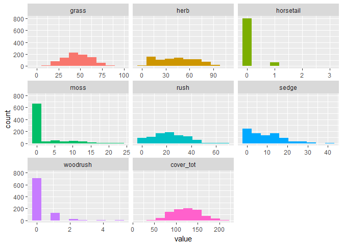
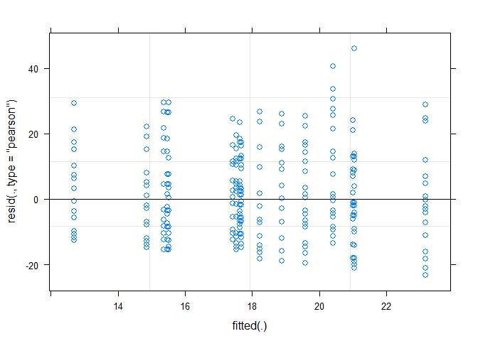

# Rush Trial: data exploration 2017: linear mixed effects model

Packages

```r
library(tidyverse)
```

```
## Warning: package 'tidyverse' was built under R version 3.3.3
```

```
## -- Attaching packages ---------------------------------- tidyverse 1.2.1 --
```

```
## v ggplot2 2.2.1     v purrr   0.2.4
## v tibble  1.4.1     v dplyr   0.7.4
## v tidyr   0.7.2     v stringr 1.2.0
## v readr   1.1.1     v forcats 0.2.0
```

```
## Warning: package 'tibble' was built under R version 3.3.3
```

```
## Warning: package 'tidyr' was built under R version 3.3.3
```

```
## Warning: package 'readr' was built under R version 3.3.3
```

```
## Warning: package 'purrr' was built under R version 3.3.3
```

```
## Warning: package 'dplyr' was built under R version 3.3.3
```

```
## Warning: package 'stringr' was built under R version 3.3.3
```

```
## Warning: package 'forcats' was built under R version 3.3.3
```

```
## -- Conflicts ------------------------------------- tidyverse_conflicts() --
## x dplyr::filter() masks stats::filter()
## x dplyr::lag()    masks stats::lag()
```

```r
library(skimr)
```

```
## Warning: package 'skimr' was built under R version 3.3.3
```

```
## 
## Attaching package: 'skimr'
```

```
## The following objects are masked from 'package:dplyr':
## 
##     contains, ends_with, everything, matches, num_range, one_of,
##     starts_with
```

```r
library(funModeling)
```

```
## Warning: package 'funModeling' was built under R version 3.3.3
```

```
## Loading required package: Hmisc
```

```
## Warning: package 'Hmisc' was built under R version 3.3.3
```

```
## Loading required package: lattice
```

```
## Warning: package 'lattice' was built under R version 3.3.3
```

```
## Loading required package: survival
```

```
## Warning: package 'survival' was built under R version 3.3.3
```

```
## Loading required package: Formula
```

```
## Warning: package 'Formula' was built under R version 3.3.3
```

```
## 
## Attaching package: 'Hmisc'
```

```
## The following objects are masked from 'package:dplyr':
## 
##     combine, src, summarize
```

```
## The following objects are masked from 'package:base':
## 
##     format.pval, round.POSIXt, trunc.POSIXt, units
```

```
## funModeling v.1.6.7 :)
## Examples and tutorials at livebook.datascienceheroes.com
```

```r
library(lme4)
```

```
## Warning: package 'lme4' was built under R version 3.3.3
```

```
## Loading required package: Matrix
```

```
## Warning: package 'Matrix' was built under R version 3.3.3
```

```
## 
## Attaching package: 'Matrix'
```

```
## The following object is masked from 'package:tidyr':
## 
##     expand
```

```r
library(lmerTest)
```

```
## Warning: package 'lmerTest' was built under R version 3.3.3
```

```
## 
## Attaching package: 'lmerTest'
```

```
## The following object is masked from 'package:lme4':
## 
##     lmer
```

```
## The following object is masked from 'package:stats':
## 
##     step
```

Import data

```r
grp_calc_w <- read.csv("../data/prepped/taxon_grp_calc_w.csv", header = TRUE)
```


```r
#drop unwanted columns
data_taxa <- grp_calc_w %>% 
  select(-c(X, uid)) 

#make categories factors
data_taxa <- data_taxa %>% 
  mutate_at(c("year", "treat_plot"), as.factor)
```

```
## Warning: package 'bindrcpp' was built under R version 3.3.3
```

```r
skim(data_taxa)  
```

```
## Skim summary statistics
##  n obs: 864 
##  n variables: 14 
## 
## Variable type: factor 
##    variable missing complete   n n_unique
##    location       0      864 864        4
##        quad       1      863 864       69
##   replicate       0      864 864        3
##  treat_plot       0      864 864        8
##        type       0      864 864        2
##        year       0      864 864        3
##                           top_counts ordered
##   HM: 216, HP: 216, LM: 216, VP: 216   FALSE
##       24: 33, 47: 33, 10: 24, 29: 24   FALSE
##        A: 288, B: 288, C: 288, NA: 0   FALSE
##       1: 108, 2: 108, 3: 108, 4: 108   FALSE
##            mea: 432, pas: 432, NA: 0   FALSE
##  201: 288, 201: 288, 201: 288, NA: 0   FALSE
## 
## Variable type: integer 
##   variable missing complete   n    mean    sd p0    p25 median p75 p100
##  cover_tot       0      864 864 123.4   31.64 31 100       123 145  222
##      grass       0      864 864  47.04  16     2  35.75     47  59   97
##       herb       0      864 864  43.63  24.1   2  24        43  62  106
##  horsetail       0      864 864   0.084  0.32  0   0         0   0    3
##       moss       0      864 864   1.94   4.17  0   0         0   1   23
##       rush       0      864 864  21.31  12.67  0  12        20  30   67
##      sedge       0      864 864   9.15   7.75  0   2         7  14   41
##   woodrush       0      864 864   0.24   0.61  0   0         0   0    5
##      hist
##  <U+2581><U+2582><U+2586><U+2587><U+2587><U+2583><U+2582><U+2581>
##  <U+2581><U+2582><U+2585><U+2587><U+2587><U+2583><U+2581><U+2581>
##  <U+2587><U+2587><U+2587><U+2587><U+2587><U+2586><U+2582><U+2581>
##  <U+2587><U+2581><U+2581><U+2581><U+2581><U+2581><U+2581><U+2581>
##  <U+2587><U+2581><U+2581><U+2581><U+2581><U+2581><U+2581><U+2581>
##  <U+2587><U+2587><U+2587><U+2586><U+2585><U+2582><U+2581><U+2581>
##  <U+2587><U+2583><U+2585><U+2582><U+2581><U+2581><U+2581><U+2581>
##  <U+2587><U+2582><U+2581><U+2581><U+2581><U+2581><U+2581><U+2581>
```

```r
funModeling::plot_num(data_taxa) #plot numeric variables
```

<!-- -->

```r
funModeling::profiling_num(data_taxa) %>% pander() #instead of pander use kable()
```

```
##    variable    mean std_dev variation_coef p_01 p_05 p_25 p_50 p_75 p_95
## 1     grass  47.043   16.00           0.34 14.0   21   36   47   59   73
## 2      herb  43.634   24.10           0.55  5.6    8   24   43   62   83
## 3 horsetail   0.084    0.32           3.75  0.0    0    0    0    0    1
## 4      moss   1.938    4.17           2.15  0.0    0    0    0    1   12
## 5      rush  21.307   12.67           0.59  0.0    2   12   20   30   42
## 6     sedge   9.153    7.75           0.85  0.0    0    2    7   14   24
## 7  woodrush   0.243    0.61           2.50  0.0    0    0    0    0    1
## 8 cover_tot 123.402   31.64           0.26 58.0   75  100  123  145  177
##   p_99 skewness kurtosis iqr      range_98  range_80
## 1   84     0.11      2.7  23   [14, 84.37]  [26, 68]
## 2   96     0.20      2.1  38 [5.63, 96.37]  [12, 77]
## 3    1     4.45     27.5   0        [0, 1]    [0, 0]
## 4   17     2.36      8.2   1       [0, 17]    [0, 8]
## 5   49     0.27      2.5  18       [0, 49] [3.3, 38]
## 6   30     0.83      3.2  12       [0, 30]   [1, 19]
## 7    3     3.50     19.3   0        [0, 3]    [0, 1]
## 8  199     0.17      2.7  45  [58, 198.74] [83, 164]
```


-----------------------------------------------------------------------------
 variable     mean     std_dev   variation_coef   p_01   p_05   p_25    p_50 
----------- --------- --------- ---------------- ------ ------ ------- ------
   grass      47.04      16          0.3402        14     21    35.75    47  

   herb       43.63     24.1         0.5522       5.63    8      24      43  

 horsetail   0.08449   0.3172        3.754         0      0       0      0   

   moss       1.938     4.166         2.15         0      0       0      0   

   rush       21.31     12.67        0.5945        0      2      12      20  

   sedge      9.153     7.753        0.847         0      0       2      7   

 woodrush    0.2431    0.6079        2.501         0      0       0      0   

 cover_tot    123.4     31.64        0.2564        58     75     100    123  
-----------------------------------------------------------------------------

Table: Table continues below

 
--------------------------------------------------------------------------------
 p_75   p_95    p_99    skewness   kurtosis    iqr      range_98      range_80  
------ ------- ------- ---------- ---------- ------- --------------- -----------
  59    72.85   84.37    0.1106     2.669     23.25    [14, 84.37]    [26, 68]  

  62     83     96.37    0.1993     2.065      38     [5.63, 96.37]   [12, 77]  

  0       1       1      4.449      27.48       0        [0, 1]        [0, 0]   

  1      12      17       2.36      8.217       1        [0, 17]       [0, 8]   

  30     42      49      0.2697     2.485      18        [0, 49]      [3.3, 38] 

  14     24      30      0.8258     3.221      12        [0, 30]       [1, 19]  

  0       1       3      3.504      19.28       0        [0, 3]        [0, 1]   

 145    176.8   198.7    0.1733     2.712      45     [58, 198.74]    [83, 164] 
--------------------------------------------------------------------------------

```r
funModeling::correlation_table(data = data_taxa, target = "treat_plot") #correlation coefficient (pearsons R)
```

```
##     Variable treat_plot
## 1 treat_plot       1.00
## 2       herb       0.05
## 3  horsetail       0.05
## 4       rush       0.02
## 5      sedge       0.02
## 6       moss       0.00
## 7  cover_tot       0.00
## 8   woodrush      -0.05
## 9      grass      -0.08
```


# Analysis

A lot of this thanks to https://benwhalley.github.io/just-enough-r/fitting-models.html 

**The 1 refers to an intercept, and so in English this part of the formula means ‘add a random intercept for each level of grouping’.**

## add random intercepts (groupings within the data)


```r
model <- lmer(data = filter(data_taxa, type == "meadow"),
              formula = rush ~ treat_plot + (1 | location))
model
```

```
## Linear mixed model fit by REML ['merModLmerTest']
## Formula: rush ~ treat_plot + (1 | location)
##    Data: filter(data_taxa, type == "meadow")
## REML criterion at convergence: 3388
## Random effects:
##  Groups   Name        Std.Dev.
##  location (Intercept)  1.71   
##  Residual             12.64   
## Number of obs: 432, groups:  location, 2
## Fixed Effects:
## (Intercept)  treat_plot2  treat_plot3  treat_plot4  treat_plot5  
##      16.593        5.481        1.907        3.370       -2.815  
## treat_plot6  treat_plot7  treat_plot8  
##      -0.148       -0.037        2.722
```

```r
broom::tidy(model)
```

```
##                       term estimate std.error statistic    group
## 1              (Intercept)   16.593       2.1     7.885    fixed
## 2              treat_plot2    5.481       2.4     2.254    fixed
## 3              treat_plot3    1.907       2.4     0.784    fixed
## 4              treat_plot4    3.370       2.4     1.386    fixed
## 5              treat_plot5   -2.815       2.4    -1.157    fixed
## 6              treat_plot6   -0.148       2.4    -0.061    fixed
## 7              treat_plot7   -0.037       2.4    -0.015    fixed
## 8              treat_plot8    2.722       2.4     1.119    fixed
## 9  sd_(Intercept).location    1.715        NA        NA location
## 10 sd_Observation.Residual   12.638        NA        NA Residual
```

```r
plot(model)
```

<!-- -->

## add nesting


```r
model <- lmerTest::lmer(data = filter(data_taxa, type == "meadow"),
              formula = rush ~ treat_plot + (1 | location/replicate))
model
```

```
## Linear mixed model fit by REML ['merModLmerTest']
## Formula: rush ~ treat_plot + (1 | location/replicate)
##    Data: filter(data_taxa, type == "meadow")
## REML criterion at convergence: 3388
## Random effects:
##  Groups             Name        Std.Dev.
##  replicate:location (Intercept) 1.64e-07
##  location           (Intercept) 1.71e+00
##  Residual                       1.26e+01
## Number of obs: 432, groups:  replicate:location, 6; location, 2
## Fixed Effects:
## (Intercept)  treat_plot2  treat_plot3  treat_plot4  treat_plot5  
##      16.593        5.481        1.907        3.370       -2.815  
## treat_plot6  treat_plot7  treat_plot8  
##      -0.148       -0.037        2.722
```

```r
summary(model)
```

```
## Linear mixed model fit by REML t-tests use Satterthwaite approximations
##   to degrees of freedom [lmerMod]
## Formula: rush ~ treat_plot + (1 | location/replicate)
##    Data: filter(data_taxa, type == "meadow")
## 
## REML criterion at convergence: 3388
## 
## Scaled residuals: 
##    Min     1Q Median     3Q    Max 
## -1.832 -0.751 -0.152  0.597  3.636 
## 
## Random effects:
##  Groups             Name        Variance Std.Dev.
##  replicate:location (Intercept) 2.70e-14 1.64e-07
##  location           (Intercept) 2.94e+00 1.71e+00
##  Residual                       1.60e+02 1.26e+01
## Number of obs: 432, groups:  replicate:location, 6; location, 2
## 
## Fixed effects:
##             Estimate Std. Error      df t value Pr(>|t|)    
## (Intercept)   16.593      2.104   6.000    7.88  0.00027 ***
## treat_plot2    5.481      2.432 423.000    2.25  0.02473 *  
## treat_plot3    1.907      2.432 423.000    0.78  0.43335    
## treat_plot4    3.370      2.432 423.000    1.39  0.16657    
## treat_plot5   -2.815      2.432 423.000   -1.16  0.24781    
## treat_plot6   -0.148      2.432 423.000   -0.06  0.95146    
## treat_plot7   -0.037      2.432 423.000   -0.02  0.98786    
## treat_plot8    2.722      2.432 423.000    1.12  0.26368    
## ---
## Signif. codes:  0 '***' 0.001 '**' 0.01 '*' 0.05 '.' 0.1 ' ' 1
## 
## Correlation of Fixed Effects:
##             (Intr) trt_p2 trt_p3 trt_p4 trt_p5 trt_p6 trt_p7
## treat_plot2 -0.578                                          
## treat_plot3 -0.578  0.500                                   
## treat_plot4 -0.578  0.500  0.500                            
## treat_plot5 -0.578  0.500  0.500  0.500                     
## treat_plot6 -0.578  0.500  0.500  0.500  0.500              
## treat_plot7 -0.578  0.500  0.500  0.500  0.500  0.500       
## treat_plot8 -0.578  0.500  0.500  0.500  0.500  0.500  0.500
```

```r
broom::tidy(model)
```

```
##                                 term estimate std.error statistic
## 1                        (Intercept)  1.7e+01       2.1     7.885
## 2                        treat_plot2  5.5e+00       2.4     2.254
## 3                        treat_plot3  1.9e+00       2.4     0.784
## 4                        treat_plot4  3.4e+00       2.4     1.386
## 5                        treat_plot5 -2.8e+00       2.4    -1.157
## 6                        treat_plot6 -1.5e-01       2.4    -0.061
## 7                        treat_plot7 -3.7e-02       2.4    -0.015
## 8                        treat_plot8  2.7e+00       2.4     1.119
## 9  sd_(Intercept).replicate:location  1.6e-07        NA        NA
## 10           sd_(Intercept).location  1.7e+00        NA        NA
## 11           sd_Observation.Residual  1.3e+01        NA        NA
##                 group
## 1               fixed
## 2               fixed
## 3               fixed
## 4               fixed
## 5               fixed
## 6               fixed
## 7               fixed
## 8               fixed
## 9  replicate:location
## 10           location
## 11           Residual
```

## add random slope (to vary by treatment)


```r
model <- lmerTest::lmer(data = filter(data_taxa, type == "meadow"),
              formula = rush ~ treat_plot + (treat_plot | location/replicate/year))
```

```
## Warning in commonArgs(par, fn, control, environment()): maxfun < 10 *
## length(par)^2 is not recommended.
```

```
## Warning in optwrap(optimizer, devfun, getStart(start, rho$lower, rho$pp), :
## convergence code 1 from bobyqa: bobyqa -- maximum number of function
## evaluations exceeded
```

```
## Warning in checkConv(attr(opt, "derivs"), opt$par, ctrl = control
## $checkConv, : unable to evaluate scaled gradient
```

```
## Warning in checkConv(attr(opt, "derivs"), opt$par, ctrl = control
## $checkConv, : Model failed to converge: degenerate Hessian with 1 negative
## eigenvalues
```

```r
model
```

```
## Linear mixed model fit by REML ['merModLmerTest']
## Formula: rush ~ treat_plot + (treat_plot | location/replicate/year)
##    Data: filter(data_taxa, type == "meadow")
## REML criterion at convergence: 3336
## Random effects:
##  Groups                    Name        Std.Dev. Corr                   
##  year:(replicate:location) (Intercept)  2.387                          
##                            treat_plot2  4.529   -0.33                  
##                            treat_plot3  3.902   -0.26  0.47            
##                            treat_plot4  3.589   -0.10 -0.03 -0.59      
##                            treat_plot5  2.703   -0.25  0.57  0.11  0.70
##                            treat_plot6  6.846   -0.91  0.59  0.25  0.34
##                            treat_plot7  4.654   -0.14 -0.77  0.08 -0.12
##                            treat_plot8  5.868   -0.61 -0.28 -0.48  0.17
##  replicate:location        (Intercept)  1.628                          
##                            treat_plot2  0.849   -1.00                  
##                            treat_plot3  3.559   -0.75  0.75            
##                            treat_plot4  4.886   -0.54  0.54 -0.16      
##                            treat_plot5  5.098   -0.97  0.97  0.88  0.33
##                            treat_plot6  5.384    0.96 -0.96 -0.53 -0.76
##                            treat_plot7  3.736   -1.00  1.00  0.77  0.51
##                            treat_plot8  2.563    0.00  0.00 -0.67  0.84
##  location                  (Intercept)  1.891                          
##                            treat_plot2  0.868   -1.00                  
##                            treat_plot3  2.223   -1.00  1.00            
##                            treat_plot4  5.572   -1.00  1.00  1.00      
##                            treat_plot5  2.451   -1.00  1.00  1.00  1.00
##                            treat_plot6  1.939    1.00 -1.00 -1.00 -1.00
##                            treat_plot7  0.821    1.00 -1.00 -1.00 -1.00
##                            treat_plot8  8.205    1.00 -1.00 -1.00 -1.00
##  Residual                              11.167                          
##                   
##                   
##                   
##                   
##                   
##                   
##   0.61            
##  -0.36 -0.15      
##  -0.29  0.37  0.24
##                   
##                   
##                   
##                   
##                   
##  -0.87            
##   0.98 -0.95      
##  -0.23 -0.28 -0.03
##                   
##                   
##                   
##                   
##                   
##  -1.00            
##  -1.00  1.00      
##  -1.00  1.00  1.00
##                   
## Number of obs: 432, groups:  
## year:(replicate:location), 18; replicate:location, 6; location, 2
## Fixed Effects:
## (Intercept)  treat_plot2  treat_plot3  treat_plot4  treat_plot5  
##      16.593        5.481        1.907        3.370       -2.815  
## treat_plot6  treat_plot7  treat_plot8  
##      -0.148       -0.037        2.722  
## convergence code 1; 2 optimizer warnings; 1 lme4 warnings
```

```r
summary(model)
```

```
## Error in calculation of the Satterthwaite's approximation. The output of lme4 package is returned
```

```
## summary from lme4 is returned
## some computational error has occurred in lmerTest
```

```
## Linear mixed model fit by REML ['lmerMod']
## Formula: rush ~ treat_plot + (treat_plot | location/replicate/year)
##    Data: filter(data_taxa, type == "meadow")
## 
## REML criterion at convergence: 3336
## 
## Scaled residuals: 
##    Min     1Q Median     3Q    Max 
## -2.124 -0.686 -0.106  0.564  3.690 
## 
## Random effects:
##  Groups                    Name        Variance Std.Dev. Corr             
##  year:(replicate:location) (Intercept)   5.697   2.387                    
##                            treat_plot2  20.513   4.529   -0.33            
##                            treat_plot3  15.223   3.902   -0.26  0.47      
##                            treat_plot4  12.882   3.589   -0.10 -0.03 -0.59
##                            treat_plot5   7.304   2.703   -0.25  0.57  0.11
##                            treat_plot6  46.867   6.846   -0.91  0.59  0.25
##                            treat_plot7  21.664   4.654   -0.14 -0.77  0.08
##                            treat_plot8  34.433   5.868   -0.61 -0.28 -0.48
##  replicate:location        (Intercept)   2.651   1.628                    
##                            treat_plot2   0.721   0.849   -1.00            
##                            treat_plot3  12.668   3.559   -0.75  0.75      
##                            treat_plot4  23.875   4.886   -0.54  0.54 -0.16
##                            treat_plot5  25.989   5.098   -0.97  0.97  0.88
##                            treat_plot6  28.984   5.384    0.96 -0.96 -0.53
##                            treat_plot7  13.955   3.736   -1.00  1.00  0.77
##                            treat_plot8   6.571   2.563    0.00  0.00 -0.67
##  location                  (Intercept)   3.576   1.891                    
##                            treat_plot2   0.754   0.868   -1.00            
##                            treat_plot3   4.941   2.223   -1.00  1.00      
##                            treat_plot4  31.051   5.572   -1.00  1.00  1.00
##                            treat_plot5   6.008   2.451   -1.00  1.00  1.00
##                            treat_plot6   3.762   1.939    1.00 -1.00 -1.00
##                            treat_plot7   0.674   0.821    1.00 -1.00 -1.00
##                            treat_plot8  67.316   8.205    1.00 -1.00 -1.00
##  Residual                              124.708  11.167                    
##                         
##                         
##                         
##                         
##                         
##   0.70                  
##   0.34  0.61            
##  -0.12 -0.36 -0.15      
##   0.17 -0.29  0.37  0.24
##                         
##                         
##                         
##                         
##   0.33                  
##  -0.76 -0.87            
##   0.51  0.98 -0.95      
##   0.84 -0.23 -0.28 -0.03
##                         
##                         
##                         
##                         
##   1.00                  
##  -1.00 -1.00            
##  -1.00 -1.00  1.00      
##  -1.00 -1.00  1.00  1.00
##                         
## Number of obs: 432, groups:  
## year:(replicate:location), 18; replicate:location, 6; location, 2
## 
## Fixed effects:
##             Estimate Std. Error t value
## (Intercept)   16.593      2.204    7.53
## treat_plot2    5.481      2.501    2.19
## treat_plot3    1.907      3.170    0.60
## treat_plot4    3.370      4.984    0.68
## treat_plot5   -2.815      3.516   -0.80
## treat_plot6   -0.148      3.733   -0.04
## treat_plot7   -0.037      2.913   -0.01
## treat_plot8    2.722      6.425    0.42
## 
## Correlation of Fixed Effects:
##             (Intr) trt_p2 trt_p3 trt_p4 trt_p5 trt_p6 trt_p7
## treat_plot2 -0.645                                          
## treat_plot3 -0.754  0.519                                   
## treat_plot4 -0.760  0.408  0.481                            
## treat_plot5 -0.782  0.507  0.696  0.622                     
## treat_plot6  0.012  0.187 -0.098 -0.319 -0.259              
## treat_plot7 -0.410  0.217  0.344  0.102  0.406 -0.032       
## treat_plot8  0.351 -0.104 -0.414 -0.581 -0.377  0.436  0.320
## convergence code: 1
## unable to evaluate scaled gradient
## Model failed to converge: degenerate  Hessian with 1 negative eigenvalues
## maxfun < 10 * length(par)^2 is not recommended.
```

```r
broom::tidy(model)
```

```
##                                                      term estimate
## 1                                             (Intercept)  16.5926
## 2                                             treat_plot2   5.4815
## 3                                             treat_plot3   1.9074
## 4                                             treat_plot4   3.3704
## 5                                             treat_plot5  -2.8148
## 6                                             treat_plot6  -0.1481
## 7                                             treat_plot7  -0.0370
## 8                                             treat_plot8   2.7222
## 9                sd_(Intercept).year:(replicate:location)   2.3868
## 10               sd_treat_plot2.year:(replicate:location)   4.5291
## 11               sd_treat_plot3.year:(replicate:location)   3.9016
## 12               sd_treat_plot4.year:(replicate:location)   3.5891
## 13               sd_treat_plot5.year:(replicate:location)   2.7027
## 14               sd_treat_plot6.year:(replicate:location)   6.8459
## 15               sd_treat_plot7.year:(replicate:location)   4.6544
## 16               sd_treat_plot8.year:(replicate:location)   5.8679
## 17  cor_(Intercept).treat_plot2.year:(replicate:location)  -0.3258
## 18  cor_(Intercept).treat_plot3.year:(replicate:location)  -0.2600
## 19  cor_(Intercept).treat_plot4.year:(replicate:location)  -0.1006
## 20  cor_(Intercept).treat_plot5.year:(replicate:location)  -0.2490
## 21  cor_(Intercept).treat_plot6.year:(replicate:location)  -0.9068
## 22  cor_(Intercept).treat_plot7.year:(replicate:location)  -0.1396
## 23  cor_(Intercept).treat_plot8.year:(replicate:location)  -0.6144
## 24  cor_treat_plot2.treat_plot3.year:(replicate:location)   0.4739
## 25  cor_treat_plot2.treat_plot4.year:(replicate:location)  -0.0254
## 26  cor_treat_plot2.treat_plot5.year:(replicate:location)   0.5683
## 27  cor_treat_plot2.treat_plot6.year:(replicate:location)   0.5874
## 28  cor_treat_plot2.treat_plot7.year:(replicate:location)  -0.7708
## 29  cor_treat_plot2.treat_plot8.year:(replicate:location)  -0.2822
## 30  cor_treat_plot3.treat_plot4.year:(replicate:location)  -0.5931
## 31  cor_treat_plot3.treat_plot5.year:(replicate:location)   0.1065
## 32  cor_treat_plot3.treat_plot6.year:(replicate:location)   0.2524
## 33  cor_treat_plot3.treat_plot7.year:(replicate:location)   0.0777
## 34  cor_treat_plot3.treat_plot8.year:(replicate:location)  -0.4770
## 35  cor_treat_plot4.treat_plot5.year:(replicate:location)   0.7024
## 36  cor_treat_plot4.treat_plot6.year:(replicate:location)   0.3446
## 37  cor_treat_plot4.treat_plot7.year:(replicate:location)  -0.1193
## 38  cor_treat_plot4.treat_plot8.year:(replicate:location)   0.1712
## 39  cor_treat_plot5.treat_plot6.year:(replicate:location)   0.6147
## 40  cor_treat_plot5.treat_plot7.year:(replicate:location)  -0.3639
## 41  cor_treat_plot5.treat_plot8.year:(replicate:location)  -0.2945
## 42  cor_treat_plot6.treat_plot7.year:(replicate:location)  -0.1539
## 43  cor_treat_plot6.treat_plot8.year:(replicate:location)   0.3709
## 44  cor_treat_plot7.treat_plot8.year:(replicate:location)   0.2449
## 45                      sd_(Intercept).replicate:location   1.6283
## 46                      sd_treat_plot2.replicate:location   0.8491
## 47                      sd_treat_plot3.replicate:location   3.5592
## 48                      sd_treat_plot4.replicate:location   4.8862
## 49                      sd_treat_plot5.replicate:location   5.0979
## 50                      sd_treat_plot6.replicate:location   5.3836
## 51                      sd_treat_plot7.replicate:location   3.7357
## 52                      sd_treat_plot8.replicate:location   2.5635
## 53         cor_(Intercept).treat_plot2.replicate:location  -1.0000
## 54         cor_(Intercept).treat_plot3.replicate:location  -0.7471
## 55         cor_(Intercept).treat_plot4.replicate:location  -0.5408
## 56         cor_(Intercept).treat_plot5.replicate:location  -0.9728
## 57         cor_(Intercept).treat_plot6.replicate:location   0.9591
## 58         cor_(Intercept).treat_plot7.replicate:location  -0.9995
## 59         cor_(Intercept).treat_plot8.replicate:location   0.0015
## 60         cor_treat_plot2.treat_plot3.replicate:location   0.7471
## 61         cor_treat_plot2.treat_plot4.replicate:location   0.5408
## 62         cor_treat_plot2.treat_plot5.replicate:location   0.9728
## 63         cor_treat_plot2.treat_plot6.replicate:location  -0.9591
## 64         cor_treat_plot2.treat_plot7.replicate:location   0.9995
## 65         cor_treat_plot2.treat_plot8.replicate:location  -0.0015
## 66         cor_treat_plot3.treat_plot4.replicate:location  -0.1550
## 67         cor_treat_plot3.treat_plot5.replicate:location   0.8808
## 68         cor_treat_plot3.treat_plot6.replicate:location  -0.5285
## 69         cor_treat_plot3.treat_plot7.replicate:location   0.7678
## 70         cor_treat_plot3.treat_plot8.replicate:location  -0.6658
## 71         cor_treat_plot4.treat_plot5.replicate:location   0.3312
## 72         cor_treat_plot4.treat_plot6.replicate:location  -0.7567
## 73         cor_treat_plot4.treat_plot7.replicate:location   0.5139
## 74         cor_treat_plot4.treat_plot8.replicate:location   0.8403
## 75         cor_treat_plot5.treat_plot6.replicate:location  -0.8675
## 76         cor_treat_plot5.treat_plot7.replicate:location   0.9796
## 77         cor_treat_plot5.treat_plot8.replicate:location  -0.2331
## 78         cor_treat_plot6.treat_plot7.replicate:location  -0.9497
## 79         cor_treat_plot6.treat_plot8.replicate:location  -0.2815
## 80         cor_treat_plot7.treat_plot8.replicate:location  -0.0332
## 81                                sd_(Intercept).location   1.8911
## 82                                sd_treat_plot2.location   0.8683
## 83                                sd_treat_plot3.location   2.2228
## 84                                sd_treat_plot4.location   5.5723
## 85                                sd_treat_plot5.location   2.4511
## 86                                sd_treat_plot6.location   1.9395
## 87                                sd_treat_plot7.location   0.8207
## 88                                sd_treat_plot8.location   8.2046
## 89                   cor_(Intercept).treat_plot2.location  -1.0000
## 90                   cor_(Intercept).treat_plot3.location  -1.0000
## 91                   cor_(Intercept).treat_plot4.location  -1.0000
## 92                   cor_(Intercept).treat_plot5.location  -1.0000
## 93                   cor_(Intercept).treat_plot6.location   1.0000
## 94                   cor_(Intercept).treat_plot7.location   0.9996
## 95                   cor_(Intercept).treat_plot8.location   1.0000
## 96                   cor_treat_plot2.treat_plot3.location   1.0000
## 97                   cor_treat_plot2.treat_plot4.location   1.0000
## 98                   cor_treat_plot2.treat_plot5.location   1.0000
## 99                   cor_treat_plot2.treat_plot6.location  -1.0000
## 100                  cor_treat_plot2.treat_plot7.location  -0.9996
## 101                  cor_treat_plot2.treat_plot8.location  -1.0000
## 102                  cor_treat_plot3.treat_plot4.location   1.0000
## 103                  cor_treat_plot3.treat_plot5.location   1.0000
## 104                  cor_treat_plot3.treat_plot6.location  -1.0000
## 105                  cor_treat_plot3.treat_plot7.location  -0.9996
## 106                  cor_treat_plot3.treat_plot8.location  -1.0000
## 107                  cor_treat_plot4.treat_plot5.location   1.0000
## 108                  cor_treat_plot4.treat_plot6.location  -1.0000
## 109                  cor_treat_plot4.treat_plot7.location  -0.9997
## 110                  cor_treat_plot4.treat_plot8.location  -1.0000
## 111                  cor_treat_plot5.treat_plot6.location  -1.0000
## 112                  cor_treat_plot5.treat_plot7.location  -0.9996
## 113                  cor_treat_plot5.treat_plot8.location  -1.0000
## 114                  cor_treat_plot6.treat_plot7.location   0.9998
## 115                  cor_treat_plot6.treat_plot8.location   1.0000
## 116                  cor_treat_plot7.treat_plot8.location   0.9998
## 117                               sd_Observation.Residual  11.1673
##     std.error statistic                     group
## 1         2.2     7.530                     fixed
## 2         2.5     2.192                     fixed
## 3         3.2     0.602                     fixed
## 4         5.0     0.676                     fixed
## 5         3.5    -0.801                     fixed
## 6         3.7    -0.040                     fixed
## 7         2.9    -0.013                     fixed
## 8         6.4     0.424                     fixed
## 9          NA        NA year:(replicate:location)
## 10         NA        NA year:(replicate:location)
## 11         NA        NA year:(replicate:location)
## 12         NA        NA year:(replicate:location)
## 13         NA        NA year:(replicate:location)
## 14         NA        NA year:(replicate:location)
## 15         NA        NA year:(replicate:location)
## 16         NA        NA year:(replicate:location)
## 17         NA        NA year:(replicate:location)
## 18         NA        NA year:(replicate:location)
## 19         NA        NA year:(replicate:location)
## 20         NA        NA year:(replicate:location)
## 21         NA        NA year:(replicate:location)
## 22         NA        NA year:(replicate:location)
## 23         NA        NA year:(replicate:location)
## 24         NA        NA year:(replicate:location)
## 25         NA        NA year:(replicate:location)
## 26         NA        NA year:(replicate:location)
## 27         NA        NA year:(replicate:location)
## 28         NA        NA year:(replicate:location)
## 29         NA        NA year:(replicate:location)
## 30         NA        NA year:(replicate:location)
## 31         NA        NA year:(replicate:location)
## 32         NA        NA year:(replicate:location)
## 33         NA        NA year:(replicate:location)
## 34         NA        NA year:(replicate:location)
## 35         NA        NA year:(replicate:location)
## 36         NA        NA year:(replicate:location)
## 37         NA        NA year:(replicate:location)
## 38         NA        NA year:(replicate:location)
## 39         NA        NA year:(replicate:location)
## 40         NA        NA year:(replicate:location)
## 41         NA        NA year:(replicate:location)
## 42         NA        NA year:(replicate:location)
## 43         NA        NA year:(replicate:location)
## 44         NA        NA year:(replicate:location)
## 45         NA        NA        replicate:location
## 46         NA        NA        replicate:location
## 47         NA        NA        replicate:location
## 48         NA        NA        replicate:location
## 49         NA        NA        replicate:location
## 50         NA        NA        replicate:location
## 51         NA        NA        replicate:location
## 52         NA        NA        replicate:location
## 53         NA        NA        replicate:location
## 54         NA        NA        replicate:location
## 55         NA        NA        replicate:location
## 56         NA        NA        replicate:location
## 57         NA        NA        replicate:location
## 58         NA        NA        replicate:location
## 59         NA        NA        replicate:location
## 60         NA        NA        replicate:location
## 61         NA        NA        replicate:location
## 62         NA        NA        replicate:location
## 63         NA        NA        replicate:location
## 64         NA        NA        replicate:location
## 65         NA        NA        replicate:location
## 66         NA        NA        replicate:location
## 67         NA        NA        replicate:location
## 68         NA        NA        replicate:location
## 69         NA        NA        replicate:location
## 70         NA        NA        replicate:location
## 71         NA        NA        replicate:location
## 72         NA        NA        replicate:location
## 73         NA        NA        replicate:location
## 74         NA        NA        replicate:location
## 75         NA        NA        replicate:location
## 76         NA        NA        replicate:location
## 77         NA        NA        replicate:location
## 78         NA        NA        replicate:location
## 79         NA        NA        replicate:location
## 80         NA        NA        replicate:location
## 81         NA        NA                  location
## 82         NA        NA                  location
## 83         NA        NA                  location
## 84         NA        NA                  location
## 85         NA        NA                  location
## 86         NA        NA                  location
## 87         NA        NA                  location
## 88         NA        NA                  location
## 89         NA        NA                  location
## 90         NA        NA                  location
## 91         NA        NA                  location
## 92         NA        NA                  location
## 93         NA        NA                  location
## 94         NA        NA                  location
## 95         NA        NA                  location
## 96         NA        NA                  location
## 97         NA        NA                  location
## 98         NA        NA                  location
## 99         NA        NA                  location
## 100        NA        NA                  location
## 101        NA        NA                  location
## 102        NA        NA                  location
## 103        NA        NA                  location
## 104        NA        NA                  location
## 105        NA        NA                  location
## 106        NA        NA                  location
## 107        NA        NA                  location
## 108        NA        NA                  location
## 109        NA        NA                  location
## 110        NA        NA                  location
## 111        NA        NA                  location
## 112        NA        NA                  location
## 113        NA        NA                  location
## 114        NA        NA                  location
## 115        NA        NA                  location
## 116        NA        NA                  location
## 117        NA        NA                  Residual
```


```r
model <- lmerTest::lmer(data = filter(data_taxa, type == "meadow"),
              formula = rush ~ year + (1 | location/treat_plot))
model
```

```
## Linear mixed model fit by REML ['merModLmerTest']
## Formula: rush ~ year + (1 | location/treat_plot)
##    Data: filter(data_taxa, type == "meadow")
## REML criterion at convergence: 3412
## Random effects:
##  Groups              Name        Std.Dev.
##  treat_plot:location (Intercept)  3.08   
##  location            (Intercept)  1.33   
##  Residual                        12.46   
## Number of obs: 432, groups:  treat_plot:location, 16; location, 2
## Fixed Effects:
## (Intercept)     year2016     year2017  
##      18.306       -0.403       -0.806
```

```r
summary(model)
```

```
## Linear mixed model fit by REML t-tests use Satterthwaite approximations
##   to degrees of freedom [lmerMod]
## Formula: rush ~ year + (1 | location/treat_plot)
##    Data: filter(data_taxa, type == "meadow")
## 
## REML criterion at convergence: 3412
## 
## Scaled residuals: 
##    Min     1Q Median     3Q    Max 
## -1.735 -0.715 -0.182  0.567  3.951 
## 
## Random effects:
##  Groups              Name        Variance Std.Dev.
##  treat_plot:location (Intercept)   9.51    3.08   
##  location            (Intercept)   1.77    1.33   
##  Residual                        155.25   12.46   
## Number of obs: 432, groups:  treat_plot:location, 16; location, 2
## 
## Fixed effects:
##             Estimate Std. Error      df t value Pr(>|t|)   
## (Intercept)   18.306      1.600   2.000   11.44   0.0085 **
## year2016      -0.403      1.468 414.000   -0.27   0.7840   
## year2017      -0.806      1.468 414.000   -0.55   0.5836   
## ---
## Signif. codes:  0 '***' 0.001 '**' 0.01 '*' 0.05 '.' 0.1 ' ' 1
## 
## Correlation of Fixed Effects:
##          (Intr) yr2016
## year2016 -0.459       
## year2017 -0.459  0.500
```

```r
broom::tidy(model)
```

```
##                                 term estimate std.error statistic
## 1                        (Intercept)    18.31       1.6     11.44
## 2                           year2016    -0.40       1.5     -0.27
## 3                           year2017    -0.81       1.5     -0.55
## 4 sd_(Intercept).treat_plot:location     3.08        NA        NA
## 5            sd_(Intercept).location     1.33        NA        NA
## 6            sd_Observation.Residual    12.46        NA        NA
##                 group
## 1               fixed
## 2               fixed
## 3               fixed
## 4 treat_plot:location
## 5            location
## 6            Residual
```


