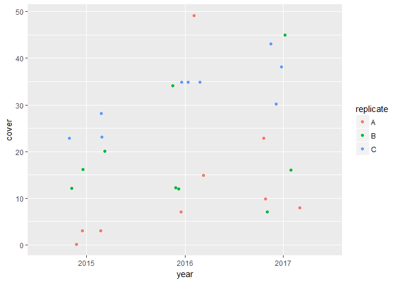

# Rush Trial: analyse standardised change

Packages

```r
library(tidyverse)
```

```
## Warning: package 'tidyverse' was built under R version 3.3.3
```

```
## -- Attaching packages ---------------------------------- tidyverse 1.2.1 --
```

```
## v ggplot2 2.2.1     v purrr   0.2.4
## v tibble  1.4.1     v dplyr   0.7.4
## v tidyr   0.7.2     v stringr 1.2.0
## v readr   1.1.1     v forcats 0.2.0
```

```
## Warning: package 'tibble' was built under R version 3.3.3
```

```
## Warning: package 'tidyr' was built under R version 3.3.3
```

```
## Warning: package 'readr' was built under R version 3.3.3
```

```
## Warning: package 'purrr' was built under R version 3.3.3
```

```
## Warning: package 'dplyr' was built under R version 3.3.3
```

```
## Warning: package 'stringr' was built under R version 3.3.3
```

```
## Warning: package 'forcats' was built under R version 3.3.3
```

```
## -- Conflicts ------------------------------------- tidyverse_conflicts() --
## x dplyr::filter() masks stats::filter()
## x dplyr::lag()    masks stats::lag()
```

```r
library(skimr)
```

```
## Warning: package 'skimr' was built under R version 3.3.3
```

```
## 
## Attaching package: 'skimr'
```

```
## The following objects are masked from 'package:dplyr':
## 
##     contains, ends_with, everything, matches, num_range, one_of,
##     starts_with
```

```r
library(funModeling)
```

```
## Warning: package 'funModeling' was built under R version 3.3.3
```

```
## Loading required package: Hmisc
```

```
## Warning: package 'Hmisc' was built under R version 3.3.3
```

```
## Loading required package: lattice
```

```
## Warning: package 'lattice' was built under R version 3.3.3
```

```
## Loading required package: survival
```

```
## Warning: package 'survival' was built under R version 3.3.3
```

```
## Loading required package: Formula
```

```
## Warning: package 'Formula' was built under R version 3.3.3
```

```
## 
## Attaching package: 'Hmisc'
```

```
## The following objects are masked from 'package:dplyr':
## 
##     combine, src, summarize
```

```
## The following objects are masked from 'package:base':
## 
##     format.pval, round.POSIXt, trunc.POSIXt, units
```

```
## funModeling v.1.6.7 :)
## Examples and tutorials at livebook.datascienceheroes.com
```

Import data

```r
grp_calc_w <- read.csv("../data/prepped/taxon_grp_calc_w.csv", header = TRUE)
```


```r
#drop unwanted columns
data_taxa <- grp_calc_w %>% 
  select(-c(X, uid)) 

#make categories factors
data_taxa <- data_taxa %>% 
  mutate_at(c("year", "treat_plot"), as.factor)
```

```
## Warning: package 'bindrcpp' was built under R version 3.3.3
```

```r
data_taxa_long <- data_taxa %>% 
  select(-cover_tot) %>% 
  gather(key = "taxon", value = "cover", grass:woodrush) 

head(data_taxa_long)
```

```
##   year replicate location treat_plot quad   type taxon cover
## 1 2016         A       HM          1   11 meadow grass    56
## 2 2017         A       HM          1   20 meadow grass    60
## 3 2017         A       HM          1   35 meadow grass    52
## 4 2016         A       HM          1   44 meadow grass    41
## 5 2015         A       HM          1   51 meadow grass    35
## 6 2015         A       HM          1   61 meadow grass    68
```


```r
plotdata <- data_taxa_long %>% 
  filter(location == "HP", treat_plot == "1", taxon == "rush")

ggplot(data = plotdata, aes(x = year, y = cover)) +
  geom_jitter(aes(colour = replicate), width = 0.2, height = 0.2)
```

<!-- -->


```r
plotdata <- data_taxa_long %>% 
  filter(location == "HP", treat_plot == "1", taxon == "rush")

ggplot(data = plotdata) +
  geom_point(aes(x = year, y = cover))
```

<!-- -->

```r
ggplot(data = plotdata, aes(x = year, y = cover)) +
  geom_jitter(aes(colour = replicate), width = 0.2, height = 0.2)
```

<!-- -->

```r
ggplot(data = plotdata, aes(x = year, y = cover, colour = replicate)) +
  geom_smooth(aes(group = replicate), method = "lm") +
  geom_smooth(aes(group = taxon, colour = "global"), method = "lm") +
  geom_jitter(width = 0.2, height = 0.2) 
```

<!-- -->


standardise mean to zero

```r
plotdata <- data_taxa_long %>% 
  filter(location == "HP", treat_plot == "1", taxon == "herb")

#calculate mean of baseline year: 
baseMean <- plotdata %>% 
  filter(year == "2015") %>% 
  summarise(mean = mean(cover))  

plotdata <- mutate(plotdata, cover_adj = cover - baseMean[1,1])

ggplot(data = plotdata) +
  geom_point(aes(x = year, y = cover_adj), position = "jitter")
```

<!-- -->

```r
ggplot(data = plotdata, aes(x = year, y = cover_adj, colour = replicate)) +
  geom_smooth(aes(group = replicate), method = "lm") +
  geom_smooth(aes(group = taxon, colour = "global"), method = "lm") +
  geom_jitter(width = 0.2, height = 0.2) 
```

<!-- -->

why are the slopes different to the non-standardised data????

