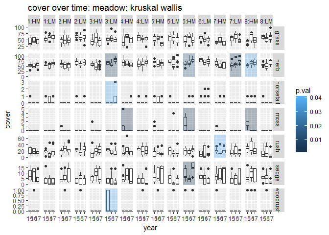
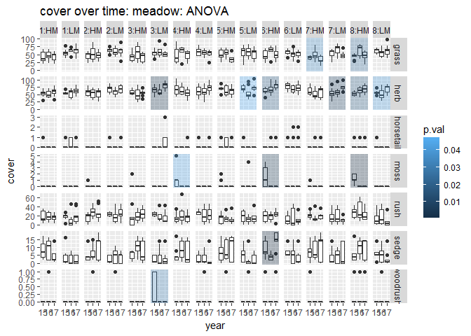

# Rush Trial: analyse one by one: non-parametric

##Packages

```r
library(tidyverse)
```

```
## Warning: package 'tidyverse' was built under R version 3.3.3
```

```
## -- Attaching packages ---------------------------------- tidyverse 1.2.1 --
```

```
## v ggplot2 2.2.1     v purrr   0.2.4
## v tibble  1.4.1     v dplyr   0.7.4
## v tidyr   0.7.2     v stringr 1.2.0
## v readr   1.1.1     v forcats 0.2.0
```

```
## Warning: package 'tibble' was built under R version 3.3.3
```

```
## Warning: package 'tidyr' was built under R version 3.3.3
```

```
## Warning: package 'readr' was built under R version 3.3.3
```

```
## Warning: package 'purrr' was built under R version 3.3.3
```

```
## Warning: package 'dplyr' was built under R version 3.3.3
```

```
## Warning: package 'stringr' was built under R version 3.3.3
```

```
## Warning: package 'forcats' was built under R version 3.3.3
```

```
## -- Conflicts ------------------------------------- tidyverse_conflicts() --
## x dplyr::filter() masks stats::filter()
## x dplyr::lag()    masks stats::lag()
```

```r
library(skimr)
```

```
## Warning: package 'skimr' was built under R version 3.3.3
```

```
## 
## Attaching package: 'skimr'
```

```
## The following objects are masked from 'package:dplyr':
## 
##     contains, ends_with, everything, matches, num_range, one_of,
##     starts_with
```

```r
library(funModeling)
```

```
## Warning: package 'funModeling' was built under R version 3.3.3
```

```
## Loading required package: Hmisc
```

```
## Warning: package 'Hmisc' was built under R version 3.3.3
```

```
## Loading required package: lattice
```

```
## Warning: package 'lattice' was built under R version 3.3.3
```

```
## Loading required package: survival
```

```
## Warning: package 'survival' was built under R version 3.3.3
```

```
## Loading required package: Formula
```

```
## Warning: package 'Formula' was built under R version 3.3.3
```

```
## 
## Attaching package: 'Hmisc'
```

```
## The following objects are masked from 'package:dplyr':
## 
##     combine, src, summarize
```

```
## The following objects are masked from 'package:base':
## 
##     format.pval, round.POSIXt, trunc.POSIXt, units
```

```
## funModeling v.1.6.7 :)
## Examples and tutorials at livebook.datascienceheroes.com
```

```r
library(ggpubr)   # helps make publication-ready graphs
```

```
## Warning: package 'ggpubr' was built under R version 3.3.3
```

```
## Loading required package: magrittr
```

```
## 
## Attaching package: 'magrittr'
```

```
## The following object is masked from 'package:purrr':
## 
##     set_names
```

```
## The following object is masked from 'package:tidyr':
## 
##     extract
```

```r
library(broom)    # cleans up code output from common functions
```

```
## Warning: package 'broom' was built under R version 3.3.3
```

##Import data

```r
grp_calc_w <- read.csv("../data/prepped/taxon_grp_calc_w.csv", header = TRUE)
```


```r
#drop unwanted columns
data_taxa <- grp_calc_w %>% 
  select(-c(X, uid)) 

#make categories factors
data_taxa <- data_taxa %>% 
  mutate_at(c("year", "treat_plot"), as.factor)
```

```
## Warning: package 'bindrcpp' was built under R version 3.3.3
```

```r
data_taxa_long <- data_taxa %>% 
  select(-cover_tot) %>% 
  gather(key = "taxon", value = "cover", grass:woodrush) 

head(data_taxa_long)
```

```
##   year replicate location treat_plot quad   type taxon cover
## 1 2016         A       HM          1   11 meadow grass    56
## 2 2017         A       HM          1   20 meadow grass    60
## 3 2017         A       HM          1   35 meadow grass    52
## 4 2016         A       HM          1   44 meadow grass    41
## 5 2015         A       HM          1   51 meadow grass    35
## 6 2015         A       HM          1   61 meadow grass    68
```

##Test for normality

done in script rush_03_stats_2017.Rmd

not normal

##Test for homoscedascity
Bartlett Test of Homogeneity of Variances: if the p-value is smaller than 0.05 then data not suitable for ANOVA

```r
#run Bartlett test for homogeneity of variances 
bart <- bartlett.test(cover ~ year, data = data_taxa_long)
bart
```

```
## 
## 	Bartlett test of homogeneity of variances
## 
## data:  cover by year
## Bartlett's K-squared = 5.568, df = 2, p-value = 0.06179
```

```r
bart <- bartlett.test(cover ~ treat_plot, data = data_taxa_long)
bart
```

```
## 
## 	Bartlett test of homogeneity of variances
## 
## data:  cover by treat_plot
## Bartlett's K-squared = 12.023, df = 7, p-value = 0.0998
```

seems ok, but should I be breaking this down more???

Anyway, not normally distributed, so we're going non-parametric. 

## Compare means

### Kruskal-Wallis rank sum test

This test estimates the probability that all the samples were drawn from the same population, i.e. that the true mean is the same for each survey.  

```r
#run Kruskal Wallis test
krusk <- data_taxa_long %>% 
  group_by(type, location, treat_plot, taxon) %>% 
  summarise_at(vars(cover), funs(
    "chi-sq" = kruskal.test(. ~ year)$statistic,
    "df" = kruskal.test(. ~ year)$parameter,
    "p.val" = kruskal.test(. ~ year)$p.value,
    #"method" = kruskal.test(. ~ year)$method, 
    "formula" = kruskal.test(. ~ year)$data.name
  )) 

write.csv(krusk, file = "../outputs/kruskalTest.csv")

pander(krusk, digits = 3)
```


--------------------------------------------------------------------------------------
  type     location   treat_plot     taxon     chi-sq   df    p.val        formula    
--------- ---------- ------------ ----------- -------- ---- ---------- ---------------
 meadow       HM          1          grass     0.409    2     0.815     cover by year 

 meadow       HM          1          herb       1.67    2     0.434     cover by year 

 meadow       HM          1        horsetail     2      2     0.368     cover by year 

 meadow       HM          1          moss        NA     2       NA      cover by year 

 meadow       HM          1          rush      0.172    2     0.918     cover by year 

 meadow       HM          1          sedge      2.04    2     0.361     cover by year 

 meadow       HM          1        woodrush      2      2     0.368     cover by year 

 meadow       HM          2          grass     0.0591   2     0.971     cover by year 

 meadow       HM          2          herb      0.491    2     0.782     cover by year 

 meadow       HM          2        horsetail     NA     2       NA      cover by year 

 meadow       HM          2          moss        2      2     0.368     cover by year 

 meadow       HM          2          rush       3.71    2     0.157     cover by year 

 meadow       HM          2          sedge      1.23    2     0.542     cover by year 

 meadow       HM          2        woodrush      2      2     0.368     cover by year 

 meadow       HM          3          grass      3.11    2     0.211     cover by year 

 meadow       HM          3          herb      0.824    2     0.662     cover by year 

 meadow       HM          3        horsetail     NA     2       NA      cover by year 

 meadow       HM          3          moss        2      2     0.368     cover by year 

 meadow       HM          3          rush       4.69    2     0.096     cover by year 

 meadow       HM          3          sedge      4.65    2     0.098     cover by year 

 meadow       HM          3        woodrush      NA     2       NA      cover by year 

 meadow       HM          4          grass      3.2     2     0.202     cover by year 

 meadow       HM          4          herb       2.17    2     0.338     cover by year 

 meadow       HM          4        horsetail     2      2     0.368     cover by year 

 meadow       HM          4          moss       11.7    2    0.00282    cover by year 

 meadow       HM          4          rush      0.224    2     0.894     cover by year 

 meadow       HM          4          sedge      2.94    2     0.229     cover by year 

 meadow       HM          4        woodrush      NA     2       NA      cover by year 

 meadow       HM          5          grass      5.36    2     0.0684    cover by year 

 meadow       HM          5          herb       1.53    2     0.466     cover by year 

 meadow       HM          5        horsetail    1.89    2     0.389     cover by year 

 meadow       HM          5          moss       4.15    2     0.125     cover by year 

 meadow       HM          5          rush       1.6     2     0.448     cover by year 

 meadow       HM          5          sedge     0.295    2     0.863     cover by year 

 meadow       HM          5        woodrush      2      2     0.368     cover by year 

 meadow       HM          6          grass      4.48    2     0.106     cover by year 

 meadow       HM          6          herb       8.47    2     0.0145    cover by year 

 meadow       HM          6        horsetail    2.26    2     0.323     cover by year 

 meadow       HM          6          moss       11.7    2    0.00291    cover by year 

 meadow       HM          6          rush       1.58    2     0.453     cover by year 

 meadow       HM          6          sedge      14.1    2    0.000871   cover by year 

 meadow       HM          6        woodrush     2.17    2     0.338     cover by year 

 meadow       HM          7          grass      4.65    2     0.0977    cover by year 

 meadow       HM          7          herb       1.42    2     0.491     cover by year 

 meadow       HM          7        horsetail    1.04    2     0.595     cover by year 

 meadow       HM          7          moss       4.16    2     0.125     cover by year 

 meadow       HM          7          rush       6.41    2     0.0406    cover by year 

 meadow       HM          7          sedge     0.359    2     0.836     cover by year 

 meadow       HM          7        woodrush     4.16    2     0.125     cover by year 

 meadow       HM          8          grass      4.42    2      0.11     cover by year 

 meadow       HM          8          herb       6.75    2     0.0342    cover by year 

 meadow       HM          8        horsetail   0.565    2     0.754     cover by year 

 meadow       HM          8          moss       17.8    2    0.000136   cover by year 

 meadow       HM          8          rush       1.12    2     0.572     cover by year 

 meadow       HM          8          sedge      2.63    2     0.269     cover by year 

 meadow       HM          8        woodrush      0      2       1       cover by year 

 meadow       LM          1          grass      4.26    2     0.119     cover by year 

 meadow       LM          1          herb       2.79    2     0.248     cover by year 

 meadow       LM          1        horsetail    1.89    2     0.389     cover by year 

 meadow       LM          1          moss        NA     2       NA      cover by year 

 meadow       LM          1          rush       5.84    2     0.0538    cover by year 

 meadow       LM          1          sedge      2.02    2     0.364     cover by year 

 meadow       LM          1        woodrush      NA     2       NA      cover by year 

 meadow       LM          2          grass     0.099    2     0.952     cover by year 

 meadow       LM          2          herb       3.56    2     0.169     cover by year 

 meadow       LM          2        horsetail    2.26    2     0.323     cover by year 

 meadow       LM          2          moss        NA     2       NA      cover by year 

 meadow       LM          2          rush       3.49    2     0.174     cover by year 

 meadow       LM          2          sedge      1.42    2     0.491     cover by year 

 meadow       LM          2        woodrush      2      2     0.368     cover by year 

 meadow       LM          3          grass      1.36    2     0.505     cover by year 

 meadow       LM          3          herb       9.79    2    0.00748    cover by year 

 meadow       LM          3        horsetail    6.48    2     0.0392    cover by year 

 meadow       LM          3          moss        NA     2       NA      cover by year 

 meadow       LM          3          rush       5.09    2     0.0784    cover by year 

 meadow       LM          3          sedge      2.16    2     0.339     cover by year 

 meadow       LM          3        woodrush     6.5     2     0.0388    cover by year 

 meadow       LM          4          grass     0.893    2      0.64     cover by year 

 meadow       LM          4          herb       3.01    2     0.222     cover by year 

 meadow       LM          4        horsetail    2.17    2     0.338     cover by year 

 meadow       LM          4          moss        NA     2       NA      cover by year 

 meadow       LM          4          rush       1.9     2     0.388     cover by year 

 meadow       LM          4          sedge      2.43    2     0.296     cover by year 

 meadow       LM          4        woodrush     4.16    2     0.125     cover by year 

 meadow       LM          5          grass      1.34    2     0.511     cover by year 

 meadow       LM          5          herb       5.37    2     0.0682    cover by year 

 meadow       LM          5        horsetail     2      2     0.368     cover by year 

 meadow       LM          5          moss        2      2     0.368     cover by year 

 meadow       LM          5          rush      0.779    2     0.678     cover by year 

 meadow       LM          5          sedge      5.69    2     0.0582    cover by year 

 meadow       LM          5        woodrush      2      2     0.368     cover by year 

 meadow       LM          6          grass      2.23    2     0.328     cover by year 

 meadow       LM          6          herb       3.56    2     0.168     cover by year 

 meadow       LM          6        horsetail   0.0201   2      0.99     cover by year 

 meadow       LM          6          moss        NA     2       NA      cover by year 

 meadow       LM          6          rush      0.133    2     0.936     cover by year 

 meadow       LM          6          sedge      3.5     2     0.174     cover by year 

 meadow       LM          6        woodrush      NA     2       NA      cover by year 

 meadow       LM          7          grass      4.73    2     0.094     cover by year 

 meadow       LM          7          herb       9.9     2    0.00707    cover by year 

 meadow       LM          7        horsetail     NA     2       NA      cover by year 

 meadow       LM          7          moss        NA     2       NA      cover by year 

 meadow       LM          7          rush       1.15    2     0.562     cover by year 

 meadow       LM          7          sedge      0.31    2     0.856     cover by year 

 meadow       LM          7        woodrush      NA     2       NA      cover by year 

 meadow       LM          8          grass      2.16    2     0.339     cover by year 

 meadow       LM          8          herb       5.82    2     0.0546    cover by year 

 meadow       LM          8        horsetail     2      2     0.368     cover by year 

 meadow       LM          8          moss        NA     2       NA      cover by year 

 meadow       LM          8          rush       2.44    2     0.295     cover by year 

 meadow       LM          8          sedge      3.59    2     0.166     cover by year 

 meadow       LM          8        woodrush      2      2     0.368     cover by year 

 pasture      HP          1          grass      1.73    2     0.422     cover by year 

 pasture      HP          1          herb       1.84    2     0.399     cover by year 

 pasture      HP          1        horsetail     NA     2       NA      cover by year 

 pasture      HP          1          moss       7.1     2     0.0287    cover by year 

 pasture      HP          1          rush       3.2     2     0.202     cover by year 

 pasture      HP          1          sedge      5.15    2     0.0763    cover by year 

 pasture      HP          1        woodrush    0.0316   2     0.984     cover by year 

 pasture      HP          2          grass     0.941    2     0.625     cover by year 

 pasture      HP          2          herb      0.174    2     0.917     cover by year 

 pasture      HP          2        horsetail     2      2     0.368     cover by year 

 pasture      HP          2          moss       6.47    2     0.0393    cover by year 

 pasture      HP          2          rush      0.641    2     0.726     cover by year 

 pasture      HP          2          sedge      8.69    2     0.013     cover by year 

 pasture      HP          2        woodrush     3.72    2     0.156     cover by year 

 pasture      HP          3          grass     0.611    2     0.737     cover by year 

 pasture      HP          3          herb       1.76    2     0.415     cover by year 

 pasture      HP          3        horsetail     NA     2       NA      cover by year 

 pasture      HP          3          moss       15.6    2    0.000411   cover by year 

 pasture      HP          3          rush      0.497    2      0.78     cover by year 

 pasture      HP          3          sedge      2.63    2     0.268     cover by year 

 pasture      HP          3        woodrush     4.7     2     0.0953    cover by year 

 pasture      HP          4          grass      10.3    2    0.00587    cover by year 

 pasture      HP          4          herb       0.17    2     0.918     cover by year 

 pasture      HP          4        horsetail     NA     2       NA      cover by year 

 pasture      HP          4          moss       9.21    2      0.01     cover by year 

 pasture      HP          4          rush       0.28    2     0.869     cover by year 

 pasture      HP          4          sedge     0.0942   2     0.954     cover by year 

 pasture      HP          4        woodrush     1.89    2     0.389     cover by year 

 pasture      HP          5          grass      3.65    2     0.161     cover by year 

 pasture      HP          5          herb      0.171    2     0.918     cover by year 

 pasture      HP          5        horsetail     2      2     0.368     cover by year 

 pasture      HP          5          moss       7.63    2     0.022     cover by year 

 pasture      HP          5          rush       3.91    2     0.142     cover by year 

 pasture      HP          5          sedge      3.54    2      0.17     cover by year 

 pasture      HP          5        woodrush     2.64    2     0.267     cover by year 

 pasture      HP          6          grass      4.46    2     0.107     cover by year 

 pasture      HP          6          herb       1.1     2     0.578     cover by year 

 pasture      HP          6        horsetail    3.96    2     0.138     cover by year 

 pasture      HP          6          moss       11.7    2    0.00294    cover by year 

 pasture      HP          6          rush      0.968    2     0.616     cover by year 

 pasture      HP          6          sedge     0.075    2     0.963     cover by year 

 pasture      HP          6        woodrush     3.96    2     0.138     cover by year 

 pasture      HP          7          grass      1.03    2     0.597     cover by year 

 pasture      HP          7          herb       1.06    2     0.587     cover by year 

 pasture      HP          7        horsetail    1.04    2     0.594     cover by year 

 pasture      HP          7          moss       11.7    2    0.00294    cover by year 

 pasture      HP          7          rush       3.18    2     0.204     cover by year 

 pasture      HP          7          sedge      2.51    2     0.285     cover by year 

 pasture      HP          7        woodrush     6.5     2     0.0388    cover by year 

 pasture      HP          8          grass      1.8     2     0.406     cover by year 

 pasture      HP          8          herb      0.202    2     0.904     cover by year 

 pasture      HP          8        horsetail     NA     2       NA      cover by year 

 pasture      HP          8          moss       9.45    2    0.00885    cover by year 

 pasture      HP          8          rush       2.89    2     0.236     cover by year 

 pasture      HP          8          sedge      6.51    2     0.0386    cover by year 

 pasture      HP          8        woodrush     6.26    2     0.0437    cover by year 

 pasture      VP          1          grass     0.893    2      0.64     cover by year 

 pasture      VP          1          herb       4.49    2     0.106     cover by year 

 pasture      VP          1        horsetail     2      2     0.368     cover by year 

 pasture      VP          1          moss       18.3    2    0.000107   cover by year 

 pasture      VP          1          rush       1.92    2     0.382     cover by year 

 pasture      VP          1          sedge      7.91    2     0.0191    cover by year 

 pasture      VP          1        woodrush     1.69    2      0.43     cover by year 

 pasture      VP          2          grass      1.88    2     0.391     cover by year 

 pasture      VP          2          herb       4.69    2     0.096     cover by year 

 pasture      VP          2        horsetail    4.15    2     0.125     cover by year 

 pasture      VP          2          moss       15.1    2    0.000516   cover by year 

 pasture      VP          2          rush      0.777    2     0.678     cover by year 

 pasture      VP          2          sedge      1.03    2     0.598     cover by year 

 pasture      VP          2        woodrush     2.32    2     0.314     cover by year 

 pasture      VP          3          grass      4.18    2     0.124     cover by year 

 pasture      VP          3          herb      0.485    2     0.785     cover by year 

 pasture      VP          3        horsetail     2      2     0.368     cover by year 

 pasture      VP          3          moss       19.9    2    4.87e-05   cover by year 

 pasture      VP          3          rush       1.92    2     0.382     cover by year 

 pasture      VP          3          sedge       11     2    0.00417    cover by year 

 pasture      VP          3        woodrush     2.96    2     0.227     cover by year 

 pasture      VP          4          grass      1.34    2     0.512     cover by year 

 pasture      VP          4          herb      0.168    2      0.92     cover by year 

 pasture      VP          4        horsetail     2      2     0.368     cover by year 

 pasture      VP          4          moss       13.7    2    0.00107    cover by year 

 pasture      VP          4          rush      0.202    2     0.904     cover by year 

 pasture      VP          4          sedge      2.37    2     0.306     cover by year 

 pasture      VP          4        woodrush     1.02    2      0.6      cover by year 

 pasture      VP          5          grass      1.18    2     0.555     cover by year 

 pasture      VP          5          herb       1.83    2     0.401     cover by year 

 pasture      VP          5        horsetail     NA     2       NA      cover by year 

 pasture      VP          5          moss       18.1    2    0.000118   cover by year 

 pasture      VP          5          rush       3.06    2     0.217     cover by year 

 pasture      VP          5          sedge      3.42    2     0.181     cover by year 

 pasture      VP          5        woodrush     1.2     2     0.549     cover by year 

 pasture      VP          6          grass      1.18    2     0.554     cover by year 

 pasture      VP          6          herb       0.85    2     0.654     cover by year 

 pasture      VP          6        horsetail     2      2     0.368     cover by year 

 pasture      VP          6          moss       16.6    2    0.000252   cover by year 

 pasture      VP          6          rush       1.02    2     0.601     cover by year 

 pasture      VP          6          sedge     0.723    2     0.697     cover by year 

 pasture      VP          6        woodrush      0      2       1       cover by year 

 pasture      VP          7          grass      6.28    2     0.0433    cover by year 

 pasture      VP          7          herb      0.534    2     0.766     cover by year 

 pasture      VP          7        horsetail    1.89    2     0.389     cover by year 

 pasture      VP          7          moss       18.4    2    0.000101   cover by year 

 pasture      VP          7          rush       3.13    2     0.209     cover by year 

 pasture      VP          7          sedge     0.495    2     0.781     cover by year 

 pasture      VP          7        woodrush     5.78    2     0.0556    cover by year 

 pasture      VP          8          grass      1.54    2     0.463     cover by year 

 pasture      VP          8          herb       3.22    2      0.2      cover by year 

 pasture      VP          8        horsetail    3.71    2     0.156     cover by year 

 pasture      VP          8          moss       12.7    2    0.00171    cover by year 

 pasture      VP          8          rush       3.91    2     0.141     cover by year 

 pasture      VP          8          sedge      2.22    2      0.33     cover by year 

 pasture      VP          8        woodrush    0.609    2     0.737     cover by year 
--------------------------------------------------------------------------------------
The null hypothesis is that the samples are drawn from the same population, so if p is smaller than 0.05 we must reject that hypothesis. 


The following treatment plots have shown significant change: 


```r
krusk.sig <- krusk %>% 
  filter(p.val < 0.05) %>% 
  arrange(type, treat_plot, taxon) 

pander(krusk.sig, digits = 3)
```


--------------------------------------------------------------------------------------
  type     location   treat_plot     taxon     chi-sq   df    p.val        formula    
--------- ---------- ------------ ----------- -------- ---- ---------- ---------------
 meadow       LM          3          herb       9.79    2    0.00748    cover by year 

 meadow       LM          3        horsetail    6.48    2     0.0392    cover by year 

 meadow       LM          3        woodrush     6.5     2     0.0388    cover by year 

 meadow       HM          4          moss       11.7    2    0.00282    cover by year 

 meadow       HM          6          herb       8.47    2     0.0145    cover by year 

 meadow       HM          6          moss       11.7    2    0.00291    cover by year 

 meadow       HM          6          sedge      14.1    2    0.000871   cover by year 

 meadow       LM          7          herb       9.9     2    0.00707    cover by year 

 meadow       HM          7          rush       6.41    2     0.0406    cover by year 

 meadow       HM          8          herb       6.75    2     0.0342    cover by year 

 meadow       HM          8          moss       17.8    2    0.000136   cover by year 

 pasture      HP          1          moss       7.1     2     0.0287    cover by year 

 pasture      VP          1          moss       18.3    2    0.000107   cover by year 

 pasture      VP          1          sedge      7.91    2     0.0191    cover by year 

 pasture      HP          2          moss       6.47    2     0.0393    cover by year 

 pasture      VP          2          moss       15.1    2    0.000516   cover by year 

 pasture      HP          2          sedge      8.69    2     0.013     cover by year 

 pasture      HP          3          moss       15.6    2    0.000411   cover by year 

 pasture      VP          3          moss       19.9    2    4.87e-05   cover by year 

 pasture      VP          3          sedge       11     2    0.00417    cover by year 

 pasture      HP          4          grass      10.3    2    0.00587    cover by year 

 pasture      HP          4          moss       9.21    2      0.01     cover by year 

 pasture      VP          4          moss       13.7    2    0.00107    cover by year 

 pasture      HP          5          moss       7.63    2     0.022     cover by year 

 pasture      VP          5          moss       18.1    2    0.000118   cover by year 

 pasture      HP          6          moss       11.7    2    0.00294    cover by year 

 pasture      VP          6          moss       16.6    2    0.000252   cover by year 

 pasture      VP          7          grass      6.28    2     0.0433    cover by year 

 pasture      HP          7          moss       11.7    2    0.00294    cover by year 

 pasture      VP          7          moss       18.4    2    0.000101   cover by year 

 pasture      HP          7        woodrush     6.5     2     0.0388    cover by year 

 pasture      HP          8          moss       9.45    2    0.00885    cover by year 

 pasture      VP          8          moss       12.7    2    0.00171    cover by year 

 pasture      HP          8          sedge      6.51    2     0.0386    cover by year 

 pasture      HP          8        woodrush     6.26    2     0.0437    cover by year 
--------------------------------------------------------------------------------------

##Graph it
boxplot with linear model

```r
plotdata <- data_taxa %>% 
  filter(type == "meadow") %>% 
#  select(-one_of(c("woodrush", "moss", "horsetail", "cover_tot"))) %>% 
  gather(key = "taxon", value = "cover", grass:woodrush) #%>% 
#  mutate(taxon = factor(taxon, levels = c("rush", "grass", "herb", "sedge", "moss", "horsetail", "woodrush")))

#Create a data frame with the faceting variables
# and some dummy data (that will be overwritten)
facets <- filter(krusk, type == "meadow")
facets$year <- 1
facets$cover <- 1


meadow.sm <-   ggplot(plotdata, 
                      aes(x = year, y = cover)) +
  geom_boxplot(data = plotdata, aes(group = year)) +
  geom_smooth(method = "lm", se = FALSE)   +
  scale_x_discrete(labels = c("15", "16", "17")) +
  geom_rect(data = subset(facets, p.val < 0.05), aes(fill = p.val), 
            xmin = -Inf,xmax = Inf,
            ymin = -Inf, ymax = Inf, alpha = 0.3) +
  facet_grid(taxon ~ treat_plot:location, scales = "free_y") +
  labs(title = "cover over time: meadow: kruskal wallis")

meadow.sm
```

<!-- -->

```r
ggsave(meadow.sm, filename = "../outputs/meadow.sm.krusk.png", width = 30, units = "cm", dpi = 600)
```

```
## Saving 30 x 12.7 cm image
```


```r
plotdata <- data_taxa %>% 
  filter(type == "pasture") %>% 
#  select(-one_of(c("woodrush", "moss", "horsetail", "cover_tot"))) %>% 
  gather(key = "taxon", value = "cover", grass:woodrush) #%>% 
#  mutate(taxon = factor(taxon, levels = c("rush", "grass", "herb", "sedge", "moss", "horsetail", "woodrush")))

#Create a data frame with the faceting variables
# and some dummy data (that will be overwritten)
facets <- filter(krusk, type == "pasture")
facets$year <- 1
facets$cover <- 1


pasture.sm <-   ggplot(plotdata, 
                      aes(x = year, y = cover)) +
  geom_boxplot(data = plotdata, aes(group = year)) +
  geom_smooth(method = "lm", se = FALSE)   +
  scale_x_discrete(labels = c("15", "16", "17")) +
  geom_rect(data = subset(facets, p.val < 0.05), aes(fill = p.val), 
            xmin = -Inf,xmax = Inf,
            ymin = -Inf, ymax = Inf, alpha = 0.3) +
  facet_grid(taxon ~ treat_plot:location, scales = "free_y") +
  labs(title = "cover over time: pasture: kruskal wallis")

pasture.sm
```

<!-- -->

```r
ggsave(pasture.sm, filename = "../outputs/pasture.sm.krusk.png", width = 30, units = "cm", dpi = 600)
```

```
## Saving 30 x 12.7 cm image
```


