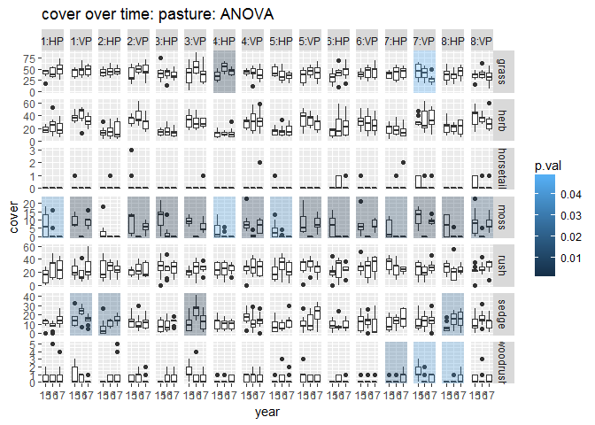
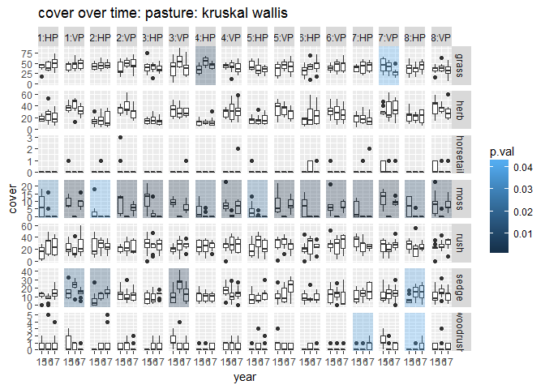

# Rush Trial: analyse one by one:

##Packages

```r
library(tidyverse)
```

```
## Warning: package 'tidyverse' was built under R version 3.3.3
```

```
## -- Attaching packages ---------------------------------- tidyverse 1.2.1 --
```

```
## v ggplot2 2.2.1     v purrr   0.2.4
## v tibble  1.4.1     v dplyr   0.7.4
## v tidyr   0.7.2     v stringr 1.2.0
## v readr   1.1.1     v forcats 0.2.0
```

```
## Warning: package 'tibble' was built under R version 3.3.3
```

```
## Warning: package 'tidyr' was built under R version 3.3.3
```

```
## Warning: package 'readr' was built under R version 3.3.3
```

```
## Warning: package 'purrr' was built under R version 3.3.3
```

```
## Warning: package 'dplyr' was built under R version 3.3.3
```

```
## Warning: package 'stringr' was built under R version 3.3.3
```

```
## Warning: package 'forcats' was built under R version 3.3.3
```

```
## -- Conflicts ------------------------------------- tidyverse_conflicts() --
## x dplyr::filter() masks stats::filter()
## x dplyr::lag()    masks stats::lag()
```

```r
library(skimr)
```

```
## Warning: package 'skimr' was built under R version 3.3.3
```

```
## 
## Attaching package: 'skimr'
```

```
## The following objects are masked from 'package:dplyr':
## 
##     contains, ends_with, everything, matches, num_range, one_of,
##     starts_with
```

```r
library(funModeling)
```

```
## Warning: package 'funModeling' was built under R version 3.3.3
```

```
## Loading required package: Hmisc
```

```
## Warning: package 'Hmisc' was built under R version 3.3.3
```

```
## Loading required package: lattice
```

```
## Warning: package 'lattice' was built under R version 3.3.3
```

```
## Loading required package: survival
```

```
## Warning: package 'survival' was built under R version 3.3.3
```

```
## Loading required package: Formula
```

```
## Warning: package 'Formula' was built under R version 3.3.3
```

```
## 
## Attaching package: 'Hmisc'
```

```
## The following objects are masked from 'package:dplyr':
## 
##     combine, src, summarize
```

```
## The following objects are masked from 'package:base':
## 
##     format.pval, round.POSIXt, trunc.POSIXt, units
```

```
## funModeling v.1.6.7 :)
## Examples and tutorials at livebook.datascienceheroes.com
```

```r
library(ggpubr)   # helps make publication-ready graphs
```

```
## Warning: package 'ggpubr' was built under R version 3.3.3
```

```
## Loading required package: magrittr
```

```
## 
## Attaching package: 'magrittr'
```

```
## The following object is masked from 'package:purrr':
## 
##     set_names
```

```
## The following object is masked from 'package:tidyr':
## 
##     extract
```

```r
library(broom)    # cleans up code output from common functions
```

```
## Warning: package 'broom' was built under R version 3.3.3
```

```r
library(nortest)
```

##Import data

```r
grp_calc_w <- read.csv("../data/prepped/taxon_grp_calc_w.csv", header = TRUE)
```


```r
#drop unwanted columns
data_taxa <- grp_calc_w %>% 
  select(-c(X, uid)) 

#make categories factors
data_taxa <- data_taxa %>% 
  mutate_at(c("year", "treat_plot"), as.factor)
```

```
## Warning: package 'bindrcpp' was built under R version 3.3.3
```

```r
data_taxa_long <- data_taxa %>% 
  select(-cover_tot) %>% 
  gather(key = "taxon", value = "cover", grass:woodrush) %>% 
  mutate(taxon, taxon = as.factor(taxon))

head(data_taxa_long)
```

```
##   year replicate location treat_plot quad   type taxon cover
## 1 2016         A       HM          1   11 meadow grass    56
## 2 2017         A       HM          1   20 meadow grass    60
## 3 2017         A       HM          1   35 meadow grass    52
## 4 2016         A       HM          1   44 meadow grass    41
## 5 2015         A       HM          1   51 meadow grass    35
## 6 2015         A       HM          1   61 meadow grass    68
```


###Test for normality

####Anderson Darling test
Anderson Darling composite test for normality: **if the p-value is < 0.05 then reject hypothesis that the distribution is normal**


```r
#run Anderson Darling test
ad <- data_taxa_long %>% 
  group_by(type, location, taxon) %>% 
  summarise_at(vars(cover), funs(
    "A" = ad.test(.)$statistic,
    "p.val" = ad.test(.)$p.value,
    "formula" = ad.test(.)$data.name, 
    "n" = length(.)
    )) %>% 
  arrange(desc(p.val))

write.csv(ad, file = "../outputs/adTest.csv")

pander(filter(ad, p.val >= 0.05), digits = 3)
```


-------------------------------------------------------------
  type     location   taxon     A     p.val    formula    n  
--------- ---------- ------- ------- -------- --------- -----
 pasture      HP      grass   0.211   0.857     cover    216 

 meadow       HM      herb    0.254   0.729     cover    216 

 pasture      VP      grass   0.322   0.527     cover    216 

 meadow       LM      grass   0.375   0.411     cover    216 

 meadow       LM      herb    0.442   0.286     cover    216 

 pasture      VP      herb    0.653   0.0871    cover    216 
-------------------------------------------------------------

####Shapiro-Wilk test
Only available between 3 and 5000 samples.  **if the p-value is < 0.05 then reject hypothesis that the distribution is normal**

```r
#run  Shapiro-Wilk test
#doesn't seem to cope well with under represented taxa, so filtered out. 
shapiro <- data_taxa_long %>% 
  filter(taxon == "rush" | 
           taxon == "grass" | 
           taxon == "herb" | 
           taxon == "sedge") %>% 
  group_by(type, location, treat_plot, taxon) %>% 
  summarise_at(vars(cover), funs(
    "W" = shapiro.test(.)$statistic,
    "p.val" = shapiro.test(.)$p.value,
    "formula" = shapiro.test(.)$data.name, 
    "n" = length(.)
    )) %>% 
  arrange(desc(p.val))

write.csv(shapiro, file = "../outputs/shapiroTest.csv")

pander(filter(shapiro, p.val >= 0.05), digits = 3)
```


-------------------------------------------------------------------------
  type     location   treat_plot   taxon     W     p.val    formula   n  
--------- ---------- ------------ ------- ------- -------- --------- ----
 meadow       LM          1        herb    0.986   0.965     cover    27 

 meadow       LM          4        herb    0.985   0.954     cover    27 

 pasture      HP          1        grass   0.984   0.939     cover    27 

 pasture      VP          3        grass   0.983   0.925     cover    27 

 meadow       LM          2        herb    0.983   0.921     cover    27 

 meadow       LM          2        grass   0.982   0.913     cover    27 

 pasture      VP          8        grass   0.982   0.901     cover    27 

 meadow       LM          1        grass   0.981   0.891     cover    27 

 meadow       HM          3        herb    0.981   0.884     cover    27 

 meadow       LM          5        herb    0.98    0.865     cover    27 

 meadow       LM          4        grass   0.978   0.811     cover    27 

 meadow       HM          4        herb    0.977   0.781     cover    27 

 meadow       HM          6        herb    0.977   0.779     cover    27 

 pasture      HP          4        grass   0.976   0.775     cover    27 

 meadow       LM          7        herb    0.976   0.754     cover    27 

 pasture      VP          3        rush    0.975    0.75     cover    27 

 meadow       LM          7        grass   0.975   0.739     cover    27 

 meadow       LM          3        herb    0.974   0.705     cover    27 

 pasture      VP          7        rush    0.972   0.651     cover    27 

 pasture      HP          2        grass   0.97    0.601     cover    27 

 pasture      VP          4        grass   0.97     0.59     cover    27 

 meadow       HM          1        herb    0.969   0.587     cover    27 

 pasture      VP          5        grass   0.969    0.58     cover    27 

 meadow       LM          6        grass   0.969   0.564     cover    27 

 pasture      HP          6        rush    0.969   0.564     cover    27 

 pasture      VP          8        herb    0.968   0.556     cover    27 

 pasture      HP          5        grass   0.968   0.555     cover    27 

 pasture      HP          7        rush    0.968   0.542     cover    27 

 pasture      HP          6        grass   0.967   0.514     cover    27 

 pasture      HP          3        grass   0.967   0.513     cover    27 

 pasture      VP          6        rush    0.967   0.513     cover    27 

 pasture      HP          8        herb    0.966    0.51     cover    27 

 pasture      VP          8        sedge   0.966   0.503     cover    27 

 pasture      HP          8        grass   0.966   0.503     cover    27 

 pasture      VP          6        herb    0.965   0.481     cover    27 

 pasture      VP          7        sedge   0.964   0.455     cover    27 

 meadow       HM          8        grass   0.964   0.453     cover    27 

 pasture      HP          7        grass   0.964   0.451     cover    27 

 meadow       HM          8        herb    0.964   0.442     cover    27 

 pasture      VP          5        herb    0.964   0.442     cover    27 

 meadow       LM          8        grass   0.963   0.436     cover    27 

 pasture      VP          2        herb    0.962   0.413     cover    27 

 pasture      VP          4        rush    0.961   0.392     cover    27 

 meadow       LM          5        grass   0.961   0.386     cover    27 

 meadow       LM          6        herb    0.96    0.373     cover    27 

 pasture      VP          1        herb    0.96    0.372     cover    27 

 meadow       HM          7        herb    0.96    0.363     cover    27 

 meadow       HM          6        rush    0.96    0.362     cover    27 

 pasture      HP          3        rush    0.959   0.359     cover    27 

 pasture      VP          1        grass   0.958   0.334     cover    27 

 meadow       HM          5        herb    0.958   0.326     cover    27 

 meadow       HM          2        grass   0.957    0.32     cover    27 

 pasture      VP          1        sedge   0.957   0.317     cover    27 

 meadow       HM          2        herb    0.957   0.311     cover    27 

 pasture      VP          6        grass   0.956   0.306     cover    27 

 pasture      VP          4        sedge   0.956   0.303     cover    27 

 meadow       LM          4        rush    0.956   0.302     cover    27 

 meadow       HM          2        rush    0.955   0.289     cover    27 

 meadow       HM          3        grass   0.954   0.273     cover    27 

 pasture      VP          3        sedge   0.954   0.269     cover    27 

 pasture      HP          1        sedge   0.954   0.267     cover    27 

 pasture      HP          2        rush    0.954   0.262     cover    27 

 pasture      HP          7        sedge   0.954    0.26     cover    27 

 pasture      HP          5        rush    0.953   0.256     cover    27 

 pasture      VP          2        grass   0.953   0.247     cover    27 

 pasture      HP          1        rush    0.952   0.237     cover    27 

 pasture      HP          3        herb    0.951   0.227     cover    27 

 meadow       LM          8        herb    0.951   0.221     cover    27 

 pasture      HP          8        rush    0.951   0.221     cover    27 

 pasture      VP          3        herb    0.95    0.212     cover    27 

 pasture      VP          7        grass   0.948   0.193     cover    27 

 meadow       HM          3        rush    0.945   0.166     cover    27 

 pasture      HP          7        herb    0.945   0.163     cover    27 

 pasture      VP          2        sedge   0.941    0.13     cover    27 

 meadow       LM          2        rush    0.94    0.121     cover    27 

 pasture      VP          4        herb    0.94    0.119     cover    27 

 pasture      HP          2        sedge   0.939   0.118     cover    27 

 meadow       HM          5        grass   0.938   0.109     cover    27 

 pasture      HP          1        herb    0.936   0.0961    cover    27 

 meadow       LM          3        grass   0.936   0.096     cover    27 

 pasture      VP          7        herb    0.936   0.0945    cover    27 

 pasture      VP          8        rush    0.935   0.0943    cover    27 

 meadow       HM          6        grass   0.935   0.0904    cover    27 

 pasture      VP          2        rush    0.935   0.0901    cover    27 

 meadow       HM          7        grass   0.934   0.088     cover    27 

 meadow       HM          1        grass   0.934   0.0856    cover    27 

 meadow       HM          1        rush    0.931   0.0742    cover    27 

 pasture      HP          6        sedge   0.931   0.0723    cover    27 

 meadow       LM          5        rush    0.929   0.0656    cover    27 

 pasture      HP          8        sedge   0.928   0.062     cover    27 

 meadow       HM          5        rush    0.928   0.0614    cover    27 

 meadow       LM          3        rush    0.926   0.0538    cover    27 
-------------------------------------------------------------------------

###Test for homoscedascity
Bartlett Test of Homogeneity of Variances: if the p-value is smaller than 0.05 then data not suitable for ANOVA

```r
#run Bartlett test for homogeneity of variances 

bartlett <- data_taxa_long %>% 
  filter(taxon == "rush" | 
           taxon == "grass" | 
           taxon == "herb" | 
           taxon == "sedge") %>% 
  group_by(type, location, treat_plot, taxon) %>% 
  summarise_at(vars(cover), funs(
    "Ksq" = bartlett.test(. ~ year)$statistic,
    "p.val" = bartlett.test(. ~ year)$p.value,
    "formula" = bartlett.test(. ~ year)$data.name, 
    "n" = length(.)
    )) %>% 
  arrange(desc(p.val))

write.csv(bartlett, file = "../outputs/bartlettTest.csv")

pander(filter(bartlett, p.val >= 0.05), digits = 3)
```


---------------------------------------------------------------------------------
  type     location   treat_plot   taxon     Ksq     p.val       formula      n  
--------- ---------- ------------ ------- --------- -------- --------------- ----
 pasture      VP          4        rush    0.00162   0.999    cover by year   27 

 pasture      HP          6        sedge   0.0291    0.986    cover by year   27 

 meadow       LM          2        herb     0.033    0.984    cover by year   27 

 pasture      VP          3        sedge   0.0452    0.978    cover by year   27 

 meadow       HM          6        grass   0.0894    0.956    cover by year   27 

 pasture      HP          7        herb    0.0898    0.956    cover by year   27 

 pasture      VP          8        sedge    0.177    0.915    cover by year   27 

 meadow       LM          3        herb     0.183    0.912    cover by year   27 

 meadow       LM          4        herb     0.236    0.889    cover by year   27 

 pasture      HP          5        rush     0.286    0.867    cover by year   27 

 meadow       HM          7        herb     0.318    0.853    cover by year   27 

 pasture      VP          7        sedge    0.338    0.845    cover by year   27 

 pasture      VP          8        rush     0.384    0.825    cover by year   27 

 meadow       HM          5        grass    0.392    0.822    cover by year   27 

 meadow       HM          1        sedge    0.416    0.812    cover by year   27 

 meadow       LM          8        sedge    0.43     0.807    cover by year   27 

 meadow       HM          1        herb     0.43     0.807    cover by year   27 

 meadow       LM          5        grass    0.465    0.792    cover by year   27 

 meadow       HM          5        sedge    0.465    0.792    cover by year   27 

 pasture      VP          4        sedge    0.482    0.786    cover by year   27 

 meadow       HM          5        rush     0.486    0.784    cover by year   27 

 meadow       HM          1        grass    0.522     0.77    cover by year   27 

 pasture      HP          4        sedge    0.536    0.765    cover by year   27 

 meadow       HM          3        rush     0.543    0.762    cover by year   27 

 meadow       LM          7        herb     0.579    0.749    cover by year   27 

 meadow       LM          4        grass    0.635    0.728    cover by year   27 

 pasture      VP          5        rush     0.638    0.727    cover by year   27 

 pasture      VP          1        grass    0.654    0.721    cover by year   27 

 meadow       HM          2        herb     0.68     0.712    cover by year   27 

 pasture      HP          2        grass    0.691    0.708    cover by year   27 

 pasture      VP          7        rush     0.705    0.703    cover by year   27 

 meadow       HM          7        sedge    0.715    0.699    cover by year   27 

 meadow       HM          8        sedge    0.741     0.69    cover by year   27 

 pasture      HP          6        grass    0.749    0.688    cover by year   27 

 pasture      VP          2        sedge    0.775    0.679    cover by year   27 

 meadow       HM          4        sedge    0.782    0.676    cover by year   27 

 meadow       LM          6        herb     0.808    0.668    cover by year   27 

 pasture      HP          3        herb     0.836    0.658    cover by year   27 

 meadow       LM          3        grass    0.853    0.653    cover by year   27 

 pasture      VP          3        grass    0.895    0.639    cover by year   27 

 pasture      VP          6        sedge    0.94     0.625    cover by year   27 

 meadow       HM          4        herb     1.04     0.596    cover by year   27 

 pasture      HP          4        grass    1.07     0.587    cover by year   27 

 meadow       HM          6        rush     1.07     0.586    cover by year   27 

 pasture      VP          6        rush      1.1     0.576    cover by year   27 

 pasture      HP          5        herb     1.12     0.571    cover by year   27 

 meadow       LM          5        sedge    1.21     0.546    cover by year   27 

 meadow       HM          7        rush     1.22     0.542    cover by year   27 

 pasture      VP          6        herb     1.25     0.534    cover by year   27 

 pasture      HP          4        rush     1.29     0.525    cover by year   27 

 pasture      HP          1        rush     1.29     0.525    cover by year   27 

 pasture      HP          1        sedge    1.32     0.516    cover by year   27 

 meadow       LM          1        grass    1.38     0.501    cover by year   27 

 pasture      HP          8        grass    1.41     0.494    cover by year   27 

 pasture      VP          5        sedge    1.41     0.493    cover by year   27 

 meadow       HM          2        rush     1.42     0.491    cover by year   27 

 pasture      VP          7        grass    1.45     0.483    cover by year   27 

 meadow       LM          8        rush     1.49     0.474    cover by year   27 

 pasture      HP          5        grass     1.5     0.472    cover by year   27 

 pasture      HP          2        herb     1.54     0.463    cover by year   27 

 pasture      HP          8        herb     1.67     0.435    cover by year   27 

 pasture      VP          6        grass    1.68     0.432    cover by year   27 

 meadow       HM          1        rush     1.71     0.425    cover by year   27 

 meadow       HM          3        grass    1.72     0.423    cover by year   27 

 pasture      HP          2        rush     1.72     0.422    cover by year   27 

 pasture      VP          8        grass     1.8     0.406    cover by year   27 

 pasture      VP          1        sedge     1.9     0.387    cover by year   27 

 pasture      HP          3        rush     1.91     0.384    cover by year   27 

 meadow       LM          5        rush     1.93     0.381    cover by year   27 

 pasture      HP          1        grass    1.94     0.379    cover by year   27 

 meadow       LM          6        grass    1.94     0.379    cover by year   27 

 pasture      VP          3        herb     1.97     0.373    cover by year   27 

 pasture      VP          1        rush     1.99     0.369    cover by year   27 

 meadow       HM          5        herb       2      0.367    cover by year   27 

 pasture      VP          5        herb     2.01     0.366    cover by year   27 

 meadow       LM          7        sedge    2.02     0.364    cover by year   27 

 pasture      HP          5        sedge    2.06     0.357    cover by year   27 

 pasture      HP          3        grass    2.06     0.356    cover by year   27 

 meadow       HM          2        sedge    2.07     0.355    cover by year   27 

 meadow       LM          6        rush      2.2     0.333    cover by year   27 

 pasture      VP          5        grass    2.23     0.328    cover by year   27 

 pasture      VP          2        herb     2.27     0.321    cover by year   27 

 pasture      HP          7        sedge     2.3     0.316    cover by year   27 

 pasture      HP          6        rush     2.31     0.314    cover by year   27 

 meadow       LM          7        grass    2.41      0.3     cover by year   27 

 pasture      HP          8        sedge    2.47     0.291    cover by year   27 

 meadow       HM          4        grass     2.7     0.259    cover by year   27 

 meadow       HM          6        herb     2.97     0.226    cover by year   27 

 pasture      HP          7        grass    2.97     0.226    cover by year   27 

 meadow       LM          6        sedge    2.98     0.225    cover by year   27 

 meadow       LM          2        sedge    3.18     0.204    cover by year   27 

 meadow       LM          2        grass    3.25     0.197    cover by year   27 

 pasture      VP          1        herb     3.34     0.188    cover by year   27 

 pasture      HP          3        sedge    3.37     0.185    cover by year   27 

 meadow       HM          8        herb      3.4     0.182    cover by year   27 

 meadow       LM          4        sedge    3.53     0.171    cover by year   27 

 pasture      VP          2        rush     3.73     0.155    cover by year   27 

 meadow       HM          8        rush     3.97     0.137    cover by year   27 

 pasture      VP          2        grass    3.99     0.136    cover by year   27 

 meadow       LM          5        herb       4      0.136    cover by year   27 

 pasture      VP          3        rush     4.35     0.114    cover by year   27 

 pasture      VP          4        herb     4.42      0.11    cover by year   27 

 meadow       LM          1        rush     4.65     0.0979   cover by year   27 

 meadow       LM          8        grass    4.72     0.0942   cover by year   27 

 meadow       HM          2        grass     4.8     0.0908   cover by year   27 

 meadow       HM          4        rush     4.91     0.0859   cover by year   27 

 meadow       LM          1        sedge    4.97     0.0835   cover by year   27 

 meadow       HM          8        grass    4.99     0.0825   cover by year   27 

 meadow       LM          7        rush     5.02     0.0813   cover by year   27 

 meadow       LM          8        herb     5.16     0.0757   cover by year   27 

 pasture      HP          4        herb     5.44     0.0657   cover by year   27 

 pasture      VP          8        herb      5.5     0.064    cover by year   27 

 meadow       HM          3        herb     5.52     0.0633   cover by year   27 

 pasture      VP          4        grass    5.69     0.0581   cover by year   27 

 pasture      VP          7        herb      5.8     0.0549   cover by year   27 
---------------------------------------------------------------------------------

## Compare means: parametric

```r
aov <- data_taxa_long %>% 
  group_by(type, location, treat_plot, taxon) %>% 
  summarise_at(vars(cover), funs(
    "p.val" = tidy(aov(. ~ year))$p.value[1], 
    "n" = length(.)
  )) 

write.csv(aov, file = "../outputs/aov.csv")

pander(head(aov), digits = 3)
```


---------------------------------------------------------
  type    location   treat_plot     taxon     p.val   n  
-------- ---------- ------------ ----------- ------- ----
 meadow      HM          1          grass     0.891   27 

 meadow      HM          1          herb      0.402   27 

 meadow      HM          1        horsetail   0.383   27 

 meadow      HM          1          moss       NA     27 

 meadow      HM          1          rush      0.86    27 

 meadow      HM          1          sedge     0.396   27 
---------------------------------------------------------

The following treatment plots have shown significant change: 


```r
aov.sig <- aov %>% 
  filter(p.val < 0.05) %>% 
  arrange(type, treat_plot, taxon) 

pander(aov.sig, digits = 3)
```


------------------------------------------------------------
  type     location   treat_plot    taxon      p.val     n  
--------- ---------- ------------ ---------- ---------- ----
 meadow       LM          3          herb     0.00482    27 

 meadow       LM          3        woodrush    0.0317    27 

 meadow       HM          4          moss      0.0429    27 

 meadow       LM          5          herb      0.0479    27 

 meadow       HM          6          herb      0.0191    27 

 meadow       HM          6          moss     0.00592    27 

 meadow       HM          6         sedge     3.62e-05   27 

 meadow       HM          7         grass      0.0352    27 

 meadow       LM          7          herb      0.0105    27 

 meadow       HM          8         grass      0.0245    27 

 meadow       HM          8          herb      0.0186    27 

 meadow       LM          8          herb      0.0408    27 

 meadow       HM          8          moss     1.56e-05   27 

 pasture      HP          1          moss      0.0395    27 

 pasture      VP          1          moss     2.36e-07   27 

 pasture      VP          1         sedge      0.0223    27 

 pasture      VP          2          moss     0.000762   27 

 pasture      HP          2         sedge      0.017     27 

 pasture      HP          3          moss     8.75e-05   27 

 pasture      VP          3          moss     1.16e-07   27 

 pasture      VP          3         sedge     0.00109    27 

 pasture      HP          4         grass     0.00112    27 

 pasture      HP          4          moss      0.0429    27 

 pasture      VP          4          moss     0.00345    27 

 pasture      HP          5          moss      0.0341    27 

 pasture      VP          5          moss     0.00126    27 

 pasture      HP          6          moss     0.00179    27 

 pasture      VP          6          moss     0.000934   27 

 pasture      VP          7         grass      0.049     27 

 pasture      HP          7          moss     0.00885    27 

 pasture      VP          7          moss     1.43e-07   27 

 pasture      HP          7        woodrush    0.0242    27 

 pasture      VP          7        woodrush    0.0406    27 

 pasture      HP          8          moss     0.00309    27 

 pasture      VP          8          moss      0.0105    27 

 pasture      HP          8         sedge      0.025     27 

 pasture      HP          8        woodrush    0.0412    27 
------------------------------------------------------------

##Graph it


```r
#plot data, with facets shaded if p < 0.05

plotdata <- data_taxa %>% 
  filter(type == "meadow") %>% 
#  select(-one_of(c("woodrush", "moss", "horsetail", "cover_tot"))) %>% 
  gather(key = "taxon", value = "cover", grass:woodrush) #%>% 
#  mutate(taxon = factor(taxon, levels = c("rush", "grass", "herb", "sedge", "moss", "horsetail", "woodrush")))

#Create a data frame with the faceting variables
# and some dummy data (that will be overwritten)
facets <- filter(aov, type == "meadow")
facets$year <- 1
facets$cover <- 1


meadow.sm <-   ggplot(plotdata, 
                      aes(x = year, y = cover)) +
  geom_boxplot(data = plotdata, aes(group = year)) +
  geom_smooth(method = "lm", se = FALSE)   +
  scale_x_discrete(labels = c("15", "16", "17")) +
  geom_rect(data = subset(facets, p.val < 0.05), aes(fill = p.val), 
            xmin = -Inf,xmax = Inf,
            ymin = -Inf, ymax = Inf, alpha = 0.3) +
  facet_grid(taxon ~ treat_plot:location, scales = "free_y") +
  labs(title = "cover over time: meadow: ANOVA")

meadow.sm
```

<!-- -->

```r
ggsave(meadow.sm, filename = "../outputs/meadow.sm.aov.png", width = 30, units = "cm", dpi = 600)
```

```
## Saving 30 x 12.7 cm image
```


```r
#plot data, with facets shaded if p < 0.05

plotdata <- data_taxa %>% 
  filter(type == "pasture") %>% 
#  select(-one_of(c("woodrush", "moss", "horsetail", "cover_tot"))) %>% 
  gather(key = "taxon", value = "cover", grass:woodrush) #%>% 
#  mutate(taxon = factor(taxon, levels = c("rush", "grass", "herb", "sedge", "moss", "horsetail", "woodrush")))

#Create a data frame with the faceting variables
# and some dummy data (that will be overwritten)
facets <- filter(aov, type == "pasture")
facets$year <- 1
facets$cover <- 1


pasture.sm <-   ggplot(plotdata, 
                      aes(x = year, y = cover)) +
  geom_boxplot(data = plotdata, aes(group = year)) +
  geom_smooth(method = "lm", se = FALSE)   +
  scale_x_discrete(labels = c("15", "16", "17")) +
  geom_rect(data = subset(facets, p.val < 0.05), aes(fill = p.val), 
            xmin = -Inf,xmax = Inf,
            ymin = -Inf, ymax = Inf, alpha = 0.3) +
  facet_grid(taxon ~ treat_plot:location, scales = "free_y") +
  labs(title = "cover over time: pasture: ANOVA")

pasture.sm
```

<!-- -->

```r
ggsave(pasture.sm, filename = "../outputs/pasture.sm.aov.png", width = 30, units = "cm", dpi = 600)
```

```
## Saving 30 x 12.7 cm image
```


## Compare means: non-parametric

### Kruskal-Wallis rank sum test

This test estimates the probability that all the samples were drawn from the same population, i.e. that the true mean is the same for each survey.  

```r
#run Kruskal Wallis test
krusk <- data_taxa_long %>% 
  group_by(type, location, treat_plot, taxon) %>% 
  summarise_at(vars(cover), funs(
    "chi-sq" = kruskal.test(. ~ year)$statistic,
    "df" = kruskal.test(. ~ year)$parameter,
    "p.val" = kruskal.test(. ~ year)$p.value,
    #"method" = kruskal.test(. ~ year)$method, 
    "formula" = kruskal.test(. ~ year)$data.name, 
    "n" = length(.)
  )) 

write.csv(krusk, file = "../outputs/kruskalTest.csv")

pander(head(krusk), digits = 3)
```


---------------------------------------------------------------------------------------
  type    location   treat_plot     taxon     chi-sq   df   p.val      formula      n  
-------- ---------- ------------ ----------- -------- ---- ------- --------------- ----
 meadow      HM          1          grass     0.409    2    0.815   cover by year   27 

 meadow      HM          1          herb       1.67    2    0.434   cover by year   27 

 meadow      HM          1        horsetail     2      2    0.368   cover by year   27 

 meadow      HM          1          moss        NA     2     NA     cover by year   27 

 meadow      HM          1          rush      0.172    2    0.918   cover by year   27 

 meadow      HM          1          sedge      2.04    2    0.361   cover by year   27 
---------------------------------------------------------------------------------------
The null hypothesis is that the samples are drawn from the same population, so if p is smaller than 0.05 we must reject that hypothesis. 


The following treatment plots have shown significant change: 


```r
krusk.sig <- krusk %>% 
  filter(p.val < 0.05) %>% 
  arrange(type, treat_plot, taxon) 

pander(krusk.sig, digits = 3)
```


----------------------------------------------------------------------
  type     location   treat_plot     taxon     chi-sq   df    p.val   
--------- ---------- ------------ ----------- -------- ---- ----------
 meadow       LM          3          herb       9.79    2    0.00748  

 meadow       LM          3        horsetail    6.48    2     0.0392  

 meadow       LM          3        woodrush     6.5     2     0.0388  

 meadow       HM          4          moss       11.7    2    0.00282  

 meadow       HM          6          herb       8.47    2     0.0145  

 meadow       HM          6          moss       11.7    2    0.00291  

 meadow       HM          6          sedge      14.1    2    0.000871 

 meadow       LM          7          herb       9.9     2    0.00707  

 meadow       HM          7          rush       6.41    2     0.0406  

 meadow       HM          8          herb       6.75    2     0.0342  

 meadow       HM          8          moss       17.8    2    0.000136 

 pasture      HP          1          moss       7.1     2     0.0287  

 pasture      VP          1          moss       18.3    2    0.000107 

 pasture      VP          1          sedge      7.91    2     0.0191  

 pasture      HP          2          moss       6.47    2     0.0393  

 pasture      VP          2          moss       15.1    2    0.000516 

 pasture      HP          2          sedge      8.69    2     0.013   

 pasture      HP          3          moss       15.6    2    0.000411 

 pasture      VP          3          moss       19.9    2    4.87e-05 

 pasture      VP          3          sedge       11     2    0.00417  

 pasture      HP          4          grass      10.3    2    0.00587  

 pasture      HP          4          moss       9.21    2      0.01   

 pasture      VP          4          moss       13.7    2    0.00107  

 pasture      HP          5          moss       7.63    2     0.022   

 pasture      VP          5          moss       18.1    2    0.000118 

 pasture      HP          6          moss       11.7    2    0.00294  

 pasture      VP          6          moss       16.6    2    0.000252 

 pasture      VP          7          grass      6.28    2     0.0433  

 pasture      HP          7          moss       11.7    2    0.00294  

 pasture      VP          7          moss       18.4    2    0.000101 

 pasture      HP          7        woodrush     6.5     2     0.0388  

 pasture      HP          8          moss       9.45    2    0.00885  

 pasture      VP          8          moss       12.7    2    0.00171  

 pasture      HP          8          sedge      6.51    2     0.0386  

 pasture      HP          8        woodrush     6.26    2     0.0437  
----------------------------------------------------------------------

Table: Table continues below

 
--------------------
    formula      n  
--------------- ----
 cover by year   27 

 cover by year   27 

 cover by year   27 

 cover by year   27 

 cover by year   27 

 cover by year   27 

 cover by year   27 

 cover by year   27 

 cover by year   27 

 cover by year   27 

 cover by year   27 

 cover by year   27 

 cover by year   27 

 cover by year   27 

 cover by year   27 

 cover by year   27 

 cover by year   27 

 cover by year   27 

 cover by year   27 

 cover by year   27 

 cover by year   27 

 cover by year   27 

 cover by year   27 

 cover by year   27 

 cover by year   27 

 cover by year   27 

 cover by year   27 

 cover by year   27 

 cover by year   27 

 cover by year   27 

 cover by year   27 

 cover by year   27 

 cover by year   27 

 cover by year   27 

 cover by year   27 
--------------------

##Graph it


```r
#plot data, with facets shaded if p < 0.05

plotdata <- data_taxa %>% 
  filter(type == "meadow") %>% 
#  select(-one_of(c("woodrush", "moss", "horsetail", "cover_tot"))) %>% 
  gather(key = "taxon", value = "cover", grass:woodrush) #%>% 
#  mutate(taxon = factor(taxon, levels = c("rush", "grass", "herb", "sedge", "moss", "horsetail", "woodrush")))

#Create a data frame with the faceting variables
# and some dummy data (that will be overwritten)
facets <- filter(krusk, type == "meadow")
facets$year <- 1
facets$cover <- 1


meadow.sm <-   ggplot(plotdata, 
                      aes(x = year, y = cover)) +
  geom_boxplot(data = plotdata, aes(group = year)) +
  geom_smooth(method = "lm", se = FALSE)   +
  scale_x_discrete(labels = c("15", "16", "17")) +
  geom_rect(data = subset(facets, p.val < 0.05), aes(fill = p.val), 
            xmin = -Inf,xmax = Inf,
            ymin = -Inf, ymax = Inf, alpha = 0.3) +
  facet_grid(taxon ~ treat_plot:location, scales = "free_y") +
  labs(title = "cover over time: meadow: kruskal wallis")

meadow.sm
```

<!-- -->

```r
#ggsave(meadow.sm, filename = "../outputs/meadow.sm.krusk.png", width = 30, units = "cm", dpi = 600)
```


```r
#plot data, with facets shaded if p < 0.05

plotdata <- data_taxa %>% 
  filter(type == "pasture") %>% 
#  select(-one_of(c("woodrush", "moss", "horsetail", "cover_tot"))) %>% 
  gather(key = "taxon", value = "cover", grass:woodrush) #%>% 
#  mutate(taxon = factor(taxon, levels = c("rush", "grass", "herb", "sedge", "moss", "horsetail", "woodrush")))

#Create a data frame with the faceting variables
# and some dummy data (that will be overwritten)
facets <- filter(krusk, type == "pasture")
facets$year <- 1
facets$cover <- 1


pasture.sm <-   ggplot(plotdata, 
                      aes(x = year, y = cover)) +
  geom_boxplot(data = plotdata, aes(group = year)) +
  geom_smooth(method = "lm", se = FALSE)   +
  scale_x_discrete(labels = c("15", "16", "17")) +
  geom_rect(data = subset(facets, p.val < 0.05), aes(fill = p.val), 
            xmin = -Inf,xmax = Inf,
            ymin = -Inf, ymax = Inf, alpha = 0.3) +
  facet_grid(taxon ~ treat_plot:location, scales = "free_y") +
  labs(title = "cover over time: pasture: kruskal wallis")

pasture.sm
```

<!-- -->

```r
#ggsave(pasture.sm, filename = "../outputs/pasture.sm.krusk.png", width = 30, units = "cm", dpi = 600)
```

