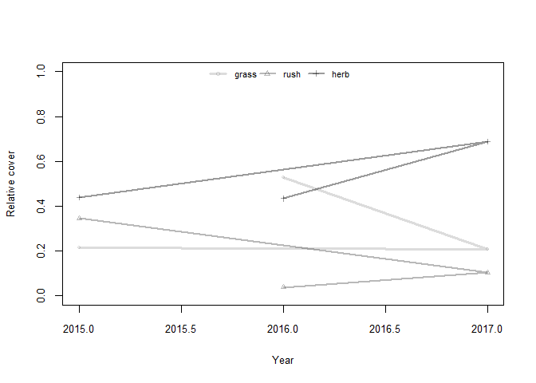
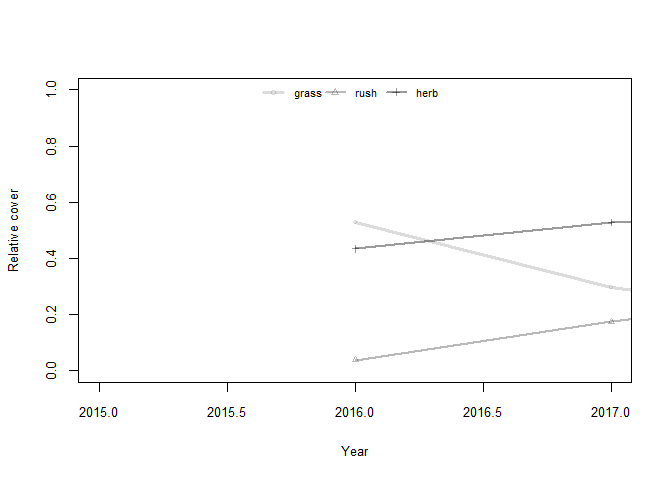
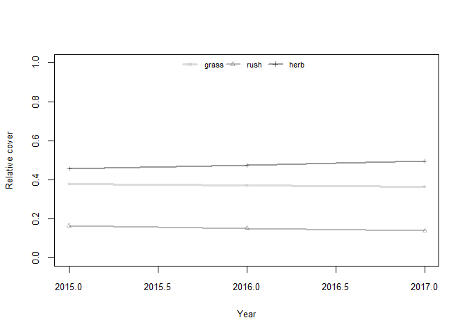
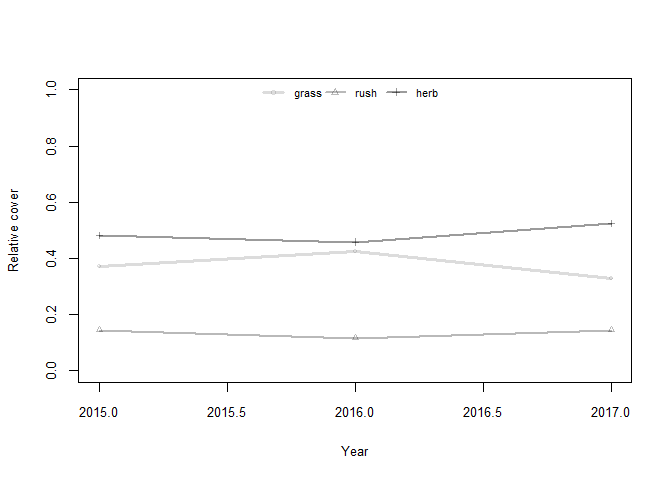
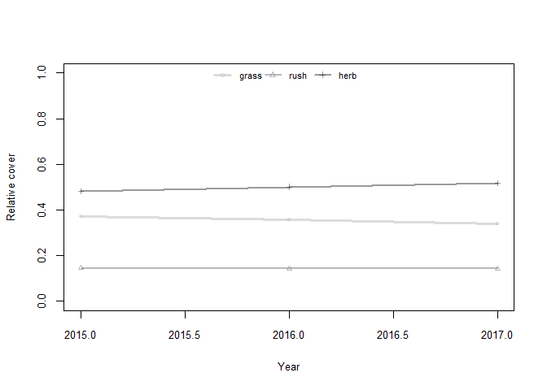
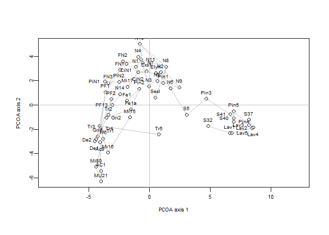
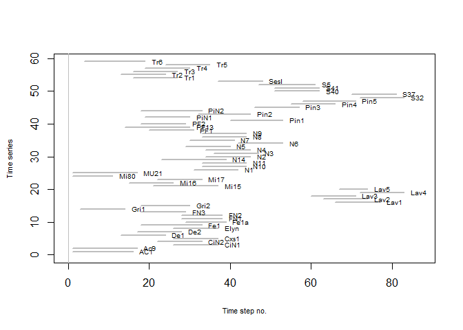
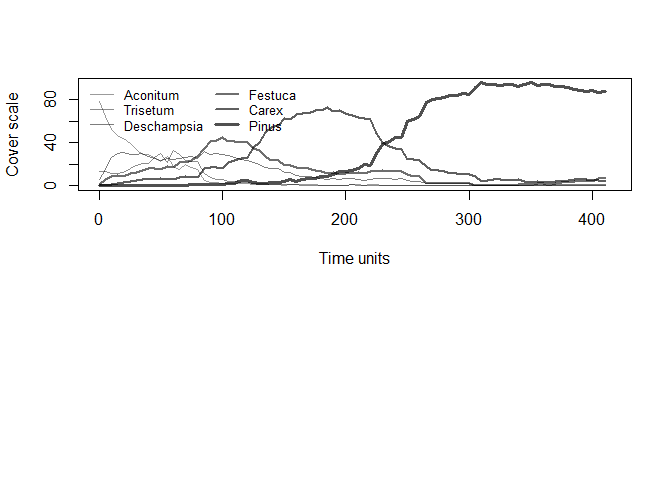

# Rush Trial: analyse markov chains

##Packages


##Import data

```r
grp_calc_w <- read.csv("../data/prepped/taxon_grp_calc_w.csv", header = TRUE)
```


```r
#drop unwanted columns
data_taxa <- grp_calc_w %>% 
  select(-c(X, uid)) 

#make categories factors
data_taxa <- data_taxa %>% 
  mutate_at(c("year", "treat_plot"), as.factor)
```

```
## Warning: package 'bindrcpp' was built under R version 3.3.3
```

```r
data_taxa_long <- data_taxa %>% 
  select(-cover_tot) %>% 
  gather(key = "taxon", value = "cover", grass:woodrush) 

head(data_taxa_long)
```

```
##   year replicate location treat_plot quad   type taxon cover
## 1 2016         A       HM          1   11 meadow grass    56
## 2 2017         A       HM          1   20 meadow grass    60
## 3 2017         A       HM          1   35 meadow grass    52
## 4 2016         A       HM          1   44 meadow grass    41
## 5 2015         A       HM          1   51 meadow grass    35
## 6 2015         A       HM          1   61 meadow grass    68
```

#Markov model
single quadrat

```r
model_veg <- data_taxa %>% 
  filter(location == "HM", treat_plot == "1", quad == "11") %>% 
  mutate_at(.$year, as.numeric) %>% 
  select(grass:woodrush)
model_time <- data_taxa %>% 
  filter(location == "HM", treat_plot == "1", quad == "11") %>% 
  mutate_at(.vars = "year", .funs = as.character) %>% 
  mutate_at(.vars = "year", .funs = as.double) %>% 
  select(year)

o.fm <- fitmarkov(veg = select(model_veg, grass, rush, herb), 
                  t = model_time$year, 
                  adjust = TRUE)
```

```
## Call:
## fitmarkov.default(veg = select(model_veg, grass, rush, herb), 
##     t = model_time$year, adjust = TRUE)
```

```r
o.fm$t.modeled
```

```
## [1] 2016 2017 2018
```

```r
plot(o.fm)
```

<!-- --><!-- -->


single replicate (three quads) - baseline

```r
modeldata <- data_taxa %>% 
  filter(location == "HM", treat_plot == "1") %>% 
  mutate_at(.vars = "year", .funs = as.character) %>% 
  mutate_at(.vars = "year", .funs = as.double) %>% 
  group_by(year) %>% 
  select(year, grass:woodrush) %>%
  summarise_all(.funs = mean) 

o.fm <- fitmarkov(veg = select(modeldata, grass, rush, herb), 
                  t = modeldata$year, 
                  adjust = TRUE)
```

```
## Call:
## fitmarkov.default(veg = select(modeldata, grass, rush, herb), 
##     t = modeldata$year, adjust = TRUE)
```

```r
o.fm$t.modeled
```

```
## [1] 2015 2016 2017
```

```r
plot(o.fm)
```

<!-- --><!-- -->


single replicate (three quads) - treatment

```r
modeldata <- data_taxa %>% 
  filter(location == "HM", treat_plot == "6") %>% 
  mutate_at(.vars = "year", .funs = as.character) %>% 
  mutate_at(.vars = "year", .funs = as.double) %>% 
  group_by(year) %>% 
  select(year, grass:woodrush) %>%
  summarise_all(.funs = mean) 

o.fm <- fitmarkov(veg = select(modeldata, grass, rush, herb), 
                  t = modeldata$year, 
                  adjust = TRUE)
```

```
## Call:
## fitmarkov.default(veg = select(modeldata, grass, rush, herb), 
##     t = modeldata$year, adjust = TRUE)
```

```r
o.fm$t.modeled
```

```
## [1] 2015 2016 2017
```

```r
plot(o.fm)
```

<!-- --><!-- -->

I'm not sure we have enough time points to use a markov model


#synthetic time series

example from Wildi, O. 2013. Data Analysis in Vegetation Ecology. 2nd ed. Wiley-Blackwell, Chichester.

```r
sn59veg
```

```
##     Aconitum Trisetum Deschampsia Festuca  Carex   Pinus
## 1    20.7000  11.8000     49.4000 15.7000  2.230  0.0588
## 2    26.0000   5.4500     50.2000 16.3000  1.880  0.1830
## 3    22.0000   4.9000     50.8000 19.0000  2.300  0.3000
## 4    18.5000   4.3000     51.5000 22.0000  2.800  0.5000
## 5    15.0000   3.8000     52.2000 25.2000  3.130  0.6700
## 6     8.2500   5.6100     45.1000 35.9000  4.540  0.6750
## 7     7.4800   5.0100     44.0000 37.8000  5.080  0.7310
## 8     6.7100   4.4100     42.8000 39.7000  5.630  0.7860
## 9     7.2300   4.1600     41.6000 40.4000  5.670  0.9520
## 10    5.2300   4.8200     42.1000 40.2000  6.650  0.9870
## 11    3.2300   5.4800     42.7000 40.0000  7.640  1.0200
## 12    1.7900   5.6300     44.0000 40.3000  7.130  1.1500
## 13    1.7500   4.6400     43.2000 38.9000  9.990  1.4800
## 14    3.3400   3.0000     40.3000 41.0000 11.100  1.2300
## 15    2.6200   3.8000     44.6000 36.8000  9.940  2.2800
## 16    1.2900   4.7100     40.5000 38.8000 11.900  2.8900
## 17    0.5670   1.5300     21.9000 12.0000  7.610 56.4000
## 18    0.1630   0.5650     14.4000 19.7000  9.190 56.0000
## 19    0.8580   1.0900     22.5000 34.8000 12.300 28.5000
## 20    1.5500   1.6200     30.5000 50.0000 15.400  0.8850
## 21    1.4100   1.7100     32.6000 51.2000 12.200  0.8530
## 22    1.1600   2.0700     30.5000 48.3000 17.100  0.9080
## 23    0.9580   2.0300     31.3000 53.2000 11.900  0.6630
## 24    0.4420   0.9360     29.8000 56.3000 12.300  0.3070
## 25    0.7160   0.7950     27.8000 49.1000 20.700  0.8840
## 26    0.5170   0.6820     26.0000 57.4000 14.700  0.6560
## 27    0.2420   0.4840     24.1000 50.6000 22.300  2.2000
## 28    0.5230   1.5100     20.4000 50.1000 21.900  5.6100
## 29    4.9000   4.5800     69.0000 17.2000  4.190  0.1360
## 30    5.3600   5.9600     65.3000 16.7000  6.420  0.2160
## 31    5.5100   7.7400     66.4000 12.7000  7.190  0.4390
## 32    4.0000   7.5900     56.7000 24.7000  6.430  0.6540
## 33    4.1000   7.3000     56.4000 25.1000  6.500  0.6000
## 34    4.2000   7.0000     56.1000 25.5000  6.600  0.5000
## 35    4.3000   6.7000     55.8000 25.9000  6.700  0.4000
## 36    4.3800   6.4200     55.5000 26.5000  6.820  0.3510
## 37    5.6700   5.9400     56.1000 23.3000  8.620  0.3790
## 38    4.6000   6.6000     50.0000 28.0000  8.900  0.6000
## 39    3.7000   7.2000     45.0000 32.0000  9.200  0.9000
## 40    2.7800   7.9900     40.1000 38.7000  9.320  1.1700
## 41    0.0546   0.4690      2.9200  7.0200 89.000  0.5170
## 42    0.4660   0.3610      4.4000 16.5000 68.900  9.4600
## 43    0.5790   0.4210      5.3100 17.6000 62.800 13.3000
## 44    0.6920   0.4810      6.2100 18.8000 56.800 17.1000
## 45    0.3240   0.2590      3.2700 10.6000 62.900 22.7000
## 46    0.0470   0.0741      1.1600  2.9000 62.700 33.1000
## 47    0.2000   0.3000      1.5000  3.6000 55.000 38.0000
## 48    0.4000   0.6000      1.9000  4.3000 48.000 44.0000
## 49    0.6000   0.9000      2.3000  5.0000 41.000 49.0000
## 50    0.8000   1.2000      2.7000  5.7000 34.000 55.0000
## 51    1.0000   1.5000      3.1000  6.4000 27.000 59.0000
## 52    1.2400   0.1850      3.7100  7.1900 21.300 66.4000
## 53    0.0023   0.0045      0.0917  0.1550  7.150 92.6000
## 54    0.0001   0.0021      0.0592  0.1260  6.360 93.5000
## 55    0.0007   0.0025      0.0579  0.0890  5.130 94.7000
## 56    0.0014   0.0028      0.0566  0.0517  3.890 96.0000
## 57    0.0014   0.0027      0.0556  0.0566  3.460 96.4000
## 58    0.0013   0.0026      0.0547  0.0616  3.030 96.9000
## 59    0.0050   0.0026      0.4900  0.0600  4.400 94.9000
## 60    0.0100   0.0026      0.4700  0.0700  5.900 93.5000
## 61    0.0150   0.0026      0.4500  0.0800  7.300 92.1000
## 62    0.0200   0.0026      0.4300  0.0900  8.700 90.7000
## 63    0.0281   0.0292      0.0408  0.1010 10.400 89.4000
## 64    0.0214   0.0420      0.9120  0.6500 14.200 84.1000
## 65    0.0124   0.0235      0.5080  0.3780  8.610 90.5000
## 66    0.0033   0.0050      0.1050  0.1050  2.980 96.8000
## 67    0.0010   0.0066      0.0683  0.1090  6.860 93.0000
## 68    0.0010   0.0068      0.0757  0.1140  6.980 92.8000
## 69    0.0011   0.0070      0.0830  0.1180  7.090 92.7000
## 70    0.0022   0.0076      0.0926  0.1360  7.270 92.5000
## 71    0.0033   0.0083      0.1020  0.1540  7.450 92.3000
## 72    0.0030   0.0100      0.3000  0.2500  7.450 91.8000
## 73    0.0035   0.0200      0.5000  0.3500  7.380 91.6000
## 74    0.0040   0.0300      0.7000  0.4500  7.350 91.4000
## 75    0.0036   0.0379      0.7640  0.5770  7.360 91.3000
## 76    0.0599   0.1930      1.4000  1.4300  8.190 88.7000
## 77    0.0481   0.1120      0.8940  1.1700  9.290 88.5000
## 78    0.0363   0.0303      0.3860  0.9060 10.400 88.3000
## 79    0.0000   0.0019      0.0961  0.0361 99.800  0.0251
## 80    0.0000   0.0019      0.0755  0.0361 99.900  0.0282
## 81    0.0000   0.0020      0.0580  0.0747 99.800  0.0343
## 82    0.0039   0.0039      0.7410  1.5800 97.600  0.0645
## 83    0.0800   0.0600      0.1500  3.0000 95.000  0.2500
## 84    0.1600   0.1200      0.2300  4.5000 92.500  0.5000
## 85    0.2400   0.1800      0.3100  6.0000 90.000  0.7500
## 86    0.3680   0.2240      3.9800  7.2900 87.000  1.1100
## 87    0.4690   0.3730      6.2800  7.9000 80.500  4.4500
## 88    0.5700   0.5210      8.5800  8.5200 74.000  7.7800
## 89    0.6710   0.6700     10.9000  9.1400 67.500 11.1000
## 90    0.7720   0.8190     13.2000  9.7600 61.000 14.5000
## 91    0.3960   0.4210      1.8300  5.7600 80.900 10.7000
## 92    0.3740   0.3420      2.0000  8.1300 84.100  5.0900
## 93    0.5500   0.4560      2.7200 12.9000 79.000  4.4000
## 94    0.4690   0.3580      3.3900 10.7000 75.700  9.4300
## 95    0.5150   0.3880      3.3100 12.5000 74.500  8.8500
## 96    1.0400   0.7380      7.1800 21.0000 57.500 12.5000
## 97    1.0000   0.7000      6.7000 19.0000 57.000 15.0000
## 98    0.9000   0.6300      6.2000 18.0000 56.000 17.5000
## 99    0.8000   0.5700      5.7000 17.0000 55.000 20.0000
## 100   0.7000   0.5100      5.2000 16.0000 54.000 22.5000
## 101   0.6000   0.4500      4.7000 15.0000 53.000 25.0000
## 102   0.5510   0.3920      4.2100 14.3000 52.900 27.6000
## 103   0.0838   0.0626      4.6800 81.8000 13.200  0.1840
## 104   1.2600   3.2000     12.4000 67.0000 15.400  0.7240
## 105   1.4100   3.8800     12.4000 64.2000 17.300  0.7450
## 106   1.2400   3.4700     11.4000 59.6000 24.000  0.2990
## 107   1.4400   2.4200     14.4000 54.0000 27.300  0.3850
## 108   0.9990   0.9340      7.9400 49.9000 39.600  0.5500
## 109   0.9300   1.2000      7.7000 41.0000 46.000  0.5000
## 110   0.8800   1.5000      7.4000 35.0000 52.000  0.4000
## 111   0.8300   1.8000      7.1000 29.0000 59.000  0.3000
## 112   0.7800   2.1000      6.8000 23.0000 65.000  0.2000
## 113   0.7300   2.5000      6.5000 17.0000 72.000  0.1000
## 114   0.6890   3.0300      6.2700 11.1000 78.800  0.1160
## 115   0.0852   0.4090     10.0000  6.2400 54.100 29.1000
## 116   0.1880   0.8790     11.5000  9.1000 51.600 26.7000
## 117   0.0545   0.6480     10.6000 17.3000 45.200 26.2000
## 118   0.5660   1.0200     12.6000 17.6000 47.200 21.0000
## 119   0.5700   1.4000     13.5000 20.0000 44.000 19.5000
## 120   0.5800   1.8000     14.5000 23.0000 40.000 18.5000
## 121   0.6080   2.2500     15.3000 26.3000 37.900 17.7000
## 122   0.1250   0.0899      3.6900 13.1000 55.500 27.5000
## 123   0.1930   0.3840      5.3400 13.1000 53.500 27.5000
## 124   0.2610   0.6770      6.9800 13.1000 51.400 27.6000
## 125   0.3290   0.9710      8.6300 13.1000 49.300 27.6000
## 126   0.3970   1.2700     10.3000 13.1000 47.200 27.7000
## 127  74.8000  14.7000      6.8800  2.3700  0.550  0.6950
## 128  72.0000  10.8000     12.5000  3.4500  0.536  0.7080
## 129  69.8000   7.4100     17.4000  4.2000  0.479  0.6850
## 130  69.9000   4.0600     20.5000  4.4800  0.432  0.6450
## 131  69.2000   5.4100     19.9000  4.3600  0.779  0.3880
## 132  69.0000   6.5000     19.1000  4.2500  1.040  0.1630
## 133  66.7000   6.8900     18.0000  6.9200  1.330  0.1750
## 134  65.1000   7.6900     15.9000  9.4400  1.570  0.2900
## 135  63.9000   8.5500     13.5000 11.8000  1.770  0.5110
## 136  64.5000   7.8800     12.9000 12.5000  1.700  0.4450
## 137  65.2000   7.3100     12.2000 13.3000  1.650  0.4190
## 138  66.2000   6.5800     11.3000 14.1000  1.530  0.3850
## 139  65.6000   9.4000     10.2000 13.0000  1.340  0.4920
## 140  64.6000  12.1000      9.5900 11.9000  1.210  0.5490
## 141  67.1000  11.6000      8.6200 11.1000  1.170  0.4910
## 142  69.4000  11.1000      7.9000  9.9300  1.200  0.5090
## 143  72.1000  10.5000      7.3900  8.3300  1.300  0.4630
## 144   5.6700  13.5000     42.0000 26.2000 11.900  0.7320
## 145   2.7600   8.5800     40.4000 24.6000 22.500  1.2000
## 146   2.6700   7.3200     42.0000 24.2000 17.200  6.6300
## 147   6.3100   6.3600     36.7000 29.7000 15.700  5.2700
## 148   3.9200   8.5500     46.0000 26.7000  9.320  5.5200
## 149   3.7300   6.6200     37.7000 34.6000 14.300  3.1200
## 150   3.5500   4.7000     29.3000 42.5000 19.300  0.7210
## 151   2.4400   3.6000     25.2000 34.7000 28.700  5.4600
## 152   2.7600   3.2800     27.4000 44.1000 19.900  2.5100
## 153   1.7800   3.4900     26.6000 40.8000 24.500  2.7800
## 154   1.6900   3.2000     25.9000 41.1000 25.300  2.6000
## 155   1.6000   3.0000     25.2000 41.4000 26.100  2.5000
## 156   1.5300   2.8900     24.5000 41.7000 27.000  2.4000
## 157   1.3700   2.5800     21.0000 37.8000 34.000  3.2600
## 158   1.2100   2.2600     17.5000 33.8000 41.100  4.1200
## 159   1.1600   2.5700     18.6000 27.2000 47.600  2.8500
## 160   1.1100   2.8900     19.6000 20.6000 54.200  1.5800
## 161   2.5900   8.2000     40.9000 38.8000  9.380  0.1450
## 162   9.0900   6.6300     30.8000 41.4000  9.710  2.3000
## 163   7.0600   4.8700     25.9000 44.6000 14.000  3.6600
## 164   2.1400   3.6600     30.9000 52.1000  9.440  1.8100
## 165   1.7400   2.3600     20.9000 53.4000 16.900  4.6400
## 166   4.3200   2.4500     16.0000 50.4000 21.500  5.3400
## 167   1.9100   1.1200     14.0000 61.1000 18.100  3.7600
## 168   3.1000   2.3300     19.2000 58.6000 14.200  2.5900
## 169   2.8600   1.4300     14.4000 64.9000 15.100  1.3700
## 170   2.1000   1.2000     11.9000 49.0000 33.000  1.4000
## 171   1.3000   0.8000      9.6000 34.0000 51.000  1.5000
## 172   0.5110   0.5330      7.3600 19.7000 70.300  1.6400
## 173   2.4700   8.8700     43.9000 39.3000  5.270  0.1680
## 174   2.3800   5.4600     34.4000 49.0000  8.100  0.7510
## 175   4.1400   2.6000     25.9000 57.1000  9.780  0.5230
## 176   5.6500   2.3300     30.8000 50.4000 10.100  0.7730
## 177   2.2300   3.6800     28.2000 55.5000  9.720  0.7090
## 178   2.0300   2.2800     24.6000 56.0000 14.000  1.1400
## 179   2.0800   1.5800     18.2000 59.5000 16.800  1.8300
## 180   2.5300   2.8100     23.5000 54.9000 14.500  1.8600
## 181   2.4700   2.0100     22.5000 48.9000 22.300  1.9000
## 182   1.9000   1.6600     16.9000 34.5000 42.000  1.4000
## 183   1.4000   1.3300     11.5000 21.5000 62.000  0.9000
## 184   0.9120   1.0100      6.4800  8.4800 82.700  0.4330
## 185   4.6500   3.9300     33.8000 47.4000  6.880  3.3700
## 186   3.5000   3.5000     33.8000 48.8000  6.800  3.3700
## 187   2.5000   3.0000     33.8000 50.3000  6.800  3.3700
## 188   1.5700   2.5900     33.8000 51.8000  6.840  3.3700
## 189   3.5900   3.4000     33.6000 48.9000  6.440  4.0400
## 190   5.6000   4.2100     33.4000 46.0000  6.040  4.7100
## 191   5.3000   3.0600     28.5000 46.1000 10.700  6.3600
## 192   5.0100   1.9100     23.6000 46.2000 15.300  8.0000
## 193   4.8000   2.0100     22.7000 48.3000 15.100  7.0800
## 194   4.5900   2.1100     21.9000 50.3000 14.900  6.1600
## 195   1.7300   3.4000     22.5000 40.6000 14.700 17.0000
## 196   1.9400   3.0700     23.1000 43.6000 10.900 17.4000
## 197   1.9900   3.0500     22.7000 43.9000 16.500 11.9000
## 198   1.6000   2.3000     21.0000 42.0000 20.000 12.3000
## 199   1.3000   1.9000     18.0000 41.0000 24.000 12.8000
## 200   1.0000   1.4000     15.0000 40.0000 28.000 13.3000
## 201   0.7760   0.9780     12.8000 39.8000 31.900 13.7000
## 202   0.0665   0.0925     33.7000  4.4600 58.100  3.6200
## 203   0.4840   0.3120     25.7000  9.9000 60.700  2.9200
## 204   0.1290   0.1010     19.1000  9.8100 68.400  2.5200
## 205   0.2940   0.2340     17.1000  9.8900 69.500  2.9100
## 206   0.3890   0.2430     16.9000  9.0700 70.200  3.2300
## 207   0.1410   0.2450     15.9000  7.1800 73.600  2.9000
## 208   0.2190   0.2220     13.0000  8.3000 75.700  2.5400
## 209   0.2980   0.1990     10.0000  9.4100 77.900  2.1800
## 210   0.2010   0.2270      6.0400  7.5300 84.800  1.1700
## 211   0.1800   0.2200      5.2000  7.4800 85.000  1.2200
## 212   0.1500   0.2100      4.5000  7.4200 86.000 12.8000
## 213   0.1260   0.2110      3.8200  7.3700 87.100  1.3500
## 214  42.1000   7.5600     30.0000 18.7000  1.490  0.1090
## 215  35.7000   7.5200     29.2000 22.7000  4.720  0.1530
## 216  29.3000   7.4800     28.5000 26.7000  7.940  0.1970
## 217  17.6000   5.9500     31.5000 37.5000  7.190  0.3220
## 218   5.8700   4.4200     34.5000 48.3000  6.440  0.4470
## 219   4.8000   5.5100     37.4000 46.2000  5.580  0.5710
## 220   4.8900   7.1400     36.7000 45.4000  5.370  0.5980
## 221   7.5600   7.1400     36.1000 43.6000  5.090  0.5370
## 222   9.1500   7.7400     36.7000 41.5000  4.460  0.4560
## 223   7.6400   6.9100     36.8000 42.5000  5.570  0.5400
## 224   5.8100   5.7300     34.4000 45.2000  5.730  3.1000
## 225   3.9800   4.5600     32.1000 47.9000  5.890  5.6600
## 226   0.7520   0.5220      6.6300 16.5000 74.900  0.6540
## 227   0.2680   0.6790      4.4500 15.8000 78.000  0.8130
## 228   0.4220   0.8980      8.3000 19.2000 70.600  0.5530
## 229   0.3800   0.3790      5.0600 13.7000 80.000  0.4580
## 230   0.4860   0.5840      6.6400 13.6000 78.000  0.6740
## 231   0.6980   1.1800      7.7300 14.2000 75.300  0.9400
## 232   0.6300   1.1000      7.6000 14.0000 75.400  1.1000
## 233   0.6000   1.1000      7.4500 13.8000 75.600  1.3000
## 234   0.5700   1.1000      7.3000 13.6000 75.800  1.5000
## 235   0.5400   1.1000      7.1500 13.4000 76.000  1.7000
## 236   0.5130   1.1300      7.0300 13.3000 76.200  1.8500
## 237  10.1000  69.9000      8.6900 10.3000  0.968  0.0335
## 238   9.6500  40.7000     21.6000 25.0000  2.920  0.1260
## 239   4.3700  16.1000     34.3000 40.6000  4.350  0.3060
## 240   2.7500   7.7300     37.7000 45.2000  6.160  0.4280
## 241   2.2600   7.0200     34.0000 50.2000  6.050  0.5050
## 242   3.0500   8.4700     32.1000 46.4000  9.180  0.8590
## 243   3.9000  14.3000     27.7000 44.6000  8.810  0.6770
## 244   3.5100  11.4000     29.4000 46.4000  8.400  0.8550
## 245   3.6800  11.7000     20.7000 54.0000  9.050  0.8590
## 246   4.6800  13.5000     22.9000 47.8000 10.100  0.9460
## 247   5.3300  14.5000     25.0000 42.2000 11.900  1.1200
## 248   5.8700  15.7000     27.0000 37.4000 12.700  1.2700
## 251  77.8000  12.5000      5.2500  2.2800  0.946  1.1700
## 252  28.1000  14.6000     36.3000 20.3000  0.668  0.0412
## 253  28.0000  13.5000     36.8000 20.5000  1.120  0.0913
## 254  25.7000  12.4000     38.6000 21.3000  1.940  0.0807
## 255  23.3000  13.6000     39.1000 19.2000  4.760  0.0603
## 256  30.5000  15.6000     34.1000 16.3000  3.370  0.1060
## 257  30.6000  15.2000     34.3000 16.7000  2.900  0.1000
## 258  30.8000  14.9000     34.4000 17.2000  2.620  0.1110
## 259  26.6000  18.1000     30.6000 18.7000  4.580  1.4800
## 260  16.5000  40.6000     20.4000 13.3000  6.700  0.9000
## 261   9.0800  63.2000     10.4000  8.1500  8.830  0.4150
## 262   4.9500   8.8500     31.6000 45.9000  7.120  1.6200
## 263   3.7000   5.6800     33.3000 47.0000  8.780  1.5500
## 264   2.6800   4.0300     31.7000 51.0000  9.150  1.4600
## 265   1.6700   2.3700     30.1000 55.0000  9.530  1.3700
## 266   1.6000   2.2400     27.9000 59.3000  8.180  0.8150
## 267   1.7100   3.4800     27.6000 55.8000 10.600  0.8040
## 268   1.1400   3.0700     20.0000 66.2000  9.010  0.5870
## 269   1.7600   3.4900     24.9000 60.0000  9.060  0.7090
## 270   1.4900   3.3500     20.2000 65.9000  8.390  0.7100
## 271   1.1500   2.3500     24.7000 60.1000 10.500  1.2200
## 272   0.8020   1.3500     29.2000 54.2000 12.700  1.7200
## 273   0.9400   1.8800     27.9000 54.2000 14.000  1.0900
## 274   9.6000  48.0000     22.8000 18.3000  1.120  0.1330
## 275   4.6100  41.8000     22.1000 28.0000  2.760  0.7540
## 276   4.2200  28.9000     29.6000 32.6000  3.800  0.8380
## 277   3.8200  16.1000     37.1000 37.2000  4.830  0.9220
## 278   3.0000  12.6000     37.8000 40.9000  5.090  0.6690
## 279   2.4400   5.7700     34.8000 48.2000  7.790  0.9880
## 280   2.4300   6.0300     34.3000 47.4000  8.520  1.3200
## 281   2.6800   5.7000     29.6000 51.7000  9.000  1.3600
## 282   2.2600   2.4300     26.5000 56.4000 10.700  1.7000
## 283   1.4400   2.3500     26.0000 54.4000 13.900  1.9600
## 284   0.9880   3.2100     26.3000 53.7000 13.600  2.1700
## 285   0.9470   3.2000     30.9000 46.2000 16.500  2.2700
## 286   0.0313   0.4270      2.9900  7.1700 89.100  0.2420
## 287   0.0326   0.3250      2.6600  7.1600 89.700  0.1170
## 288   0.0510   0.2580      2.7000  7.5300 89.400  0.1120
## 289   0.0694   0.1920      2.7300  7.9000 89.000  0.1060
## 290   0.0757   0.1990      2.6700  5.7300 91.100  0.2410
## 291   0.0694   0.2610      2.2200  4.4100 90.100  2.9200
## 292   0.0700   0.2610      2.5000  5.7000 85.000  7.0000
## 293   0.0800   0.2610      2.8000  7.0000 79.000 11.0000
## 294   0.0900   0.2610      3.1000  8.3000 73.000 15.0000
## 295   0.1000   0.2610      3.4000  9.6000 67.000 19.0000
## 296   0.1200   0.2610      3.7000 10.9000 61.000 23.0000
## 297   0.1490   0.2630      4.1800 12.3000 55.000 28.1000
## 298   0.0012   0.0137      5.5300  7.1500 32.300 55.0000
## 299   0.0204   0.0257      4.5100  6.0400 30.200 59.2000
## 300   0.0396   0.0377      3.5000  4.9300 28.100 63.4000
## 301   0.0214   0.0445      3.6900  4.2200 27.600 64.4000
## 302   0.0033   0.0514      3.8900  3.5100 27.100 65.5000
## 303   0.0028   0.0394      3.1200  3.2600 25.100 68.5000
## 304   0.0024   0.0274      2.3600  3.0100 23.200 71.4000
## 305   0.0025   0.0290      1.6500  2.6300 21.600 74.1000
## 306   0.0027   0.0306      0.9350  2.2500 20.000 76.8000
## 307   0.0027   0.2700      0.8600  1.8000 17.000 79.0000
## 308   0.0027   0.2200      0.7500  1.3000 14.000 82.0000
## 309   0.0030   0.0195      0.7120  0.8710 11.600 86.8000
## 310   0.0606   0.1670      1.0500  1.1800  8.610 88.9000
## 311   0.0505   0.1490      1.1600  1.1800  9.310 88.2000
## 312   0.0404   0.1310      1.2700  1.1800 10.000 87.4000
## 313   0.0300   0.0900      0.9000  1.0000 10.000 88.0000
## 314   0.0200   0.0600      0.6000  0.7500 10.000 88.5000
## 315   0.0100   0.0300      0.3000  0.5000 10.000 89.0000
## 316   0.0043   0.0118      0.0846  0.2310 10.100 89.6000
## 317   0.0037   0.0108      0.0903  0.1940  8.850 90.9000
## 318   0.0030   0.0099      0.0960  0.1560  7.580 92.2000
## 319   0.0035   0.0119      0.1260  0.2140  9.420 90.2000
## 320   0.0039   0.0140      0.1550  0.2720 11.300 88.3000
## 321   0.0043   0.0160      0.1840  0.3290 13.100 86.4000
## 322   0.0000   0.0000      0.0161  0.0456  2.880 97.1000
## 323   0.0000   0.0000      0.0080  0.0324  2.900 97.1000
## 324   0.0000   0.0000      0.0000  0.0193  2.930 97.1000
## 325   0.0000   0.0000      0.0055  0.0299  3.130 96.8000
## 326   0.0000   0.0000      0.0110  0.0404  3.320 96.6000
## 327   0.0000   0.0000      0.0122  0.0447  3.160 96.8000
## 328   0.0000   0.0000      0.0134  0.0490  3.000 96.9000
## 329   0.0000   0.0000      0.0067  0.0390  2.730 97.2000
## 330   0.0000   0.0000      0.0000  0.0290  2.450 97.5000
## 331   0.0000   0.0000      0.0000  0.0206  2.050 97.9000
## 332   0.0000   0.0000      0.0000  0.0123  1.650 98.3000
## 333   0.0000   0.0000      0.0000  0.0039  1.250 98.8000
## 334   0.0966   0.1640      1.7100  2.4600 94.000  1.5400
## 335   0.1320   0.1820      1.8000  2.9400 92.700  2.2800
## 336   0.0331   0.1230      2.3600  2.4400 92.200  2.8000
## 337   0.1660   0.2080      2.6300  5.2800 87.400  4.3200
## 338   0.2450   0.3110      1.7400  4.3700 90.600  2.7300
## 339   0.4790   0.5200      4.1100 11.1000 81.200  2.5300
## 340   0.4200   0.5000      4.1100 11.5000 80.000  3.0000
## 341   0.3900   0.4500      4.1100 12.0000 79.000  3.5000
## 342   0.3600   0.4000      4.1100 12.5000 78.000  4.0000
## 343   0.3300   0.3500      4.1100 13.0000 77.000  4.5000
## 344   0.3000   0.3000      4.1100 13.5000 76.000  5.0000
## 345   0.2720   0.2500      4.1800 14.3000 75.100  5.9400
## 346   0.0078   0.1400     12.6000  5.8800 77.300  4.0900
## 347   0.0000   0.1540     14.4000  6.6400 74.100  4.7300
## 348   0.0051   0.1330     12.9000 12.1000 69.400  5.4000
## 349   0.0058   0.1300     15.3000 11.4000 65.500  7.7000
## 350   0.0055   0.1120      9.7300  6.4500 71.900 11.8000
## 351   0.0052   0.0934      4.1700  1.5400 78.300 15.9000
## 352   0.0911   0.1220      4.4400  3.9500 69.500 21.9000
## 353   0.0035   0.0043      2.7300  5.7200 70.700 20.9000
## 354   0.0026   0.0063      2.2800  5.2500 71.200 21.2000
## 355   0.0017   0.0082      1.8400  4.7900 71.800 21.6000
## 356   0.0009   0.0101      1.3900  4.3200 72.400 21.9000
## 357   0.0000   0.0120      0.9400  3.8600 72.900 22.3000
## 358   3.9000   2.7300     15.1000 31.5000 42.200  4.5900
## 359   0.6230   1.1500     13.8000 33.7000 45.800  4.9000
## 360   0.9140   4.1900     19.8000 26.0000 45.300  3.8200
## 361   2.0600   1.9900     19.2000 33.1000 40.400  3.2700
## 362   2.5900   1.9800     18.3000 30.6000 42.900  3.6100
## 363   1.7300   1.7600     18.6000 31.5000 42.900  3.5800
## 364   0.8660   1.5400     18.8000 32.4000 42.900  3.5400
## 365   0.8080   1.1800     19.7000 29.2000 46.300  2.8900
## 366   1.8100   2.1900     24.2000 32.6000 34.700  4.4400
## 367   1.8400   2.1700     21.1000 27.3000 43.400  4.2400
## 368   1.4000   2.1000     20.5000 27.3000 43.900  4.5000
## 369   1.2000   2.1000     19.9000 27.2000 44.500  4.8000
## 370   1.0000   2.0000     19.3000 27.1000 45.100  5.1000
## 371   0.8000   1.9000     18.7000 27.1000 45.700  5.4000
## 372   0.6810   1.8300     18.1000 27.0000 46.700  5.6700
## 373   1.3100   2.0300     17.7000 25.2000 49.700  4.0900
## 374   1.9500   2.2300     17.4000 23.3000 52.700  2.5000
## 375   0.0022   0.2040      8.1500  5.5600 59.500 26.6000
## 376   0.1600   0.4000      8.3000  6.5000 58.100 26.3000
## 377   0.3200   0.6000      8.5000  7.5000 56.800 26.0000
## 378   0.4900   0.8370      8.7100  8.6500 55.600 25.8000
## 379   0.0261   0.0914      4.6100 11.3000 54.900 29.1000
## 380   0.0248   0.3840      6.5700 14.3000 52.400 26.3000
## 381   0.0234   0.6770      8.5300 17.4000 50.000 23.4000
## 382   0.0302   0.4300      7.4700 17.8000 51.100 23.2000
## 383   0.0369   0.1830      6.4100 18.2000 52.300 22.9000
## 384   0.0994   0.1120      4.4500 14.8000 57.000 23.5000
## 385   0.0900   0.2000      4.4000 15.0000 56.500 23.4000
## 386   0.0800   0.3000      4.2000 16.0000 56.000 23.1000
## 387   0.0700   0.4000      4.0000 17.0000 55.600 22.7000
## 388   0.0742   0.4230      3.8700 18.1000 55.200 22.3000
## 389   0.2190   0.2730     20.8000  7.0600 68.400  3.2500
## 390   0.2240   0.2050     15.2000  8.6500 73.000  2.6600
## 391   0.1680   0.2740     12.4000  5.8100 79.700  1.5900
## 392   0.2600   0.2480     16.7000  7.5700 73.800  1.4400
## 393   0.5100   0.3440     13.5000 11.5000 73.000  1.2700
## 394   0.9060   0.6990     15.2000  7.3600 73.600  2.3100
## 395   0.6520   0.6100     13.3000  9.4300 74.400  1.6400
## 396   0.3970   0.5200     11.4000 11.5000 75.200  0.9750
## 397   0.2950   0.4720      7.8900  8.6400 81.900  0.7740
## 398   0.2950   0.5300     10.0000 10.1000 78.000  0.6000
## 399   0.2950   0.5900     12.2000 11.6000 74.200  0.5000
## 400   0.2950   0.6510     14.8000 13.4000 70.500  0.4260
## 401   1.0100   1.2600     32.2000 36.6000 25.900  3.1100
## 402   1.1600   1.4700     31.4000 37.4000 25.300  3.2300
## 403   1.3100   1.6800     30.6000 38.2000 24.800  3.3600
## 404   5.6000   1.3000     29.2000 37.0000 23.900  3.4000
## 405  10.2000   1.0000     27.5000 35.0000 23.100  3.5000
## 406  14.2000   0.6980     25.8000 33.2000 22.400  3.6800
## 407   9.6300   0.4870     25.5000 35.0000 25.500  3.9200
## 408  16.2000   0.3840     21.6000 29.6000 26.400  5.8300
## 409   1.6400   0.4660     12.5000 39.1000 33.500 12.8000
## 410   0.8220   0.2960     14.1000 32.4000 39.200 13.2000
## 411   0.0000   0.1270     15.7000 25.7000 44.900 13.5000
## 412   2.3300   0.3190      6.0800  5.0700 86.100  0.0939
## 413   1.3900   0.3070      5.4200  5.7200 86.600  0.6090
## 414   1.3700   0.6700      8.7700  9.2900 79.500  0.4160
## 415   2.8500   3.2600     23.7000 25.2000 44.500  0.5190
## 416   2.5000   2.7800     19.3000 30.8000 44.300  0.3440
## 417   1.9400   2.1300     17.6000 43.2000 34.700  0.4630
## 418   1.7800   2.2400     15.2000 24.2000 56.100  0.5010
## 419   1.7200   2.4100     16.2000 25.2000 54.100  0.4930
## 420   1.6600   2.5900     17.2000 26.1000 52.100  0.4850
## 421   1.6000   1.7000     15.0000 22.0000 59.000  0.6000
## 422   1.6000   1.2000     12.0000 18.0000 67.000  0.8000
## 423   1.6800   0.7280      9.2500 14.3000 73.100  0.9510
## 424   1.1900   1.1300     10.5000 18.7000 67.900  0.6020
## 425   0.9200   1.4000     10.9000 19.3000 66.100  1.3400
## 426   1.0800   1.9100     13.7000 19.4000 63.000  0.9110
## 427   0.8570   1.1000      8.5700 15.1000 74.000  0.3170
## 428   0.6950   0.9470      7.0000 12.9000 77.800  0.6920
## 429   0.9790   0.8280      7.7700 18.1000 71.700  0.7020
## 430   0.8600   0.8000      7.7000 17.0000 73.000  1.0000
## 431   0.7700   0.9000      7.6000 15.4000 74.500  1.3000
## 432   0.6800   0.9000      7.5000 13.8000 76.000  1.6000
## 433   0.5900   1.0000      7.4000 12.2000 77.500  1.9000
## 434   0.5080   1.0300      7.3500 10.7000 78.300  2.1200
## 435   0.2600   0.0474      3.8200  7.1700 27.700 61.0000
## 436   0.4500   0.4000      6.8000  8.5000 27.000 56.0000
## 437   0.6500   0.8000      9.8000 10.0000 26.500 51.0000
## 438   0.9450   1.3000     13.0000 11.5000 25.900 47.4000
## 439   0.9740   0.4120     11.2000 17.1000 23.500 46.9000
## 440   0.2350   0.2760      9.3800  8.9600 26.200 55.0000
## 441   0.2670   0.3980      7.7200  7.7900 21.900 61.9000
## 442   0.2200   0.2160      6.5000  5.5200 28.700 58.9000
## 443   0.3000   0.2500      7.0000  6.5000 27.000 56.0000
## 444   0.4000   0.3000      7.5000  7.5000 26.500 55.0000
## 445   0.5000   0.3500      8.0000  8.5000 26.000 54.0000
## 446   0.6000   0.4000      8.5000  9.5000 25.500 53.0000
## 447   0.7000   0.4500      9.0000 10.5000 25.000 52.0000
## 448   0.8000   0.5000     10.0000 11.5000 24.500 51.0000
## 449   1.0800   0.6480     11.0000 12.8000 24.000 50.5000
## 450   0.0512   0.1670      1.8200  1.4000 10.800 85.8000
## 451   0.0463   0.1510      1.6500  1.2700 10.500 86.4000
## 452   0.0414   0.1350      1.4700  1.1500 10.200 87.1000
## 453   0.0410   0.1330      1.4600  1.1800 11.500 85.7000
## 454   0.0406   0.1320      1.4400  1.2100 12.700 84.4000
## 455   0.0300   0.0750      1.2000  1.0000 12.100 85.0000
## 456   0.0200   0.0500      0.9000  0.7500 11.300 86.0000
## 457   0.0100   0.0250      0.6000  0.5000 10.500 87.0000
## 458   0.0044   0.0142      0.3940  0.2740  9.740 89.6000
## 459   0.0098   0.0167      0.5030  0.3890 11.700 87.4000
## 460   0.0153   0.0193      0.6130  0.5040 13.700 85.1000
## 461   0.0208   0.0218      0.7230  0.6200 15.700 82.9000
## 462   0.0000   0.0000      0.0000  0.0169  2.650 97.3000
## 463   0.0000   0.0000      0.0000  0.0170  2.260 97.7000
## 464   0.0000   0.0000      0.0000  0.0171  1.870 98.1000
## 465   0.0000   0.0000      0.0000  0.0166  2.260 97.7000
## 466   0.0000   0.0000      0.0000  0.0161  2.650 97.3000
## 467   0.0000   0.0000      0.0000  0.0084  2.390 97.6000
## 468   0.0000   0.0000      0.0000  0.0007  2.130 97.9000
## 469   0.0000   0.0000      0.0024  0.0087  4.330 95.7000
## 470   0.0000   0.0000      0.0048  0.0167  6.530 93.4000
## 471   0.0000   0.0000      0.0032  0.0127  5.820 94.2000
## 472   0.0000   0.0000      0.0016  0.0087  5.100 94.9000
## 473   0.0000   0.0000      0.0000  0.0048  4.380 95.6000
## 474   4.5000  88.1000      2.6500  4.6300  0.119  0.0000
## 475   4.2100  88.0000      2.8600  4.8300  0.123  0.0010
## 476   4.8700  49.1000     23.1000 20.9000  2.120  0.0416
## 477   4.1400  34.8000     29.1000 28.6000  3.110  0.2480
## 478   5.2100  40.0000     21.9000 29.1000  3.450  0.3510
## 479   4.2700  36.3000     23.0000 31.9000  4.080  0.4580
## 480   5.7100  35.1000     22.6000 32.2000  3.870  0.4090
## 481   5.1700  26.6000     24.1000 38.6000  4.880  0.6190
## 482   4.1500  27.5000     18.4000 44.1000  5.230  0.6080
## 483   3.9600  21.6000     20.7000 47.4000  5.650  0.6930
## 484   4.3700  14.4000     25.3000 48.0000  7.280  0.7730
## 485   4.7200   7.9700     29.3000 48.6000  8.580  0.8870
## 486   0.0086   0.0563      0.8810  3.9100 92.300  2.9000
## 487   0.0415   0.0702      1.2900  5.5100 89.500  3.6300
## 488   0.0866   0.1550      2.3300 11.4000 78.000  7.9800
## 489   0.3820   0.3800      3.8200  8.0200 66.300 21.1000
## 490   0.2210   0.3400      3.3100 10.0000 58.400 27.7000
## 491   1.1500   0.6930      8.0400 24.5000 31.000 34.6000
## 492   1.1000   0.6500      7.8000 24.0000 29.000 37.0000
## 493   1.1000   0.6200      7.6000 23.5000 27.000 39.5000
## 494   1.1000   0.6000      7.4000 23.0000 25.000 42.0000
## 495   1.1000   0.5800      7.3000 22.5000 23.000 44.5000
## 496   1.1000   0.5600      7.1000 22.0000 21.000 47.0000
## 497   1.0000   0.5310      7.0100 21.8000 19.800 49.9000
## 501  74.7000  13.0000      9.1500  1.6800  0.887  0.5870
## 502  72.4000  16.1000      8.8000  1.6100  0.832  0.2880
## 503  71.6000  17.8000      7.9200  1.5000  0.822  0.4400
## 504  70.9000  19.3000      7.0300  1.4400  0.773  0.5810
## 505  69.6000  21.1000      6.3600  1.3700  0.827  0.7560
## 506  56.1000  27.4000      8.5800  2.6100  4.670  0.5930
## 507  44.1000  37.9000      6.9700  3.4200  7.080  0.5980
## 508  26.4000  46.1000     13.9000  5.8100  6.980  0.7630
## 509  47.8000  40.3000      6.5500  3.2000  1.680  0.5520
## 510  40.2000  42.4000      9.0300  3.7800  3.960  0.5530
## 511  34.4000  44.5000     10.9000  4.1700  5.580  0.5470
## 512  30.6000  45.6000     12.6000  4.7600  6.250  0.2060
## 513  24.2000  51.1000     12.4000  4.8300  6.980  0.5330
## 514  23.0000  54.3000     11.4000  4.6600  6.250  0.4200
## 515  22.0000  57.6000      9.4600  4.4300  6.080  0.4050
## 516  21.6000  60.0000      7.8700  4.5700  5.700  0.3390
## 517   4.6700  10.3000     43.9000 36.9000  3.930  0.4170
## 518   3.9500   6.3200     36.9000 44.3000  7.330  1.1700
## 519   4.9900   5.3100     34.9000 46.6000  7.130  1.0500
## 520   6.0300   4.3000     32.9000 48.9000  6.920  0.9370
## 521   3.5500   6.6600     36.3000 46.3000  6.340  0.8130
## 522   2.3700   5.8000     35.2000 48.0000  7.820  0.8390
## 523   1.1900   4.9400     34.1000 49.6000  9.300  0.8650
## 524   2.0600   2.8800     28.6000 53.2000 12.100  1.1900
## 525   1.9700   2.3500     27.8000 54.5000 12.400  1.0600
## 526   2.1600   1.3500     26.2000 58.0000 11.400  0.8740
## 527   1.6600   1.5900     27.2000 55.2000 13.300  1.1100
## 528   1.1600   1.8200     28.1000 52.3000 15.300  1.3500
## 529   3.7900   2.4100     67.7000 20.1000  5.440  0.6570
## 530   3.1400   2.6600     55.8000 26.8000 10.700  0.8890
## 531   1.2300   1.5200     50.5000 32.7000 12.500  1.5000
## 532   1.9800   2.5400     46.4000 30.6000 16.600  1.9500
## 533   1.4900   2.3600     49.4000 26.2000 18.500  2.0300
## 534   1.6800   2.0500     45.7000 31.4000 17.400  1.8100
## 535   1.4900   1.7600     45.3000 31.8000 18.000  1.7200
## 536   1.2800   1.4300     44.7000 32.2000 18.800  1.6100
## 537   1.0600   1.0700     44.0000 32.6000 19.900  1.5000
## 538   0.9880   1.0800     41.8000 34.6000 19.800  1.7300
## 539   0.9150   1.0800     39.7000 36.6000 19.800  1.9600
## 540   0.8410   1.0900     37.6000 38.6000 19.700  2.1900
## 541   0.7670   1.0900     35.4000 40.6000 19.700  2.4300
## 542   1.9700   0.4480      7.2400  9.8600 78.400  2.1000
## 543   0.5780   0.4450      5.0800 11.7000 82.000  0.2290
## 544   0.4580   0.4610      4.7900 11.2000 82.800  0.2410
## 545   0.3380   0.4760      4.5000 10.7000 83.700  0.2540
## 546   0.2200   0.3190      3.0200  7.7500 88.200  0.4740
## 547   0.1040   0.2270      2.6600  6.2000 90.800  0.0599
## 548   0.8000   0.2000      2.6000  6.4000 88.000  1.5000
## 549   0.7000   0.2000      2.5000  6.6000 86.500  3.0000
## 550   0.6000   0.2000      2.4000  6.8000 85.000  4.5000
## 551   0.5000   0.2000      2.3000  7.0000 83.500  6.0000
## 552   0.4000   0.2000      2.2000  7.2000 82.000  7.5000
## 553   0.0265   0.2170      2.2000  7.5200 80.700  9.3800
## 554   0.1410   0.0775      1.0700  2.2800  3.170 93.3000
## 555   0.1490   0.0798      1.0700  2.3700  3.220 93.1000
## 556   0.1570   0.0822      1.0800  2.4600  3.260 93.0000
## 557   0.2050   0.1060      1.3800  3.2000  3.600 91.5000
## 558   0.2540   0.1300      1.6700  3.9500  3.940 90.1000
## 559   0.2440   0.1300      1.6200  3.7900  4.320 89.9000
## 560   0.2340   0.1290      1.5700  3.6200  4.700 89.8000
## 561   0.2660   0.1410      1.7600  4.1300  4.760 88.9000
## 562   0.2980   0.1520      1.9400  4.6300  4.830 88.2000
## 563   0.2030   0.1060      1.3800  3.2200  5.370 89.7000
## 564   0.1080   0.0592      0.8130  1.8100  5.920 91.3000
## 565   0.0127   0.0127      0.2480  0.4030  6.460 92.9000
## 566   0.3900   0.3740      3.6200  7.4100  7.660 80.5000
## 567   0.3270   0.2720      3.1900  6.3600  6.890 83.0000
## 568   0.2640   0.1710      2.7500  5.3100  6.120 85.4000
## 569   0.2900   0.1690      3.1000  7.4300  6.570 82.5000
## 570   0.3160   0.1670      3.4500  9.5500  7.010 79.5000
## 571   0.3020   0.1590      3.4500 10.8000  7.770 77.6000
## 572   0.2880   0.1520      3.4500 12.0000  8.520 75.6000
## 573   0.3060   0.1810      4.3400 13.0000  9.770 72.4000
## 574   0.3230   0.2090      5.2200 14.0000 11.000 69.2000
## 575   0.2930   0.1830      4.3100 13.7000  9.830 71.7000
## 576   0.2630   0.1580      3.3900 13.3000  8.630 74.2000
## 577   0.2340   0.1320      2.4800 13.0000  7.440 76.7000
## 578   0.0000   0.0000      0.0000  0.0036  3.370 96.6000
## 579   0.0000   0.0000      0.0000  0.0018  3.300 96.7000
## 580   0.0000   0.0000      0.0000  0.0000  3.240 96.8000
## 581   0.0000   0.0000      0.0000  0.0000  2.730 97.3000
## 582   0.0000   0.0000      0.0000  0.0000  2.220 97.8000
## 583   0.0000   0.0000      0.0061  0.0081  2.290 97.7000
## 584   0.0000   0.0000      0.0121  0.0162  2.360 97.6000
## 585   0.0000   0.0000      0.0101  0.0162  2.100 97.9000
## 586   0.0000   0.0000      0.0081  0.0163  1.840 98.1000
## 587   0.0000   0.0000      0.0054  0.0116  1.710 98.3000
## 588   0.0000   0.0000      0.0027  0.0069  1.570 98.4000
## 589   0.0000   0.0000      0.0000  0.0022  1.440 98.6000
## 590   0.0062   0.0575      0.6710  2.3500 69.400 27.5000
## 591   0.0693   0.0817      0.4130  1.9300 76.100 21.4000
## 592   0.1460   0.1060      1.3200  4.3000 86.200  7.9800
## 593   0.1180   0.0890      1.3300  4.4300 87.700  6.3200
## 594   0.1430   0.2400      2.0400  4.8800 90.800  1.8600
## 595   0.5840   0.7710      5.9100 13.9000 75.600  3.2500
## 596   0.5400   0.6800      5.6000 13.2000 74.000  6.0000
## 597   0.5000   0.6100      5.2000 12.5000 72.000  9.0000
## 598   0.4600   0.5400      4.8000 11.8000 70.000 12.0000
## 599   0.4200   0.4700      4.5000 11.1000 68.000 15.0000
## 600   0.3800   0.4000      4.2000 10.4000 66.000 18.0000
## 601   0.3250   0.3350      3.9100  9.7100 64.400 21.4000
## 602   0.5570   2.3000      9.9700  8.6200 77.000  1.5300
## 603   0.3950   0.7280      4.9200  8.1800 84.800  1.0300
## 604   0.2290   0.4670      3.1700  8.3300 85.900  1.9100
## 605   0.3780   0.5770      4.6900  8.8700 83.000  2.5100
## 606   0.2040   0.3680      2.7400  5.3100 89.700  1.6400
## 607   0.3450   0.6000      5.1100  8.1300 83.600  2.2700
## 608   0.3800   0.7000      6.0000  8.5000 80.500  3.0000
## 609   0.4200   0.9000      7.0000  8.9000 78.000  3.8000
## 610   0.4600   1.1000      8.0000  9.3000 75.500  4.6000
## 611   0.5000   1.3000      9.0000  9.7000 73.000  5.4000
## 612   0.5400   1.5000     10.0000 10.1000 70.500  6.2000
## 613   0.5710   1.8800     11.8000 10.6000 68.100  7.0900
## 614   0.0000   0.0000      0.0000  0.0034  6.570 93.4000
## 615   0.0000   0.0000      0.0000  0.0028  5.860 94.1000
## 616   0.1320   0.0658      0.8220  2.0100  6.220 90.8000
## 617   0.2790   0.1400      1.7500  4.2600  4.080 89.5000
## 618   0.1820   0.1640      1.1900  2.7800  2.980 92.7000
## 619   0.1210   0.1090      0.7910  1.8600  2.400 94.7000
## 620   0.0606   0.0545      0.3960  0.9300  1.830 96.7000
## 621   0.0000   0.0000      0.0000  0.0023  1.250 98.8000
## 622   0.0838   0.2150     12.0000 15.6000 62.200  9.8700
## 623   0.1800   0.2700     12.2000 17.0000 57.000 11.0000
## 624   0.2800   0.3300     12.4000 19.0000 53.000 13.0000
## 625   0.4680   0.3930     12.6000 21.8000 49.700 15.1000
## 626   0.2870   0.4670     16.9000 28.1000 46.700  7.5700
## 627   0.3790   0.4940     16.6000 29.9000 44.100  8.5600
## 628   0.4700   0.5200     16.3000 31.7000 41.400  9.5600
## 629   0.6130   0.8970     15.7000 30.2000 43.400  9.1800
## 630   0.6700   1.0000     15.3000 29.0000 44.000  8.9000
## 631   0.7560   1.2700     15.0000 28.7000 45.400  8.8000
## 632   1.1100   1.4500     14.6000 28.4000 42.300 12.1000
## 633   0.6000   1.3000     13.0000 24.0000 48.000 12.4000
## 634   0.3000   1.1000     12.0000 19.0000 54.000 12.6000
## 635   0.0764   0.9100     10.4000 14.8000 61.000 12.8000
## 751  84.7000  11.8000      2.6700  0.2820  0.409  0.1980
## 752  86.2000  10.5000      2.6300  0.2640  0.241  0.2040
## 753  85.8000  12.2000      1.4500  0.1700  0.180  0.1100
## 754  85.4000  14.1000      0.3040  0.0798  0.116  0.0202
## 755  72.5000  22.5000      2.1300  0.6380  2.110  0.2000
## 756  56.5000  32.4000      4.7300  1.3900  4.570  0.4160
## 757  39.4000  39.9000      7.4300  2.4900 10.300  0.5070
## 758  32.6000  42.7000      8.5600  3.2000 12.500  0.4220
## 759  25.3000  45.6000      9.8600  3.9500 15.000  0.3050
## 760  23.2000  55.4000      7.9300  3.9000  9.370  0.1820
## 761  16.1000  57.0000     11.3000  4.6900 10.700  0.2130
## 762  29.0000  47.3000     10.5000  4.0400  8.960  0.1740
## 763  24.1000  48.8000     11.4000  4.3300 10.900  0.4220
## 764  15.7000  45.6000     15.4000  8.1000 14.400  0.7330
## 765  16.5000  43.4000     16.2000  7.7200 15.700  0.6300
## 766  17.2000  38.9000     18.1000  7.5800 17.800  0.5480
## 767  19.2000  32.8000     19.5000  6.6200 21.400  0.4930
## 768   1.3300  21.6000     50.2000 22.1000  4.250  0.5090
## 769   1.3400   7.0700     39.6000 41.0000  9.240  1.7800
## 770   1.6300   5.1000     36.1000 44.5000 10.900  1.8400
## 771   1.9200   3.1300     32.5000 48.1000 12.500  1.9000
## 772   1.5500   3.7600     32.3000 51.8000  9.520  1.1000
## 773   1.4300   3.2400     30.7000 52.3000 10.300  2.0100
## 774   1.3100   2.7300     29.0000 52.8000 11.200  2.9300
## 775   1.4500   3.3400     26.6000 54.0000 12.000  2.6500
## 776   1.5500   2.8200     22.7000 54.4000 14.100  4.4900
## 777   1.4100   2.8500     21.6000 54.0000 15.800  4.3600
## 778   1.2100   3.8100     25.2000 44.3000 22.000  3.5300
## 779   1.0100   4.7600     28.8000 34.6000 28.200  2.7000
## 780   0.1460   0.5650      5.6800 11.1000 80.100  2.3900
## 781   0.1530   0.4570      4.8500  8.9600 82.900  2.7000
## 782   0.2910   0.4520      5.2200 10.6000 79.200  4.2900
## 783   0.4290   0.4480      5.5800 12.2000 75.500  5.8800
## 784   0.1520   0.2860      2.9000  7.0300 81.900  7.7300
## 785   0.0768   0.3410      1.8000  5.0400 89.700  3.0000
## 786   0.0700   0.3400      2.1000  5.3000 89.700  3.1000
## 787   0.0800   0.3500      2.4000  5.5000 88.800  3.2000
## 788   0.0800   0.3600      2.7000  5.8000 87.900  3.3000
## 789   0.0800   0.3700      3.1000  6.0000 87.000  3.4000
## 790   0.0900   0.3800      3.6000  6.2000 86.100  3.5000
## 791   0.0991   0.3940      3.8600  6.5900 85.300  3.7700
## 792   0.0753   0.3310      3.1000  7.3000 88.900  0.2990
## 793   0.0771   0.4110      2.8600  6.6100 90.000  0.0875
## 794   0.1160   0.3560      2.8100  6.8100 89.800  0.0728
## 795   0.1540   0.3010      2.7500  7.0200 89.700  0.0581
## 796   0.0818   0.1040      1.0000  4.3000 94.500  0.0489
## 797   0.0059   0.1310      0.7330  2.8300 96.300  0.0296
## 798   0.0080   0.1300      0.9000  3.5000 93.500  0.6000
## 799   0.0100   0.1300      1.1000  4.5000 92.000  1.2000
## 800   0.0120   0.1300      1.3000  5.5000 90.500  1.8000
## 801   0.0140   0.1300      1.5000  6.5000 89.000  2.4000
## 802   0.0160   0.1300      1.7000  7.5000 87.500  3.0000
## 803   0.0191   0.1340      2.0200  7.8900 86.200  3.7000
## 804   2.8500   7.4700     35.4000 23.2000 29.300  1.7500
## 805   2.4000   5.7000     37.0000 23.0000 29.400  1.8000
## 806   1.9000   4.2000     39.0000 22.7000 29.400  1.9000
## 807   1.4800   2.7300     41.9000 22.4000 29.400  2.0600
## 808   1.1900   2.8400     38.0000 23.3000 31.000  3.7300
## 809   0.9020   2.9500     34.0000 24.1000 32.700  5.4000
## 810   0.8750   2.8300     34.5000 25.6000 31.800  4.4100
## 811   0.8480   2.7200     35.1000 27.0000 30.900  3.4100
## 812   0.7000   2.1000     33.6000 24.0000 34.000  4.7000
## 813   0.5500   1.5000     32.1000 22.0000 37.000  6.0000
## 814   0.4100   0.8940     30.6000 20.1000 40.500  7.5400
## 815   0.4850   0.7370     25.6000 21.1000 45.200  6.9700
## 816   0.3990   1.0400     28.5000 21.0000 44.400  4.7500
## 817   0.1630   0.8450     22.5000 25.2000 45.000  6.2200
## 818   0.1720   0.6780     18.1000 22.9000 50.200  8.0100
## 819   0.1810   0.5110     13.7000 20.5000 55.400  9.7900
## 820   0.0032   0.0016      0.0199  0.0494  4.070 95.9000
## 821   0.0034   0.0017      0.0215  0.0534  3.810 96.1000
## 822   0.0037   0.0019      0.0231  0.0574  3.550 96.4000
## 823   0.0041   0.0020      0.0253  0.0677  3.990 95.9000
## 824   0.0044   0.0022      0.0275  0.0781  4.420 95.5000
## 825   0.0049   0.0025      0.0307  0.0972  4.540 95.3000
## 826   0.0054   0.0027      0.0338  0.1160  4.670 95.2000
## 827   0.0042   0.0021      0.0263  0.1000  3.890 96.0000
## 828   0.0030   0.0015      0.0189  0.0838  3.110 96.8000
## 829   0.0020   0.0010      0.0126  0.0661  2.870 97.0000
## 830   0.0010   0.0005      0.0063  0.0484  2.640 97.3000
## 831   0.0000   0.0000      0.0000  0.0308  2.400 97.6000
## 832   0.0978   0.2040      1.2400  2.5900 95.200  0.6500
## 833   0.0963   0.1780      1.8100  3.9400 93.500  0.4650
## 834   0.1520   0.2140      2.1500  4.8600 91.200  1.4700
## 835   0.1880   0.1570      2.1800  5.3000 89.400  2.7900
## 836   0.1950   0.2820      2.3100  5.4800 89.000  2.6900
## 837   0.7600   2.1300     11.2000 17.4000 64.900  3.6500
## 838   7.0000   2.1000     10.8000 17.4000 62.000  6.0000
## 839   6.6000   1.8000     10.3000 17.4000 60.000  9.0000
## 840   6.2000   1.5000      9.8000 17.4000 58.000 12.0000
## 841   5.8000   1.2000      9.3000 17.4000 55.000 15.0000
## 842   5.4000   0.9000      8.8000 17.4000 52.000 18.0000
## 843   0.5010   0.6070      8.3700 17.5000 50.900 22.2000
## 844   0.1260   0.2290      5.1200 72.8000 19.200  2.5600
## 845   0.3470   0.2360      7.5800 52.3000 36.600  2.8700
## 846   0.3320   0.3120     10.4000 52.2000 33.700  3.1200
## 847   0.3980   0.2550      6.9300 43.7000 47.700  1.0500
## 848   0.7460   0.4680      8.6100 45.9000 43.000  1.2900
## 849   1.0900   0.6810     10.3000 48.1000 38.300  1.5300
## 850   0.4860   0.2470      5.1900 55.7000 37.400  1.0500
## 851   0.7240   0.3760      6.9700 50.8000 40.200  1.0200
## 852   0.8280   0.6780      7.3800 36.8000 53.800  0.4870
## 853   0.7800   0.7000      7.3800 34.0000 54.600  0.9000
## 854   0.7200   0.7300      7.3800 33.0000 55.400  1.4000
## 855   0.6600   0.7600      7.3800 32.0000 56.200  1.9000
## 856   0.6000   0.7900      7.3800 31.0000 57.000  2.4000
## 857   0.5400   0.8200      7.3800 30.0000 57.800  2.8000
## 858   0.5110   0.8440      7.3800 29.6000 58.300  3.0300
## 859   0.4820   0.8670      7.3800 29.2000 58.900  3.2600
## 860   0.5030   1.3800     30.9000  7.4900 54.300  5.4500
## 861   0.5200   1.8500     28.6000  9.8800 54.200  4.9100
## 862   0.5380   2.3200     26.4000 12.3000 54.100  4.3600
## 863   1.5000   3.5000     23.7000 11.0000 55.200  4.7000
## 864   2.5000   4.7000     21.2000  9.8000 56.400  5.1000
## 865   3.5000   5.9000     18.7000  8.6000 57.600  5.5000
## 866   4.4200   7.1800     16.2000  7.4100 59.100  5.6300
## 867   1.8600   8.2200     16.0000  7.5400 60.300  6.0400
## 868   1.5000   7.5000     16.2000  7.2500 61.100  6.1000
## 869   1.2000   6.9000     16.4000  7.0000 61.900  6.2000
## 870   0.9000   6.3000     16.6000  6.7500 62.700  6.3000
## 871   0.6040   5.7900     17.0000  6.5100 63.600  6.5500
```

```r
sn59sit
```

```
##     Plot.no Year
## 1       Tr6 1921
## 2       Tr6 1927
## 3       Tr6 1930
## 4       Tr6 1935
## 5       Tr6 1940
## 6       Tr6 1947
## 7       Tr6 1950
## 8       Tr6 1953
## 9       Tr6 1958
## 10      Tr6 1965
## 11      Tr6 1968
## 12      Tr6 1973
## 13      Tr6 1978
## 14      Tr6 1983
## 15      Tr6 1988
## 16      Tr6 1994
## 17      Tr5 1941
## 18      Tr5 1947
## 19      Tr5 1950
## 20      Tr5 1953
## 21      Tr5 1958
## 22      Tr5 1964
## 23      Tr5 1968
## 24      Tr5 1973
## 25      Tr5 1978
## 26      Tr5 1984
## 27      Tr5 1986
## 28      Tr5 1994
## 29     Gri1 1939
## 30     Gri1 1945
## 31     Gri1 1950
## 32     Gri1 1956
## 33     Gri1 1960
## 34     Gri1 1965
## 35     Gri1 1970
## 36     Gri1 1975
## 37     Gri1 1978
## 38     Gri1 1985
## 39     Gri1 1990
## 40     Gri1 1996
## 41       N9 1941
## 42       N9 1947
## 43       N9 1950
## 44       N9 1953
## 45       N9 1959
## 46       N9 1965
## 47       N9 1970
## 48       N9 1975
## 49       N9 1980
## 50       N9 1985
## 51       N9 1990
## 52       N9 1994
## 53     Pin5 1930
## 54     Pin5 1936
## 55     Pin5 1940
## 56     Pin5 1947
## 57     Pin5 1950
## 58     Pin5 1956
## 59     Pin5 1960
## 60     Pin5 1965
## 61     Pin5 1970
## 62     Pin5 1975
## 63     Pin5 1981
## 64     Pin5 1985
## 65     Pin5 1990
## 66     Pin5 1997
## 67     Pin4 1940
## 68     Pin4 1945
## 69     Pin4 1951
## 70     Pin4 1955
## 71     Pin4 1962
## 72     Pin4 1965
## 73     Pin4 1970
## 74     Pin4 1975
## 75     Pin4 1978
## 76     Pin4 1985
## 77     Pin4 1990
## 78     Pin4 1996
## 79     Cxs1 1942
## 80     Cxs1 1947
## 81     Cxs1 1952
## 82     Cxs1 1957
## 83     Cxs1 1960
## 84     Cxs1 1965
## 85     Cxs1 1970
## 86     Cxs1 1976
## 87     Cxs1 1980
## 88     Cxs1 1985
## 89     Cxs1 1990
## 90     Cxs1 1997
## 91       N5 1939
## 92       N5 1945
## 93       N5 1950
## 94       N5 1955
## 95       N5 1960
## 96       N5 1965
## 97       N5 1970
## 98       N5 1975
## 99       N5 1980
## 100      N5 1985
## 101      N5 1990
## 102      N5 1996
## 103    PiN1 1939
## 104    PiN1 1945
## 105    PiN1 1950
## 106    PiN1 1955
## 107    PiN1 1959
## 108    PiN1 1964
## 109    PiN1 1970
## 110    PiN1 1975
## 111    PiN1 1980
## 112    PiN1 1985
## 113    PiN1 1990
## 114    PiN1 1996
## 115    Sesl 1942
## 116    Sesl 1947
## 117    Sesl 1952
## 118    Sesl 1957
## 119    Sesl 1960
## 120    Sesl 1965
## 121    Sesl 1972
## 122    Sesl 1976
## 123    Sesl 1980
## 124    Sesl 1985
## 125    Sesl 1990
## 126    Sesl 1997
## 127    MU21 1917
## 128    MU21 1920
## 129    MU21 1925
## 130    MU21 1932
## 131    MU21 1935
## 132    MU21 1938
## 133    MU21 1945
## 134    MU21 1950
## 135    MU21 1956
## 136    MU21 1960
## 137    MU21 1965
## 138    MU21 1972
## 139    MU21 1975
## 140    MU21 1982
## 141    MU21 1985
## 142    MU21 1990
## 143    MU21 1996
## 144    PF13 1917
## 145    PF13 1922
## 146    PF13 1927
## 147    PF13 1932
## 148    PF13 1937
## 149    PF13 1940
## 150    PF13 1944
## 151    PF13 1950
## 152    PF13 1955
## 153    PF13 1959
## 154    PF13 1965
## 155    PF13 1970
## 156    PF13 1974
## 157    PF13 1980
## 158    PF13 1984
## 159    PF13 1990
## 160    PF13 1996
## 161     PF2 1939
## 162     PF2 1945
## 163     PF2 1950
## 164     PF2 1955
## 165     PF2 1959
## 166     PF2 1965
## 167     PF2 1971
## 168     PF2 1975
## 169     PF2 1980
## 170     PF2 1985
## 171     PF2 1990
## 172     PF2 1996
## 173     PF1 1939
## 174     PF1 1945
## 175     PF1 1950
## 176     PF1 1955
## 177     PF1 1959
## 178     PF1 1965
## 179     PF1 1971
## 180     PF1 1975
## 181     PF1 1980
## 182     PF1 1985
## 183     PF1 1990
## 184     PF1 1996
## 185    Mi15 1917
## 186    Mi15 1920
## 187    Mi15 1925
## 188    Mi15 1930
## 189    Mi15 1935
## 190    Mi15 1942
## 191    Mi15 1945
## 192    Mi15 1952
## 193    Mi15 1959
## 194    Mi15 1965
## 195    Mi15 1968
## 196    Mi15 1972
## 197    Mi15 1976
## 198    Mi15 1980
## 199    Mi15 1985
## 200    Mi15 1990
## 201    Mi15 1996
## 202    CiN2 1939
## 203    CiN2 1945
## 204    CiN2 1950
## 205    CiN2 1955
## 206    CiN2 1959
## 207    CiN2 1965
## 208    CiN2 1970
## 209    CiN2 1973
## 210    CiN2 1980
## 211    CiN2 1985
## 212    CiN2 1990
## 213    CiN2 1996
## 214    Mi16 1942
## 215    Mi16 1945
## 216    Mi16 1952
## 217    Mi16 1955
## 218    Mi16 1959
## 219    Mi16 1968
## 220    Mi16 1972
## 221    Mi16 1977
## 222    Mi16 1979
## 223    Mi16 1984
## 224    Mi16 1990
## 225    Mi16 1994
## 226     FN2 1944
## 227     FN2 1950
## 228     FN2 1955
## 229     FN2 1960
## 230     FN2 1965
## 231     FN2 1970
## 232     FN2 1975
## 233     FN2 1980
## 234     FN2 1985
## 235     FN2 1990
## 236     FN2 1996
## 237     De2 1939
## 238     De2 1945
## 239     De2 1950
## 240     De2 1955
## 241     De2 1959
## 242     De2 1965
## 243     De2 1970
## 244     De2 1975
## 245     De2 1981
## 246     De2 1985
## 247     De2 1990
## 248     De2 1996
## 251    Mi80 1943
## 252    Mi80 1952
## 253    Mi80 1956
## 254    Mi80 1959
## 255    Mi80 1968
## 256    Mi80 1972
## 257    Mi80 1975
## 258    Mi80 1979
## 259    Mi80 1984
## 260    Mi80 1990
## 261    Mi80 1996
## 262     Tr4 1941
## 263     Tr4 1947
## 264     Tr4 1950
## 265     Tr4 1953
## 266     Tr4 1958
## 267     Tr4 1964
## 268     Tr4 1968
## 269     Tr4 1973
## 270     Tr4 1978
## 271     Tr4 1985
## 272     Tr4 1988
## 273     Tr4 1994
## 274     Tr1 1941
## 275     Tr1 1947
## 276     Tr1 1950
## 277     Tr1 1953
## 278     Tr1 1958
## 279     Tr1 1964
## 280     Tr1 1968
## 281     Tr1 1973
## 282     Tr1 1978
## 283     Tr1 1984
## 284     Tr1 1988
## 285     Tr1 1994
## 286      N8 1941
## 287      N8 1947
## 288      N8 1950
## 289      N8 1953
## 290      N8 1959
## 291      N8 1965
## 292      N8 1970
## 293      N8 1975
## 294      N8 1980
## 295      N8 1985
## 296      N8 1990
## 297      N8 1994
## 298    Pin3 1940
## 299    Pin3 1945
## 300    Pin3 1950
## 301    Pin3 1955
## 302    Pin3 1961
## 303    Pin3 1965
## 304    Pin3 1970
## 305    Pin3 1975
## 306    Pin3 1979
## 307    Pin3 1985
## 308    Pin3 1990
## 309    Pin3 1996
## 310     S40 1939
## 311     S40 1945
## 312     S40 1952
## 313     S40 1955
## 314     S40 1960
## 315     S40 1965
## 316     S40 1971
## 317     S40 1975
## 318     S40 1981
## 319     S40 1985
## 320     S40 1990
## 321     S40 1997
## 322    Lav2 1939
## 323    Lav2 1945
## 324    Lav2 1950
## 325    Lav2 1955
## 326    Lav2 1960
## 327    Lav2 1965
## 328    Lav2 1970
## 329    Lav2 1975
## 330    Lav2 1981
## 331    Lav2 1985
## 332    Lav2 1990
## 333    Lav2 1996
## 334      N4 1939
## 335      N4 1945
## 336      N4 1950
## 337      N4 1955
## 338      N4 1960
## 339      N4 1965
## 340      N4 1970
## 341      N4 1975
## 342      N4 1980
## 343      N4 1985
## 344      N4 1990
## 345      N4 1996
## 346    Elyn 1942
## 347    Elyn 1947
## 348    Elyn 1952
## 349    Elyn 1957
## 350    Elyn 1960
## 351    Elyn 1969
## 352    Elyn 1972
## 353    Elyn 1976
## 354    Elyn 1980
## 355    Elyn 1985
## 356    Elyn 1990
## 357    Elyn 1997
## 358     N14 1917
## 359     N14 1922
## 360     N14 1927
## 361     N14 1932
## 362     N14 1936
## 363     N14 1940
## 364     N14 1944
## 365     N14 1950
## 366     N14 1955
## 367     N14 1960
## 368     N14 1965
## 369     N14 1970
## 370     N14 1975
## 371     N14 1980
## 372     N14 1984
## 373     N14 1990
## 374     N14 1996
## 375    Pin1 1930
## 376    Pin1 1935
## 377    Pin1 1940
## 378    Pin1 1944
## 379    Pin1 1950
## 380    Pin1 1955
## 381    Pin1 1958
## 382    Pin1 1965
## 383    Pin1 1970
## 384    Pin1 1975
## 385    Pin1 1980
## 386    Pin1 1985
## 387    Pin1 1990
## 388    Pin1 1996
## 389    CiN1 1939
## 390    CiN1 1945
## 391    CiN1 1950
## 392    CiN1 1955
## 393    CiN1 1959
## 394    CiN1 1965
## 395    CiN1 1970
## 396    CiN1 1973
## 397    CiN1 1980
## 398    CiN1 1985
## 399    CiN1 1990
## 400    CiN1 1996
## 401    Fe1a 1944
## 402    Fe1a 1950
## 403    Fe1a 1954
## 404    Fe1a 1960
## 405    Fe1a 1965
## 406    Fe1a 1968
## 407    Fe1a 1974
## 408    Fe1a 1977
## 409    Fe1a 1986
## 410    Fe1a 1990
## 411    Fe1a 1994
## 412     FN3 1939
## 413     FN3 1945
## 414     FN3 1950
## 415     FN3 1955
## 416     FN3 1959
## 417     FN3 1964
## 418     FN3 1970
## 419     FN3 1975
## 420     FN3 1981
## 421     FN3 1985
## 422     FN3 1990
## 423     FN3 1996
## 424     FN1 1944
## 425     FN1 1950
## 426     FN1 1955
## 427     FN1 1960
## 428     FN1 1965
## 429     FN1 1970
## 430     FN1 1975
## 431     FN1 1980
## 432     FN1 1985
## 433     FN1 1990
## 434     FN1 1996
## 435      S5 1924
## 436      S5 1930
## 437      S5 1935
## 438      S5 1939
## 439      S5 1944
## 440      S5 1950
## 441      S5 1954
## 442      S5 1960
## 443      S5 1965
## 444      S5 1970
## 445      S5 1975
## 446      S5 1980
## 447      S5 1985
## 448      S5 1990
## 449      S5 1996
## 450     S41 1939
## 451     S41 1945
## 452     S41 1952
## 453     S41 1955
## 454     S41 1961
## 455     S41 1965
## 456     S41 1970
## 457     S41 1975
## 458     S41 1981
## 459     S41 1985
## 460     S41 1990
## 461     S41 1997
## 462     S37 1939
## 463     S37 1945
## 464     S37 1952
## 465     S37 1955
## 466     S37 1961
## 467     S37 1965
## 468     S37 1971
## 469     S37 1975
## 470     S37 1981
## 471     S37 1985
## 472     S37 1990
## 473     S37 1997
## 474     De1 1939
## 475     De1 1945
## 476     De1 1950
## 477     De1 1955
## 478     De1 1959
## 479     De1 1965
## 480     De1 1970
## 481     De1 1975
## 482     De1 1981
## 483     De1 1986
## 484     De1 1990
## 485     De1 1996
## 486      N6 1939
## 487      N6 1945
## 488      N6 1950
## 489      N6 1955
## 490      N6 1960
## 491      N6 1965
## 492      N6 1970
## 493      N6 1975
## 494      N6 1980
## 495      N6 1985
## 496      N6 1990
## 497      N6 1996
## 501     AC1 1922
## 502     AC1 1927
## 503     AC1 1930
## 504     AC1 1935
## 505     AC1 1942
## 506     AC1 1947
## 507     AC1 1953
## 508     AC1 1957
## 509     AC1 1960
## 510     AC1 1965
## 511     AC1 1968
## 512     AC1 1974
## 513     AC1 1981
## 514     AC1 1985
## 515     AC1 1990
## 516     AC1 1994
## 517     Tr3 1941
## 518     Tr3 1947
## 519     Tr3 1950
## 520     Tr3 1953
## 521     Tr3 1959
## 522     Tr3 1965
## 523     Tr3 1968
## 524     Tr3 1973
## 525     Tr3 1978
## 526     Tr3 1984
## 527     Tr3 1990
## 528     Tr3 1994
## 529    Gri2 1939
## 530    Gri2 1945
## 531    Gri2 1950
## 532    Gri2 1956
## 533    Gri2 1960
## 534    Gri2 1965
## 535    Gri2 1970
## 536    Gri2 1975
## 537    Gri2 1978
## 538    Gri2 1985
## 539    Gri2 1990
## 540    Gri2 1995
## 541    Gri2 1998
## 542      N7 1941
## 543      N7 1947
## 544      N7 1950
## 545      N7 1953
## 546      N7 1959
## 547      N7 1965
## 548      N7 1970
## 549      N7 1975
## 550      N7 1980
## 551      N7 1985
## 552      N7 1990
## 553      N7 1994
## 554    Lav1 1939
## 555    Lav1 1945
## 556    Lav1 1950
## 557    Lav1 1955
## 558    Lav1 1960
## 559    Lav1 1965
## 560    Lav1 1970
## 561    Lav1 1975
## 562    Lav1 1980
## 563    Lav1 1985
## 564    Lav1 1990
## 565    Lav1 1996
## 566     S32 1939
## 567     S32 1945
## 568     S32 1951
## 569     S32 1955
## 570     S32 1961
## 571     S32 1965
## 572     S32 1971
## 573     S32 1975
## 574     S32 1981
## 575     S32 1985
## 576     S32 1990
## 577     S32 1997
## 578    Lav4 1939
## 579    Lav4 1945
## 580    Lav4 1950
## 581    Lav4 1955
## 582    Lav4 1960
## 583    Lav4 1965
## 584    Lav4 1970
## 585    Lav4 1975
## 586    Lav4 1981
## 587    Lav4 1985
## 588    Lav4 1990
## 589    Lav4 1996
## 590      N2 1939
## 591      N2 1945
## 592      N2 1950
## 593      N2 1955
## 594      N2 1960
## 595      N2 1965
## 596      N2 1970
## 597      N2 1975
## 598      N2 1980
## 599      N2 1985
## 600      N2 1990
## 601      N2 1996
## 602      N1 1939
## 603      N1 1945
## 604      N1 1950
## 605      N1 1955
## 606      N1 1960
## 607      N1 1965
## 608      N1 1970
## 609      N1 1975
## 610      N1 1980
## 611      N1 1985
## 612      N1 1990
## 613      N1 1996
## 614    Lav5 1939
## 615    Lav5 1950
## 616    Lav5 1960
## 617    Lav5 1970
## 618    Lav5 1980
## 619    Lav5 1985
## 620    Lav5 1990
## 621    Lav5 1996
## 622    Pin2 1930
## 623    Pin2 1935
## 624    Pin2 1940
## 625    Pin2 1944
## 626    Pin2 1950
## 627    Pin2 1955
## 628    Pin2 1958
## 629    Pin2 1965
## 630    Pin2 1970
## 631    Pin2 1973
## 632    Pin2 1979
## 633    Pin2 1985
## 634    Pin2 1990
## 635    Pin2 1996
## 751     Ac9 1917
## 752     Ac9 1922
## 753     Ac9 1925
## 754     Ac9 1932
## 755     Ac9 1935
## 756     Ac9 1940
## 757     Ac9 1947
## 758     Ac9 1950
## 759     Ac9 1953
## 760     Ac9 1959
## 761     Ac9 1965
## 762     Ac9 1968
## 763     Ac9 1974
## 764     Ac9 1982
## 765     Ac9 1985
## 766     Ac9 1990
## 767     Ac9 1997
## 768     Tr2 1941
## 769     Tr2 1947
## 770     Tr2 1950
## 771     Tr2 1953
## 772     Tr2 1958
## 773     Tr2 1965
## 774     Tr2 1968
## 775     Tr2 1973
## 776     Tr2 1978
## 777     Tr2 1986
## 778     Tr2 1990
## 779     Tr2 1994
## 780     N11 1941
## 781     N11 1947
## 782     N11 1950
## 783     N11 1953
## 784     N11 1959
## 785     N11 1965
## 786     N11 1970
## 787     N11 1975
## 788     N11 1980
## 789     N11 1985
## 790     N11 1990
## 791     N11 1995
## 792     N10 1941
## 793     N10 1947
## 794     N10 1950
## 795     N10 1953
## 796     N10 1959
## 797     N10 1965
## 798     N10 1970
## 799     N10 1975
## 800     N10 1980
## 801     N10 1985
## 802     N10 1990
## 803     N10 1994
## 804     Fe1 1921
## 805     Fe1 1925
## 806     Fe1 1930
## 807     Fe1 1933
## 808     Fe1 1940
## 809     Fe1 1944
## 810     Fe1 1950
## 811     Fe1 1954
## 812     Fe1 1960
## 813     Fe1 1965
## 814     Fe1 1968
## 815     Fe1 1974
## 816     Fe1 1977
## 817     Fe1 1984
## 818     Fe1 1990
## 819     Fe1 1994
## 820    Lav3 1939
## 821    Lav3 1945
## 822    Lav3 1950
## 823    Lav3 1955
## 824    Lav3 1960
## 825    Lav3 1965
## 826    Lav3 1970
## 827    Lav3 1975
## 828    Lav3 1980
## 829    Lav3 1985
## 830    Lav3 1990
## 831    Lav3 1996
## 832      N3 1939
## 833      N3 1945
## 834      N3 1950
## 835      N3 1955
## 836      N3 1960
## 837      N3 1965
## 838      N3 1970
## 839      N3 1975
## 840      N3 1980
## 841      N3 1985
## 842      N3 1990
## 843      N3 1996
## 844    PiN2 1922
## 845    PiN2 1927
## 846    PiN2 1929
## 847    PiN2 1936
## 848    PiN2 1940
## 849    PiN2 1944
## 850    PiN2 1950
## 851    PiN2 1955
## 852    PiN2 1959
## 853    PiN2 1965
## 854    PiN2 1970
## 855    PiN2 1975
## 856    PiN2 1980
## 857    PiN2 1985
## 858    PiN2 1990
## 859    PiN2 1996
## 860    Mi17 1942
## 861    Mi17 1945
## 862    Mi17 1952
## 863    Mi17 1955
## 864    Mi17 1960
## 865    Mi17 1965
## 866    Mi17 1969
## 867    Mi17 1977
## 868    Mi17 1980
## 869    Mi17 1985
## 870    Mi17 1990
## 871    Mi17 1996
```

```r
o.overly<- overly(sn59veg,sn59sit$Plot.no,y=0.5,sint=5)
```

```
## Call:
## overly.default(veg = sn59veg, Plot.no = sn59sit$Plot.no, y = 0.5, 
##     sint = 5)
## Number of time steps in new time series:   83 
## Time span of the new time series:          0 - 410
```

```r
# Plotting (i) minimum spanning tree, (ii) temporal arrangement of time series,
# (iii) synthetic multivariate time series
plot(o.overly,colors=NULL,l.width=NULL)
```

<!-- --><!-- --><!-- -->


